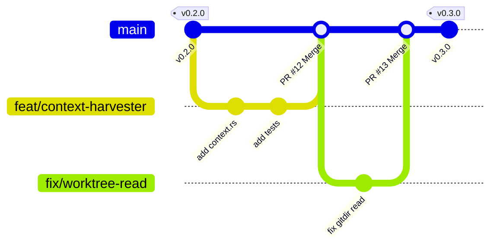

# Contributing to agent-otel-bridge

Thank you for your interest in contributing to **`agent-otel-bridge`**! We welcome contributions from human engineers and autonomous AI agents alike.

Because `agent-otel-bridge` operates on the synchronous lifecycle hot-path of AI coding agents, our community maintains strict design, architectural, and performance guardrails.

---

## 1. Branching Policy & Release Cycles

To ensure production stability, predictable releases, and smooth community contributions, this repository enforces a structured Git branching strategy:



### Branch Roles
* **`main`**: The production trunk. Always stable, always releasable.
  - Direct commits to `main` are restricted.
  - Releases are tagged directly from `main` using Semantic Versioning (`vMAJOR.MINOR.PATCH`).
* **Feature Branches (`feat/<feature-name>`)**:
  - Used for developing new capabilities (e.g. `feat/tokenomics-dashboard`, `feat/archetype-parsers`).
* **Bugfix Branches (`fix/<issue-name>`)**:
  - Used for patching defects (e.g. `fix/pipe-timeout-windows`, `fix/url-sanitizer`).
* **Documentation & Benchmark Branches (`docs/<topic>`)**:
  - Used for doc improvements, benchmark submissions, and dashboard templates.

### Pull Request Workflow
1. Fork or branch from `main`.
2. Create your topic branch: `git checkout -b feat/my-new-feature`.
3. Implement changes following the [Design Constraints](#2-architectural-and-performance-guardrails).
4. Run the automated guardrails checker:
   ```powershell
   .\scripts\check-guardrails.ps1
   ```
5. Commit with conventional commit messages (`feat: ...`, `fix: ...`, `docs: ...`, `perf: ...`).
6. Submit a Pull Request targeting `main`.

---

## 2. Architectural & Performance Guardrails

Before submitting a PR, ensure your contribution satisfies our core architectural invariants:

1. **Sub-Millisecond Client Execution SLA**:
   - `agent-hook.exe` must execute in **< 1.0 ms** on standard hardware.
   - Hard watchdog fail-open backstop: 3.0 ms maximum duration.
2. **Zero LLM Prompt Pollution**:
   - Tracing context must propagate exclusively through the OS transport layer (`$env:TRACEPARENT`).
   - Never instruct agents or LLMs to pass `--traceparent` CLI flags.
3. **Preference-Agnostic Behavioral Archetypes**:
   - Do not hardcode specific CLI tools (`rtk`, `jq`, `bat`).
   - Map tools into the 6 standardized archetypes (`FilterCompressor`, `StructuredParser`, `InspectorDiff`, `SearchRetrieval`, `BuildTestVerify`, `GenericExec`).
4. **Non-Blocking Context Harvester**:
   - Direct filesystem read only. Never spawn `git.exe` or subprocesses inside the telemetry collection path.
5. **Zero Hot-Path Disk I/O**:
   - Defaults must remain compiled-in constants. Never read YAML/JSON files on the client hot path.

---

## 3. Automated Guardrails Verification

We provide an automated verification tool in `scripts/check-guardrails.ps1` that checks:

- [x] Code formatting (`cargo fmt --check`)
- [x] Linter purity with zero warnings (`cargo clippy --workspace --all-targets -- -D warnings`)
- [x] Full workspace test suite (`cargo test --workspace`)
- [x] Client binary size threshold (< 350 KB)
- [x] Documentation generation (`cargo doc --workspace --no-deps`)
- [x] Copyright and license header integrity

Run it before pushing:
```powershell
.\scripts\check-guardrails.ps1
```

---

## 4. Enabling Local Git Hooks

To automatically prevent broken commits and branch policy violations, enable our repository Git hooks:

```powershell
git config core.hooksPath .githooks
```

Once enabled, `.githooks/pre-commit` and `.githooks/pre-push` will automatically enforce code formatting and branch naming conventions before any git commit or push.

---

## 5. Community Hardware Benchmarks

We actively track microsecond performance across diverse developer hardware. If you are testing on a new CPU/OS environment:

```powershell
# Run hardware benchmark and submit results
agent-otel-bridge benchmark --submit --open-browser
```

See [docs/COMMUNITY_BENCHMARKS.md](docs/COMMUNITY_BENCHMARKS.md) for current leaderboard results.

---

## 6. Sponsoring & Incubation

`agent-otel-bridge` is proudly sponsored and incubated by [Move the Needle](https://www.movetheneedle.info).
