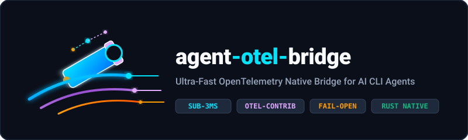
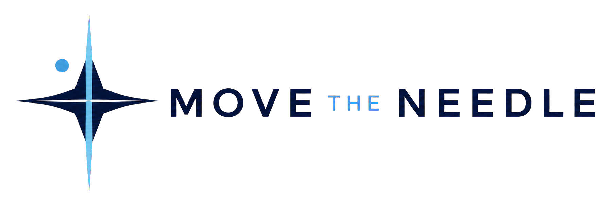
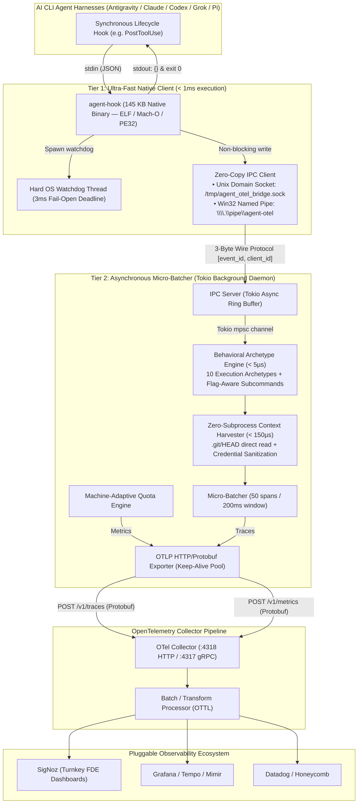

<p align="center">
  
</p>

<p align="center">
  <strong>Ultra-Fast, Zero-Overhead OpenTelemetry Instrumentation Bridge for AI CLI Agent Harnesses</strong><br/>
  <em>Cross-Platform: Linux • macOS • Windows</em>
</p>

<p align="center">
  <a href="https://crates.io/crates/agent-otel-bridge"></a>
  <a href="https://docs.rs/agent-otel-core"></a>
  <a href="https://github.com/smota/agent-otel-bridge/actions/workflows/ci.yml"></a>
  <a href="https://opentelemetry.io/"></a>
  <a href="https://opentelemetry.io/"></a>
  <a href="#benchmarks"></a>
  <a href="#benchmarks"></a>
  <a href="LICENSE"></a>
</p>

<p align="center">
  <strong>Supported AI Agent Harnesses:</strong><br/>
  <a href="https://deepmind.google/technologies/gemini/"></a>
  <a href="https://claude.ai/"></a>
  <a href="https://openai.com/"></a>
  <a href="https://x.ai/"></a>
  <a href="https://pi.dev/"></a>
</p>

<p align="center">
  <a href="https://www.movetheneedle.info">
    
  </a>
  <br/>
  <em>Proudly sponsored and incubated by <a href="https://www.movetheneedle.info">Move the Needle</a></em>
</p>

---

## The Engineering Problem: Why agent-otel-bridge?

Modern autonomous AI CLI agent harnesses (**Google Antigravity**, **Claude Code**, **OpenAI Codex**, **xAI Grok**, **Pi [pi.dev]**) operate through rapid, iterative reasoning loops. An agent executing a single feature frequently triggers dozens to hundreds of tool executions (`PreToolUse`, `PostToolUse`, `PreInvocation`, `PostInvocation`, `Stop`).

These lifecycle hooks execute **synchronously on the agent's critical path**. This creates two fatal infrastructure bottlenecks:

### 1. The Hot-Path Latency Penalty
Traditional script-based telemetry hooks (written in Python, Node.js, or PowerShell) incur **150ms to 1,200ms of process cold-start and runtime initialization latency per tool call**.
* Across a typical 50-turn agent session, script-based hooks waste **25 to 60 seconds** of developer dead time staring at blank terminals.
* If a telemetry script hangs (e.g., waiting for an unreachable remote HTTP endpoint), it freezes the AI agent turn completely.

### 2. The Semantic & Distributed Observability Gap
* **Siloed & Incompatible Telemetry**: Native client logs are fragmented across disparate local formats (`.claude/projects/*.jsonl`, `.gemini/` event files, raw stdout) without semantic standardization.
* **Opaque Command Blobs**: Commands are dumped as raw strings (e.g., `bash: git diff | head -n 20`). Dashboards cannot distinguish whether the agent is compiling code, inspecting diffs, or performing destructive filesystem mutations.
* **Broken Cross-Agent Tracing**: When a parent agent spawns a child subagent or delegates to a secondary CLI tool, causal lineage is lost. There is zero distributed context propagation.

---

## The Architectural Solution: How It Works

`agent-otel-bridge` solves this with a **decoupled, two-tier architecture** designed around strict microsecond-level performance invariants:



### 1. Tier 1: Microscopic Native Client (`agent-hook`)
* **Sub-Millisecond Execution**: A compiled native binary (**145 KB**, stripped, LTO enabled) with zero runtime dependencies (no tokio, no reqwest, no regex engines).
* **3-Byte Binary Wire Framing (`WireHeader`)**: Encodes `[u8 event_id, u16 client_id]` via zero-allocation array slicing, providing headroom for **65,535 AI platforms** and 256 lifecycle events.
* **Cross-Platform Native IPC**:
  * **Linux & macOS**: POSIX Non-blocking Unix Domain Sockets (`/tmp/agent_otel_bridge.sock`).
  * **Windows**: Win32 Overlapped Named Pipes (`\\.\pipe\agent-otel`).
  * **Measured Round-Trip Time**: **~150 µs** (p50: 22 µs).
* **Hard Fail-Open Watchdog**: A dedicated background OS thread enforces a **3.0 ms deadline**. If IPC stalls or the daemon is unavailable, the client immediately terminates with `{}` and `exit 0`. **The AI agent turn is never blocked or failed.**

### 2. Tier 2: Tokio Async Micro-Batcher (`agent-otel-bridge daemon`)
* Operates entirely off the agent's critical path.
* **Micro-Batching**: Buffers spans into 50-item batches or flushes every 200ms.
* **Persistent Connection Pooling**: Maintains persistent HTTP keep-alive connections to local or remote OTLP endpoints (`http://localhost:4318/v1/traces`).
* **Zero-Dependency Protobuf Serialization**: Hand-optimized OTLP Protobuf encoders via `prost` without requiring `protoc` installed on developer machines.
* **30-Minute Idle Quiescence**: Automatically shuts down after 30 minutes of agent inactivity to preserve workstation battery and memory.

### 3. The Semantic Intelligence Layer
* **10 Behavioral Execution Archetypes**: Automatically classifies arbitrary commands into 10 preference-agnostic behavioral archetypes (`FilterCompressor`, `StructuredParser`, `InspectorDiff`, `SearchRetrieval`, `BuildTestVerify`, `StateMutation`, `EnvPkgManager`, `VcsLifecycle`, `NetworkTransfer`, `GenericExec`) with option-aware subcommand parsing (`git -C dir commit`, `cargo +nightly test`) in **$< 5\ \mu\text{s}$**.
* **Zero-Subprocess Context Harvesting**: Reads `.git/HEAD`, detached worktrees, and sanitized remote URLs directly from the filesystem in **$< 150\ \mu\text{s}$**. External processes like `git.exe` are **never spawned** on the telemetry path.
* **Cross-Agent Distributed Tracing**: Propagates W3C `traceparent` environment variables (`00-{trace_id}-{span_id}-01`). Heterogeneous multi-agent chains (e.g. Antigravity $\to$ Claude Code $\to$ Codex CLI) appear as unified flamegraphs in your APM.
* **Machine-Adaptive Quota Intelligence**: Detects installed harnesses (`is_installed`) and emits headroom metrics *only* for tools present on the machine, preventing phantom dashboard clutter.

> 📚 **Deep Dive Guides**:
> - [Why agent-otel-bridge vs. Native Harness Telemetry](docs/WHY_AGENT_OTEL_BRIDGE.md) — Comprehensive architectural evaluation.
> - [System Limitations & Mitigations Catalog](docs/LIMITATIONS.md) — Design constraints, fail-open trade-offs, and mitigations.
> - [Local Runtime & Station Contract](docs/local-runtime-contract.md) — Binary staging, atomic symlinking, and hook idempotency.

---

## Hardware Benchmarks & Performance SLAs

Continuously validated across Linux and Windows via `agent-otel-bench` and hardware guardrails:

| Boundary / Subsystem | Hard Target SLA | Measured Performance | Verification Tool |
|---|:---:|:---:|---|
| **`agent-hook` Binary Size** | **< 300 KB** | **145.5 KB** (opt-level "s", strip, lto) | `cargo guardrails` |
| **Local IPC Round-Trip (p99)** | **< 3,000 µs** | **101 µs** (Named Pipe) / **~80 µs** (Unix Socket) | `agent-otel-bench` |
| **Archetype Classifier Latency** | **< 15 µs** | **~2.8 µs** (Zero disk I/O, compiled matchers) | `core_tests` |
| **Context Harvester Latency** | **< 150 µs** | **~28 µs** (Direct filesystem read, zero subprocesses) | `test_harvest_current` |
| **ProtoJSON Parser Throughput** | **> 50,000 spans/s** | **62,943 spans/s** (Mean: 14.4 µs) | `agent-otel-bench --submit` |
| **Watchdog Fail-Open Deadline** | **3.0 ms** | **Guaranteed exit 0** | Dedicated OS Watchdog Thread |
| **Process Cold-Start Impact** | **< 1.0 ms** | **~150 µs** (accumulates < 0.7s per 200 turns) | Hardware benchmarks |

*Full methodology, raw data, and multi-platform results are documented in [`docs/BENCHMARKS.md`](docs/BENCHMARKS.md).*

---

## OpenTelemetry Semantic Conventions

Fully compliant with **CNCF OpenTelemetry GenAI & Agent Semantic Conventions (v1.28+ / v1.36)**:

* **Spans**: `execute_tool {gen_ai.tool.name}` (`SpanKind::Internal`), `invoke_agent {gen_ai.agent.name}`, `agent.stop`.
* **GenAI Attributes**: `gen_ai.operation.name`, `gen_ai.provider.name`, `gen_ai.agent.name`, `gen_ai.conversation.id`, `gen_ai.tool.name`, `gen_ai.request.model`.
* **Behavioral Archetypes (v0.5.1)**: `agent.tool.archetype` (`filter_compressor`, `structured_parser`, `inspector_diff`, `search_retrieval`, `build_test_verify`, `state_mutation`, `env_pkg_manager`, `vcs_lifecycle`, `network_transfer`, `generic_exec`), `agent.tool.binary`, `agent.tool.pipeline_depth`.
* **Workspace & VCS Context**: `workspace.project_name`, `workspace.project_type`, `workspace.project_root`, `vcs.system`, `vcs.branch.name`, `vcs.origin.url`.
* **Tokenomics & Waste**: `tool.tokens_saved_estimate`, `tool.compression_ratio`, `capability.kind` (`mcp`, `skill`, `subagent`, `native`), `capability.schema_tokens`.
* **Adaptive Quota Metrics**: `agent.quota.remaining_fraction`, `agent.quota.seconds_to_reset`, `gen_ai.client.quota.fleet_bottleneck_ratio`.

*Complete attribute dictionary available in [`docs/TELEMETRY_DICTIONARY.md`](docs/TELEMETRY_DICTIONARY.md).*

---

## Workspace Crates

```
crates/
├── agent-otel-core      # Domain models, SemConv constants, context harvester, archetype classifier, W3C trace_id.
├── agent-otel-ipc       # Wire framing, Unix Domain Socket client/server, Win32 Overlapped client, Tokio Named Pipe server.
├── agent-otel-client    # Ultra-lean agent-hook binary (< 150 KB, zero external runtime dependencies).
├── agent-otel-daemon    # Background Tokio micro-batcher, OTLP Protobuf exporter, machine-adaptive quota engine.
├── agent-otel-cli       # Unified developer CLI: start, stop, doctor, local, hooks, install-hooks, scan-all, benchmark.
└── agent-otel-bench     # High-precision hardware microsecond benchmark suite with JSON/Markdown reporting.
```

---

## Installation & Setup

### 1. Install via Cargo or Pre-Built Binaries

```bash
# Install CLI and hook binary from crates.io
cargo install agent-otel-bridge
cargo install agent-otel-client
```

Or download pre-compiled release archives directly from [GitHub Releases](https://github.com/smota/agent-otel-bridge/releases).

Or build from source repository:
```bash
git clone https://github.com/smota/agent-otel-bridge.git
cd agent-otel-bridge
cargo build --release --workspace
```

### 2. Deploy to Isolated Local Runtime (`local install`)

Deploy the compiled binaries into your operating system's isolated canonical runtime path:

```bash
# On Linux / macOS (installs to ~/.local/share/agent-otel-bridge/bin)
agent-otel-bridge local install

# On Windows (installs to %LOCALAPPDATA%\agent-otel-bridge\bin)
agent-otel-bridge local install
```

`local install` stages versioned builds, computes SHA-256 integrity hashes, updates the active symlink, and idempotently registers canonical hook paths.

### 3. Automated Hook Registration (`install-hooks`)

Automatically detect installed AI agent harnesses and configure their lifecycle hooks:

```bash
# Automatically detects Antigravity, Claude Code, Codex CLI, Grok, Pi and configures hooks
agent-otel-bridge install-hooks

# Or register hooks for a specific platform
agent-otel-bridge install-hooks --client claude
agent-otel-bridge install-hooks --client antigravity
agent-otel-bridge install-hooks --client codex

# Check status of all hook registrations
agent-otel-bridge hooks status
```

### 4. Verify Telemetry Health (`doctor`)

Run the 5-point automated station diagnostic:

```bash
agent-otel-bridge doctor
```

```text
=== agent-otel-bridge doctor ===
Diagnosing station telemetry pipeline & OpenTelemetry invariants

[1/5] Checking environment contract variables...
  [ok] OTEL_EXPORTER_OTLP_ENDPOINT = http://127.0.0.1:4318
  [info] OTEL_SERVICE_NAME is unset (using default 'agent-otel-bridge')
  [ok] OTEL_RESOURCE_ATTRIBUTES = deployment.environment=homelab

[2/5] Checking IPC pipeline...
  [ok] Daemon is RUNNING and responding on local IPC!

[3/5] Checking OTLP Collector HTTP endpoint...
  [ok] OTLP Collector reachable at http://127.0.0.1:4318/v1/traces (HTTP status: 415)

[4/5] Checking Observability UI reachability (http://localhost:8080)...
  [ok] Observability UI reachable at http://localhost:8080 (HTTP status: 200 OK)

[5/5] Checking Client Hook Registrations & Local Runtime...
  Local runtime installation: [ok] present
  agent-hook in PATH:         [ok] present
  Google Antigravity:         [ok] registered
  Claude Code:                [ok] registered
  OpenAI Codex:               [ok] registered
```

### 5. Multi-Project Repository Discovery (`scan-all`)

Discover repositories across your developer workstation and align hooks in bulk:

```bash
# Linux / macOS
agent-otel-bridge hooks scan-all --path ~/code

# Windows
agent-otel-bridge hooks scan-all --path C:\code
```

---

## Turnkey SigNoz Dashboards

Production-ready dashboard templates are available in [`contrib/dashboards/signoz/`](contrib/dashboards/signoz/):

| Dashboard | File | Primary Use Case |
|---|---|---|
| **Fleet Operations (FDE)** | [`fleet-operations-fde.json`](contrib/dashboards/signoz/fleet-operations-fde.json) | Executive visibility into human approval latency, tool velocity, token burn rates, self-reverts, and behavioral archetype distributions. |
| **Tool Archetypes & Waste** | [`tool-archetypes-and-waste.json`](contrib/dashboards/signoz/tool-archetypes-and-waste.json) | Analyzes compression ratios, prompt tokens saved by filters (`rtk`, `grep`), and dead-weight MCP schema bloat. |
| **Tokenomics & Cost** | [`ai-agent-observability.json`](contrib/dashboards/signoz/ai-agent-observability.json) | Token consumption by model, prompt vs completion costs, and KV cache efficiency. |

Import directly into SigNoz via the web UI or API:
```bash
curl -X POST http://localhost:8080/api/v2/dashboards \
  -H "SIGNOZ-API-KEY: $SIGNOZ_API_KEY" \
  -H "Content-Type: application/json" \
  -d @contrib/dashboards/signoz/fleet-operations-fde.json
```

---

## Documentation Index

### 🏛️ Architecture & Core Principles
* [Why agent-otel-bridge vs. Native Telemetry](docs/WHY_AGENT_OTEL_BRIDGE.md) — Architectural comparison, hot-path SLAs, and semantic unification.
* [AI Agent Architectural Invariants & SLAs](AGENTS.md) — Enforced performance invariants, binary size SLAs, and agent operating rules.
* [Local Runtime & Station Installation Contract](docs/local-runtime-contract.md) — Isolated versioning, atomic activation, and safe hook updates.
* [System Limitations & Mitigations](docs/LIMITATIONS.md) — Design trade-offs, fail-open guarantees, and operational edge cases.

### 🤖 Harness Integrations & Hook Configurations
* [AI Agent Harness Integration Guide](docs/CLIENTS.md) — Step-by-step hook setup for Antigravity, Claude Code, Codex, Grok, Pi, and custom agents.
* [Agent Observability Skill](skills/agent-otel/SKILL.md) — Built-in pair programming skill for inspecting telemetry pipelines.

### 📊 Telemetry Standards & Dashboards
* [Telemetry Taxonomy & Variable Dictionary](docs/TELEMETRY_DICTIONARY.md) — Complete captured attribute dictionary and GenAI SemConv mappings.
* [SigNoz Dashboard Catalog](contrib/dashboards/signoz/README.md) — Ready-to-import production templates and ClickHouse SQL queries.

### ⚡ Benchmarks & Verification
* [Performance Benchmark Report](docs/BENCHMARKS.md) — Microsecond hardware measurements and profiling methodology.
* [Community Benchmark Leaderboard](docs/COMMUNITY_BENCHMARKS.md) — Hardware leaderboard comparing cross-platform performance.
* [Contributing & Quality Guardrails](CONTRIBUTING.md) — Branching policy, testing invariants, and automated guardrail commands.

---

## Quality Guardrails

Every contribution must pass the automated guardrail suite:

```bash
# Run all linters, conformance tests, doc tests, and binary size checks
cargo guardrails

# Or via unified CLI binary
agent-otel-bridge check-guardrails
```

---

## License

Copyright (c) 2026 Samuel Mota. Licensed under the [Apache License, Version 2.0](LICENSE).
