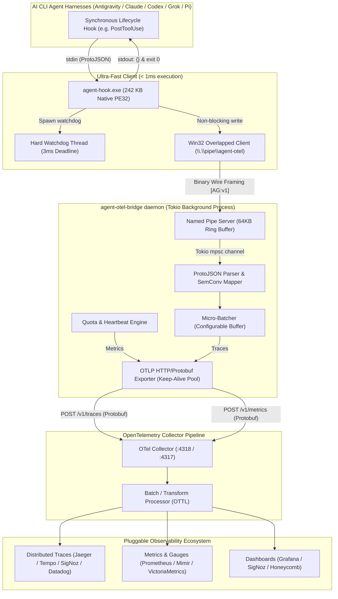

<p align="center">
  
</p>

<p align="center">
  <strong>Ultra-Fast, Zero-Overhead OpenTelemetry Instrumentation Bridge for AI CLI Agent Harnesses</strong>
</p>

<p align="center">
  <a href="https://crates.io/crates/agent-otel-bridge"></a>
  <a href="https://docs.rs/agent-otel-core"></a>
  <a href="https://github.com/smota/agent-otel-bridge/actions/workflows/ci.yml"></a>
  <a href="https://opentelemetry.io/"></a>
  <a href="https://opentelemetry.io/"></a>
  <a href="docs/COMMUNITY_BENCHMARKS.md"></a>
  <a href="#benchmarks"></a>
  <a href="LICENSE"></a>
</p>

<p align="center">
  <strong>Supported Agent Harnesses:</strong><br/>
  <a href="https://deepmind.google/technologies/gemini/"></a>
  <a href="https://claude.ai/"></a>
  <a href="https://openai.com/"></a>
  <a href="https://x.ai/"></a>
  <a href="https://pi.dev/"></a>
</p>

<p align="center">
  <a href="https://www.movetheneedle.info">
    
  </a>
  <br/>
  <em>Proudly sponsored and incubated by <a href="https://www.movetheneedle.info">Move the Needle</a></em>
</p>

---

## Overview

**`agent-otel-bridge`** is a high-performance, native OpenTelemetry sidecar bridge designed to solve the **hot-path lifecycle hook latency bottleneck** in autonomous AI CLI agent harnesses (**Google Antigravity**, **Claude Code**, **OpenAI Codex CLI**, **xAI Grok**, **Pi [pi.dev]**, and custom LLM developer agents).

Modern AI coding agents invoke synchronous lifecycle hooks (`PostToolUse`, `PreInvocation`, `PostInvocation`, `Stop`) dozens to hundreds of times per session. Traditional script-based hooks (Python, Node.js, PowerShell) impose **150ms to 1,200ms of cold-start latency per tool call**, accumulating up to several minutes of wasted developer time in a single pairing session.

`agent-otel-bridge` decouples hot-path event emission into:
1. **`agent-hook.exe`**: An ultra-fast, microscopic static PE32 binary (**242 KB**) that executes in **< 1ms**, drops the event into a local Win32 Named Pipe via Overlapped I/O, and enforces a **3ms watchdog fail-open guarantee** (never blocks or breaks the agent's workflow).
2. **`agent-otel-bridge daemon`**: A Tokio async background daemon maintaining connection pooling with the OpenTelemetry Collector (`localhost:4318`), performing micro-batching (50 spans / 200ms), and serializing canonical OTLP Protobuf traces and quota metrics without requiring `protoc` build-time dependencies.

---

## Architecture



---

## Benchmarks

Measured on Windows 11 (AMD Ryzen / NVMe) via the dedicated benchmark suite (`agent-otel-bench`):

| Measurement Stage | p50 (median) | p90 | p95 | p99 | p99.9 | SLA Target | Status |
|---|---:|---:|---:|---:|---:|---:|:---:|
| **Win32 Named Pipe RTT** | **22 µs** | **38 µs** | **57 µs** | **101 µs** | **277 µs** | < 3,000 µs | ✅ **PASS** |
| **ProtoJSON Parse + Span Build** | **1 µs** | **1 µs** | **2 µs** | **2 µs** | **5 µs** | < 3,000 µs | ✅ **PASS** |
| **Real OS Process Lifecycle** | **3.56 ms** | **4.25 ms** | **4.70 ms** | **5.59 ms** | **8.36 ms** | < 10.0 ms | ✅ **PASS** |

- **OTLP Span Processing Throughput**: **> 546,000 spans/second**.
- **Hook Cost across 200 Tool Invocations**:
  - PowerShell Hook Script: **90s – 240s** lost.
  - Python Hook Script: **30s – 56s** lost.
  - `agent-hook.exe` (Rust): **0.7s total accumulated time**.
- Full methodology and data in [`docs/BENCHMARKS.md`](docs/BENCHMARKS.md).

---

## OpenTelemetry Semantic Conventions

Fully aligned with canonical **CNCF OpenTelemetry GenAI & Agent Semantic Conventions (v1.28+ / v1.36)**:

### Spans & Canonical Attributes
- **Span Names**:
  - `execute_tool {gen_ai.tool.name}` (`SpanKind::Internal`)
  - `invoke_agent {gen_ai.agent.name}` (`SpanKind::Internal`)
  - `agent.stop` (`SpanKind::Internal`)
- **GenAI Attributes**:
  - `gen_ai.operation.name`: `execute_tool`, `invoke_agent`
  - `gen_ai.provider.name`: dynamically inferred (`"anthropic"`, `"google"`, `"openai"`, `"xai"`, `"pi"`)
  - `gen_ai.agent.name`: dynamically inferred (`"antigravity"`, `"claude-code"`, `"codex"`, `"grok"`, `"pi"`, `"ai-agent"`)
  - `gen_ai.conversation.id`: correlated session identifier (mapped from `conversationId` or Claude Code `session_id`)
  - `gen_ai.tool.name` & `gen_ai.tool.call.id`
  - `gen_ai.request.model`: e.g. `claude-3-5-sonnet`, `gemini-2.5-pro`, `gpt-4o`, `grok-2`
- **Canonical Agent Attributes**:
  - `agent.hook.event`: `PostToolUse`, `PreToolUse`, `PostInvocation`, `PreInvocation`, `Stop`
  - `agent.step.index` & `gen_ai.agent.step_index`: integer turn index
  - `agent.execution.num`: execution sequence number
  - `agent.fully_idle`: boolean quiescence indicator
  - `agent.termination_reason`: stop / completion reason (e.g. `NO_TOOL_CALL`, `model_stop`)
- **Agent Quota Gauges**:
  - `agent.quota.remaining_fraction`: Gauge (unit `"1"`, `0.0..=1.0`).
  - `agent.quota.seconds_to_reset`: Gauge (unit `"s"`, `>= 0.0`).
  - Attributes: `bucket`, `group`.
- **Universal Agent Intelligence & Context (v0.3)**:
  - **Behavioral CLI Archetypes (Preference-Agnostic)**: Commands are categorized into 6 functional archetypes (`filter_compressor`, `structured_parser`, `inspector_diff`, `search_retrieval`, `build_test_verify`, `generic_exec`) instead of hardcoding developer-specific tools (`rtk`, `jq`, `bat`). Tracks compression ratio, tokens saved, and pipeline depth.
  - **Universal MCP & Skills Taxonomy + Waste Tracking**: Standardizes tool calls across `mcp` servers, `skill` bundles, and `native` tools. Quantifies **Schema Tax** (dead-weight prompt tokens spent on inactive tools), retry thrashing, and response payload bloat.
  - **Multi-Tier Zero-Subprocess Context Harvester (< 150 µs)**: Extracts workspace path, project root, project type (`rust`, `node`, `python`, `go`), and direct file-based Git metadata (`.git/HEAD`, sanitized remote origin, worktrees) with zero external process calls (`git.exe` is never spawned).
  - **Cross-Agent Distributed Tracing (W3C `traceparent`)**: Injects and propagates W3C trace context via process environment variables (`$env:TRACEPARENT`). Heterogeneous subagents (e.g. Antigravity spawning Claude Code, which delegates to Codex) are unified into a single distributed trace DAG in SigNoz.
- **OpenTelemetry Layering & Opt-In Compatibility**:
  - Emits purely canonical, vendor-neutral attributes by default so all AI agents (Antigravity, Claude Code, Codex, Grok, Pi) share a clean data model without vendor pollution.
  - Optional `AGENT_OTEL_LEGACY_ATTRIBUTES=true` enables legacy `agy.*` aliases for older dashboards, or use an OpenTelemetry Collector `transformprocessor` (OTTL) to alias attributes in the collection tier.

---

## Crates in the Workspace

| Crate | Binary / Role | Description |
|---|---|---|
| [`agent-otel-core`](crates/agent-otel-core) | Library | Domain models, SemConv constants, deterministic 16-byte `trace_id` / 8-byte `span_id` generators, OTLP Protobuf builders. |
| [`agent-otel-ipc`](crates/agent-otel-ipc) | Library | Binary wire protocol (`MAGIC: AG`), Win32 Overlapped client (`windows-sys`), Tokio Named Pipe server (`\\.\pipe\agent-otel`). |
| [`agent-otel-client`](crates/agent-otel-client) | `agent-hook.exe` | 242 KB static PE32 binary with 3ms watchdog fail-open backstop. |
| [`agent-otel-daemon`](crates/agent-otel-daemon) | Library | Tokio micro-batcher, `reqwest` keep-alive exporter, quota ticker, 30-min idle shutdown. |
| [`agent-otel-bridge`](crates/agent-otel-cli) | `agent-otel-bridge.exe` | Unified CLI (`hook`, `daemon`, `doctor`, `hooks`, `install-hooks`, `emit-quota`, `stop`). |
| [`agent-otel-bench`](crates/agent-otel-bench) | `agent-otel-bench.exe` | High-precision microsecond benchmark suite. |

---

## Installation & Setup

### 1. Install via Cargo or Pre-built Binaries

From [crates.io](https://crates.io/crates/agent-otel-bridge):
```powershell
cargo install agent-otel-bridge
cargo install agent-otel-client
```

Or download pre-compiled release archives directly from [GitHub Releases](https://github.com/smota/agent-otel-bridge/releases).

Or build locally from repository:
```powershell
cargo install --path crates/agent-otel-client --force
cargo install --path crates/agent-otel-cli --force
```

### 2. Automated Hook Installation (`install-hooks`)

`agent-otel-bridge` automatically detects and configures lifecycle hooks for your AI agents:

```powershell
# Automatically detects installed agents (Antigravity, Claude Code, Codex, Grok, Pi) and registers hooks
agent-otel-bridge install-hooks

# Or target a specific client
agent-otel-bridge install-hooks --client antigravity
agent-otel-bridge install-hooks --client claude
agent-otel-bridge install-hooks --client codex
agent-otel-bridge install-hooks --client grok
agent-otel-bridge install-hooks --client pi

# Or register hooks for all supported clients
agent-otel-bridge install-hooks --client all

# Or install at project level (.claude/settings.json or .gemini/hooks.json, etc.)
agent-otel-bridge install-hooks --client claude --project
```

Check hook status anytime:
```powershell
agent-otel-bridge hooks status
```

### 3. Verify Installation (`doctor`)
```powershell
agent-otel-bridge doctor
```
Output:
```text
=== agent-otel-bridge doctor ===
Diagnosing station telemetry pipeline & OpenTelemetry invariants

[1/5] Checking environment contract variables...
  [ok] OTEL_EXPORTER_OTLP_ENDPOINT = http://127.0.0.1:4318
  [info] OTEL_SERVICE_NAME is unset (using default 'agent-otel-bridge')
  [ok] OTEL_RESOURCE_ATTRIBUTES = deployment.environment=homelab

[2/5] Checking named pipe IPC (\\.\pipe\agent-otel)...
  [ok] Daemon is RUNNING and responding on named pipe!

[3/5] Checking OTLP Collector HTTP endpoint...
  [ok] OTLP Collector reachable at http://127.0.0.1:4318/v1/traces

[4/5] Checking Observability UI reachability (http://localhost:8080)...
  [ok] Observability UI reachable at http://localhost:8080

[5/5] Checking Client Hook Registrations...
  agent-hook in PATH: [ok] present
  Google Antigravity: [ok] registered (C:\Users\samue\.gemini\config\hooks.json)
  Claude Code:        [ok] registered (C:\Users\samue\.claude\settings.json)
  OpenAI Codex:       [info] not registered (C:\Users\samue\.codex\hooks.json)
  xAI Grok:           [info] not registered (C:\Users\samue\.grok\hooks.json)
  Pi (pi.dev):        [info] not registered (C:\Users\samue\.pi\hooks.json)
```

### 4. Run CLI Commands
```powershell
# Start background daemon
agent-otel-bridge start

# Send manual quota probe to collector
agent-otel-bridge emit-quota --ping

# Gracefully stop daemon
agent-otel-bridge stop

# Run benchmarks and submit results to community leaderboard
cargo run --release -p agent-otel-bench -- --submit --open-browser
# Or via unified CLI:
agent-otel-bridge benchmark --submit --open-browser
```

---

## Documentation

### 🏛️ Architecture & Core Principles
| Document | Description |
|---|---|
| [Native CLI Instrumentation Design](docs/NATIVE_CLI_INSTRUMENTATION.md) | Sub-millisecond architecture, 1-byte bitwise protocol, watchdog fail-open, and zero prompt pollution. |
| [Architecture & Sequence Diagrams](docs/ARCHITECTURE.md) | Zero-copy IPC wire protocol and Win32 Named Pipe / Unix Domain Socket architecture. |
| [AI Agent Architectural Invariants & SLAs](AGENTS.md) | Enforced design constraints, sub-millisecond SLAs, and AI agent operating instructions. |

### 🤖 Harness Integrations & Client Setup
| Document | Description |
|---|---|
| [AI Agent Harness Integration](docs/CLIENTS.md) | Setup & hook configs for Google Antigravity, Claude Code, OpenAI Codex, xAI Grok, Pi, and Custom Agents. |
| [Agent Observability Skill](skills/agent-otel/SKILL.md) | Built-in pair programming skill for inspecting and diagnosing telemetry pipelines. |

### 📊 Telemetry Standards & Dashboards
| Document | Description |
|---|---|
| [Telemetry Taxonomy & Variable Dictionary](docs/TELEMETRY_DICTIONARY.md) | Complete captured attribute dictionary, 6-dimension taxonomy, and GenAI conventions. |
| [OpenTelemetry Dashboard & Visualization Guide](docs/DASHBOARDS.md) | Panel queries and visualization recipes across Grafana, SigNoz, Jaeger, and Prometheus. |
| [SigNoz Contrib Dashboard Templates](contrib/dashboards/signoz/README.md) | Ready-to-import production JSON templates (Tokenomics, Archetypes, Fleet Governance, SRE Loops). |

### ⚙️ Configuration & Diagnostics
| Document | Description |
|---|---|
| [Configuration & Environment](docs/CONFIGURATION.md) | Complete environment variable catalog and OTel Collector recipes (`config.yaml`). |
| [Troubleshooting & Diagnostic Runbook](docs/TROUBLESHOOTING.md) | Step-by-step resolution for common issues and fail-open verification. |

### ⚡ Benchmarks & Performance SLAs
| Document | Description |
|---|---|
| [Performance Benchmark Report](docs/BENCHMARKS.md) | Detailed microsecond measurement methodology and hardware SLA evaluation. |
| [Community Benchmark Matrix](docs/COMMUNITY_BENCHMARKS.md) | Living leaderboard comparing benchmark results across community hardware. |
| [Benchmark Submission Guide](docs/BENCHMARK_SUBMISSION.md) | Instructions on running automated benchmarks and contributing hardware results. |

### 🤝 Contributing & Quality Guardrails
| Document | Description |
|---|---|
| [Contributing & Branching Policy](CONTRIBUTING.md) | Branching strategy (`feat/*`, `fix/*`), PR workflow, and automated guardrail verification. |

---

## License

Copyright (c) 2026 Samuel Mota. Licensed under the [Apache License, Version 2.0](LICENSE).
