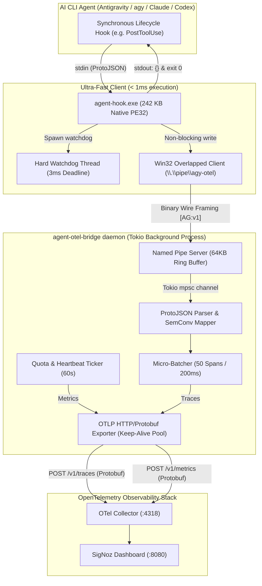

<p align="center">
  
</p>

<p align="center">
  <strong>Ultra-Fast, Zero-Overhead OpenTelemetry Instrumentation Bridge for AI CLI Agent Harnesses</strong>
</p>

<p align="center">
  <a href="https://opentelemetry.io/"></a>
  <a href="https://www.rust-lang.org/"></a>
  <a href="https://signoz.io/"></a>
  <a href="#benchmarks"></a>
  <a href="LICENSE"></a>
</p>

---

## Overview

**`agent-otel-bridge`** is a high-performance, native OpenTelemetry sidecar bridge designed to solve the **hot-path lifecycle hook latency bottleneck** in autonomous AI CLI agent harnesses (Google Antigravity / `agy`, Claude Code, OpenAI Codex CLI, Aider, and custom LLM developer tools).

Modern AI coding agents invoke synchronous lifecycle hooks (`PostToolUse`, `PreInvocation`, `PostInvocation`, `Stop`) dozens to hundreds of times per session. Traditional script-based hooks (Python, Node.js, PowerShell) impose **150ms to 1,200ms of cold-start latency per tool call**, accumulating up to several minutes of wasted developer time in a single pairing session.

`agent-otel-bridge` decouples hot-path event emission into:
1. **`agent-hook.exe`**: An ultra-fast, microscopic static PE32 binary (**242 KB**) that executes in **< 1ms**, drops the event into a local Win32 Named Pipe via Overlapped I/O, and enforces a **3ms watchdog fail-open guarantee** (never blocks or breaks the agent's workflow).
2. **`agent-otel-bridge daemon`**: A Tokio async background daemon maintaining connection pooling with the OpenTelemetry Collector (`localhost:4318`), performing micro-batching (50 spans / 200ms), and serializing canonical OTLP Protobuf traces and quota metrics without requiring `protoc` build-time dependencies.

---

## Architecture



---

## Benchmarks

Measured on Windows 11 (AMD Ryzen / NVMe) via the dedicated benchmark suite (`agent-otel-bench`):

| Measurement Stage | p50 (median) | p90 | p95 | p99 | p99.9 | SLA Target | Status |
|---|---:|---:|---:|---:|---:|---:|:---:|
| **Win32 Named Pipe RTT** | **22 µs** | **38 µs** | **57 µs** | **101 µs** | **277 µs** | < 3,000 µs | ✅ **PASS** |
| **ProtoJSON Parse + Span Build** | **1 µs** | **1 µs** | **2 µs** | **2 µs** | **5 µs** | < 3,000 µs | ✅ **PASS** |
| **Real OS Process Lifecycle** | **3.56 ms** | **4.25 ms** | **4.70 ms** | **5.59 ms** | **8.36 ms** | < 10.0 ms | ✅ **PASS** |

- **OTLP Span Processing Throughput**: **> 546,000 spans/second**.
- **Hook Cost across 200 Tool Invocations**:
  - PowerShell Hook Script: **90s – 240s** lost.
  - Python Hook Script: **30s – 56s** lost.
  - `agent-hook.exe` (Rust): **0.7s total accumulated time**.
- Full methodology and data in [`docs/BENCHMARKS.md`](docs/BENCHMARKS.md).

---

## OpenTelemetry Semantic Conventions

Fully aligned with canonical **CNCF OpenTelemetry GenAI & Agent Semantic Conventions (v1.28+ / v1.36)**:

### Spans & Attributes
- **Span Names**:
  - `execute_tool {tool_name}` (`SpanKind::Internal`)
  - `invoke_agent {agent_name}` (`SpanKind::Internal`)
  - `agent.stop`
- **GenAI Attributes**:
  - `gen_ai.operation.name`: `execute_tool`, `invoke_agent`
  - `gen_ai.provider.name`: `"google"`, `"anthropic"`, `"openai"`
  - `gen_ai.agent.name`: `"antigravity"`
  - `gen_ai.conversation.id`: Correlated session identifier
  - `gen_ai.tool.name` & `gen_ai.tool.call.id`
  - `gen_ai.request.model`: e.g. `gemini-2.5-pro`
- **Dashboard Backward-Compatibility**:
  - Preserves `agy.hook.event` (`PostToolUse`, `PostInvocation`, `Stop`).
  - Preserves `agy.step.index`, `agy.execution.num`, `agy.fully_idle`.
- **Station Quota Gauges**:
  - `agy.quota.remaining_fraction`: Gauge (unit `"1"`, `0.0..=1.0`), attributes `bucket="gemini-weekly"`, `group="gemini"`.
  - `agy.quota.seconds_to_reset`: Gauge (unit `"s"`, `>= 0.0`), attributes `bucket="gemini-weekly"`, `group="gemini"`.

---

## Crates in the Workspace

| Crate | Binary / Role | Description |
|---|---|---|
| [`agent-otel-core`](crates/agent-otel-core) | Library | Domain models, SemConv constants, deterministic 16-byte `trace_id` / 8-byte `span_id` generators, OTLP Protobuf builders. |
| [`agent-otel-ipc`](crates/agent-otel-ipc) | Library | Binary wire protocol (`MAGIC: AG`), Win32 Overlapped client (`windows-sys`), Tokio Named Pipe server. |
| [`agent-otel-client`](crates/agent-otel-client) | `agent-hook.exe` | 242 KB static PE32 binary with 3ms watchdog fail-open backstop. |
| [`agent-otel-daemon`](crates/agent-otel-daemon) | Library | Tokio micro-batcher, `reqwest` keep-alive exporter, quota ticker, 30-min idle shutdown. |
| [`agent-otel-cli`](crates/agent-otel-cli) | `agent-otel-bridge.exe` | Unified CLI (`hook`, `daemon`, `doctor`, `emit-quota`, `stop`). |
| [`agent-otel-bench`](crates/agent-otel-bench) | `agent-otel-bench.exe` | High-precision microsecond benchmark suite. |

---

## Installation & Setup

### 1. Build and Install
```powershell
# From repository root
cargo install --path crates/agent-otel-client --force
cargo install --path crates/agent-otel-cli --force
```

### 2. Verify Installation (`doctor`)
```powershell
agent-otel-bridge doctor
```
Output:
```text
=== agent-otel-bridge doctor ===
[1/4] Checking environment contract variables...
  [ok] OTEL_EXPORTER_OTLP_ENDPOINT = http://127.0.0.1:4318
  [ok] OTEL_RESOURCE_ATTRIBUTES = deployment.environment=homelab

[2/4] Checking named pipe IPC (\\.\pipe\agy-otel)...
  [ok] Daemon is RUNNING and responding on named pipe!

[3/4] Checking OTLP Collector HTTP endpoint...
  [ok] OTLP Collector reachable at http://127.0.0.1:4318/v1/traces

[4/4] Checking SigNoz UI reachability (http://localhost:8080)...
  [ok] SigNoz UI reachable at http://localhost:8080
  [dashboard] http://localhost:8080/dashboard/01a08f6b-fbeb-7439-a6a9-0809f9da72a0
```

### 3. Register Antigravity Lifecycle Hooks
In `~/.gemini/config/hooks.json`:
```json
{
  "agent-otel-bridge": {
    "PostToolUse": [
      {
        "command": "agent-hook PostToolUse",
        "timeout": 5,
        "type": "command"
      }
    ],
    "PostInvocation": [
      {
        "command": "agent-hook PostInvocation",
        "timeout": 5,
        "type": "command"
      }
    ],
    "Stop": [
      {
        "command": "agent-hook Stop",
        "timeout": 5,
        "type": "command"
      }
    ]
  }
}
```

### 4. Run CLI Commands
```powershell
# Start background daemon
agent-otel-bridge daemon

# Send manual quota probe to collector
agent-otel-bridge emit-quota --ping

# Gracefully stop daemon
agent-otel-bridge stop

# Run benchmarks
cargo run --release -p agent-otel-bench
```

---

## Documentation

- [Architecture & Sequence Diagrams](docs/ARCHITECTURE.md)
- [Performance Benchmark Report](docs/BENCHMARKS.md)
- [SigNoz Dashboard Configuration Guide](docs/SIGNOZ_DASHBOARD.md)
- [Agent Observability Skill](skills/agent-otel/SKILL.md)

---

## License

Copyright The OpenTelemetry Authors. Licensed under the [Apache License, Version 2.0](LICENSE).
