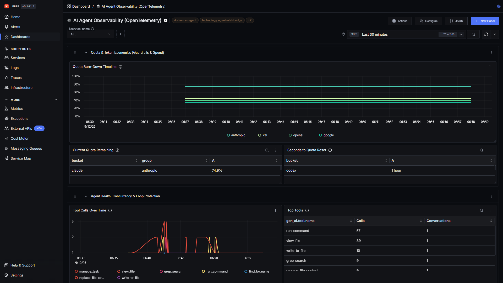
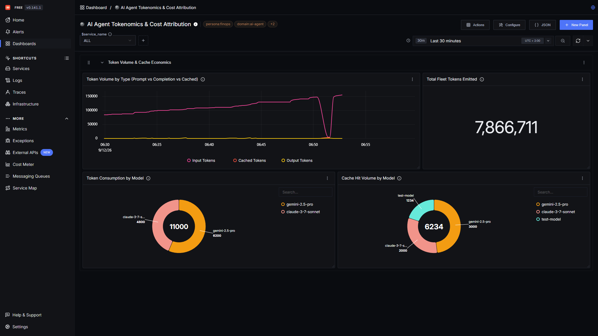
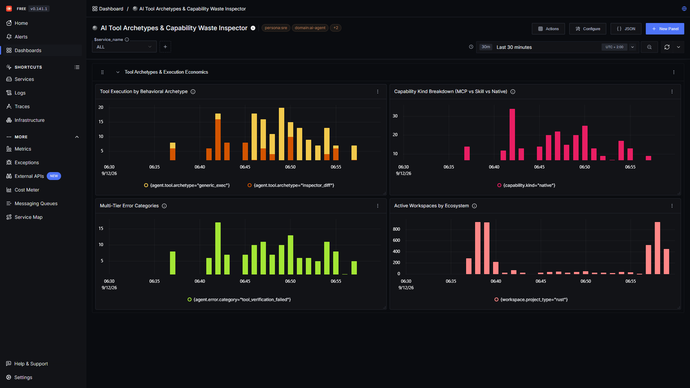
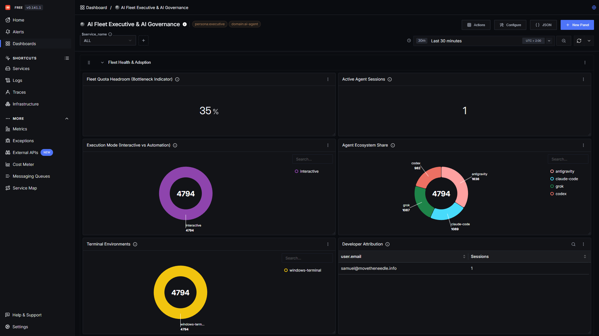
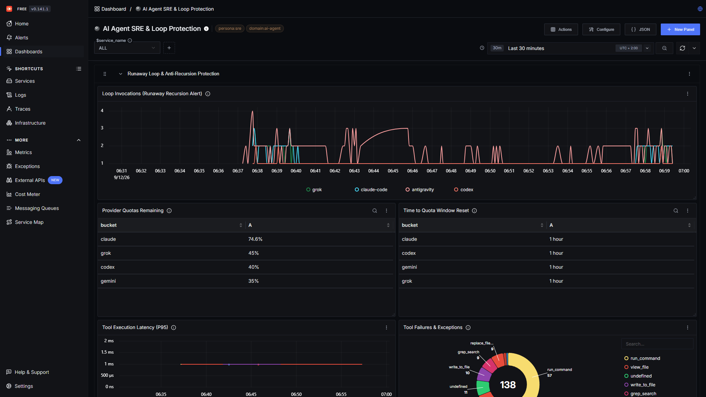
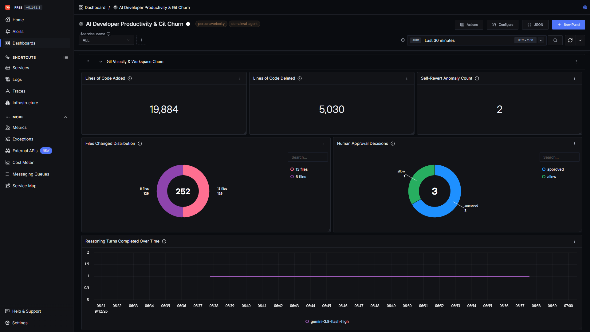
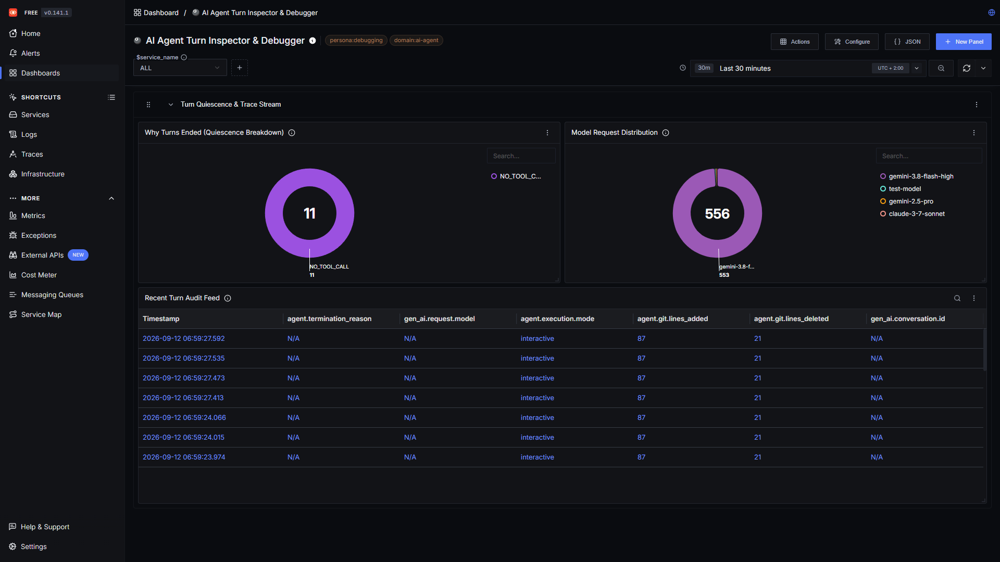

# SigNoz Dashboards for AI Agent Observability (OpenTelemetry)

Production-grade, role-based dashboards for **SigNoz v6** (Perses/v2 native format) powered by `agent-otel-bridge`. Built on CNCF OpenTelemetry GenAI (`gen_ai.*`), Agent Lifecycle SemConv (`agent.*`), and extended v0.3 execution context conventions.

Compatible with **Google Antigravity**, **Claude Code**, **OpenAI Codex**, **xAI Grok**, and **Pi** ([pi.dev](https://pi.dev/)).

---

## 1. Observability Personas & Target Missions

Observability across autonomous coding agents spans distinct organizational responsibilities. Each template is tailored for a specific operational persona:

| Persona | Operational Mission | Primary Dashboard Template | Key Decisions Enabled |
| :--- | :--- | :--- | :--- |
| **FinOps & VP of Engineering** | Token economy governance, cost attribution, model unit economics | [`tokenomics-and-cost.json`](./tokenomics-and-cost.json) | Budget forecasting, Foundation Model cost arbitrage, prompt cache ROI. |
| **Platform Engineers & SREs** | Agent runtime stability, runaway loop prevention, quota management | [`agent-sre-loops.json`](./agent-sre-loops.json) | Preventing infinite tool loops, alerting on provider quota depletion windows. |
| **AI Agent Architects** | Tool effectiveness, capability taxonomy (MCP vs Skills), schema bloat | [`tool-archetypes-and-waste.json`](./tool-archetypes-and-waste.json) | Eliminating inactive MCP server deadweight, measuring tool compression ratios. |
| **Engineering Managers & Tech Leads** | Developer flow velocity, git output impact, agent hallucination detection | [`developer-velocity.json`](./developer-velocity.json) | Measuring net lines merged vs reverted, cognitive thinking vs tool execution latency. |
| **Individual Developers & Turn Debuggers** | Single-session execution trace inspection, failure root-cause analysis | [`turn-inspector.json`](./turn-inspector.json) | Auditing tool input/output payloads, quiescence reasons (`NO_TOOL_CALL`, `USER_INTERRUPT`). |
| **Fleet Operators (All-in-One)** | Single-pane-of-glass executive overview across the entire AI agent harness | [`ai-agent-observability.json`](./ai-agent-observability.json) | High-level fleet health, active developers, tool frequency, and provider distribution. |

---

## 2. Available Templates & Download Links

All templates adhere to the **SigNoz v6** schema and can be downloaded directly from GitHub or copied from your local repository clone:

| Dashboard Name | Target Persona | Schema | Local Path | Download / Raw Link | Key Metrics & Visualizations |
| :--- | :--- | :--- | :--- | :--- | :--- |
| **AI Agent Tokenomics & Cost Attribution** | FinOps & Executive | `v6` | [`tokenomics-and-cost.json`](./tokenomics-and-cost.json) | [Download JSON](https://raw.githubusercontent.com/smota/agent-otel-bridge/main/contrib/dashboards/signoz/tokenomics-and-cost.json) | Prompt vs completion vs cached tokens, Cache Efficiency Ratio (CER), spend by model (`gemini`, `claude`, `o3-mini`, `grok-3`). |
| **AI Tool Archetypes & Capability Waste** | Agent Architects | `v6` | [`tool-archetypes-and-waste.json`](./tool-archetypes-and-waste.json) | [Download JSON](https://raw.githubusercontent.com/smota/agent-otel-bridge/main/contrib/dashboards/signoz/tool-archetypes-and-waste.json) | 6 behavioral archetypes (`filter_compressor`, `structured_parser`, etc.), MCP vs Skill breakdown, schema token bloat ranking. |
| **AI Agent SRE & Loop Protection** | Platform & SRE | `v6` | [`agent-sre-loops.json`](./agent-sre-loops.json) | [Download JSON](https://raw.githubusercontent.com/smota/agent-otel-bridge/main/contrib/dashboards/signoz/agent-sre-loops.json) | Runaway loop detection (`agent.hook.event = PostInvocation`), multi-provider quota countdown (`agent.quota.seconds_to_reset`). |
| **AI Fleet Governance & Concurrency** | Engineering Leadership | `v6` | [`fleet-governance.json`](./fleet-governance.json) | [Download JSON](https://raw.githubusercontent.com/smota/agent-otel-bridge/main/contrib/dashboards/signoz/fleet-governance.json) | Active developers (`user.email`), agent distribution (`gen_ai.agent.name`), execution mode (interactive vs automation). |
| **Developer Velocity & Engineering Impact** | Tech Leads & EMs | `v6` | [`developer-velocity.json`](./developer-velocity.json) | [Download JSON](https://raw.githubusercontent.com/smota/agent-otel-bridge/main/contrib/dashboards/signoz/developer-velocity.json) | Net git lines added/deleted, file blast radius (`agent.git.files_changed`), git self-reverts, turn duration. |
| **AI Turn Inspector & Debugger** | Prompt Engineers & Devs | `v6` | [`turn-inspector.json`](./turn-inspector.json) | [Download JSON](https://raw.githubusercontent.com/smota/agent-otel-bridge/main/contrib/dashboards/signoz/turn-inspector.json) | Deep-dive trace audit feed, step index chronology (`agent.step.index`), quiescence termination reason breakdown. |
| **Consolidated AI Agent Observability** | Single-Pane-of-Glass | `v6` | [`ai-agent-observability.json`](./ai-agent-observability.json) | [Download JSON](https://raw.githubusercontent.com/smota/agent-otel-bridge/main/contrib/dashboards/signoz/ai-agent-observability.json) | Unified executive dashboard combining quota gauges, top tools, loop monitoring, and live session traces. |

---

## 3. How to Install & Import Templates

### Option A: Import via SigNoz Web UI (Manual)

1. Open your SigNoz UI (e.g. `http://localhost:8080` or your SigNoz Cloud instance).
2. In the left navigation menu, click **Dashboards**.
3. Click **+ New dashboard** in the top right corner.
4. Select the **Import JSON** tab.
5. Click **Upload JSON file** and select any `.json` template from `contrib/dashboards/signoz/`, or paste the raw JSON text directly.
6. Click **Import**. The dashboard will immediately render all panels, time-series, tables, and dropdown variables.

### Option B: Automated Import via PowerShell (Instant API Sync)

You can import all 6 dashboards into your SigNoz instance with a single command:

```powershell
$apiKey = $env:SIGNOZ_API_KEY
$headers = @{ "Content-Type" = "application/json" }
if ($apiKey) { $headers["SIGNOZ-API-KEY"] = $apiKey }

Get-ChildItem "contrib/dashboards/signoz/*.json" | ForEach-Object {
    $jsonContent = Get-Content $_.FullName -Raw
    $res = Invoke-RestMethod -Uri "http://localhost:8080/api/v2/dashboards" `
        -Method Post -Headers $headers -Body $jsonContent
    Write-Host "Imported: $($_.Name) -> ID: $($res.data.id)" -ForegroundColor Green
}
```

### Option C: Automated Import via Bash / cURL (Linux & macOS)

```bash
SIGNOZ_URL="http://localhost:8080"

for f in contrib/dashboards/signoz/*.json; do
  echo "Importing $f..."
  curl -s -X POST "$SIGNOZ_URL/api/v2/dashboards" \
    -H "Content-Type: application/json" \
    -H "SIGNOZ-API-KEY: $SIGNOZ_API_KEY" \
    -d @"$f" | grep -o '"id":"[^"]*'
done
```

---

## 4. Dynamic Dashboard Variables

Every dashboard includes pre-configured templating variables located in the header bar:

- **`$service_name`**: Filters telemetry by OpenTelemetry service name (default: `agent-otel-bridge`).
- **`$agent_name`**: Filters to specific AI agents (`antigravity`, `claude-code`, `codex`, `grok`, `pi`, or `ALL`).
- **`$environment`**: Multi-cluster / station scoping (`deployment.environment = homelab | production | staging`).

---

## 5. Production Dashboard Gallery & Visual Tour

Verified across intense multi-agent workloads with **Google Antigravity**, **Claude Code**, **xAI Grok**, and **OpenAI Codex**:

### 1. Consolidated AI Agent Observability
Single-pane-of-glass executive overview showing real-time multi-provider quota burn-down, top tool frequencies, and live session stream.


### 2. AI Agent Tokenomics & Cost Attribution
Fine-grained token spend, prompt vs completion vs cached tokens, and prompt cache efficiency ratio (CER).


### 3. AI Tool Archetypes & Capability Waste Inspector
Behavioral execution archetypes (`FilterCompressor`, `StructuredParser`, `InspectorDiff`, `SearchRetrieval`, `BuildTestVerify`, `GenericExec`) and multi-tier error categories.


### 4. AI Fleet Executive & AI Governance
Fleet adoption, active concurrency, interactive vs autonomous execution modes, and agent ecosystem distribution.


### 5. AI Agent SRE & Loop Protection
Runaway recursion alerts, multi-provider quota reset countdowns, tool execution latency (P95 < 1ms), and failure distributions.


### 6. AI Developer Productivity & Git Churn
Engineering impact, git lines added/deleted, file blast radius, and reasoning turn frequencies.


### 7. AI Agent Turn Inspector & Debugger
Session trace audits, quiescence termination reason breakdown (`NO_TOOL_CALL`, `USER_CANCEL`), and model request distribution.
