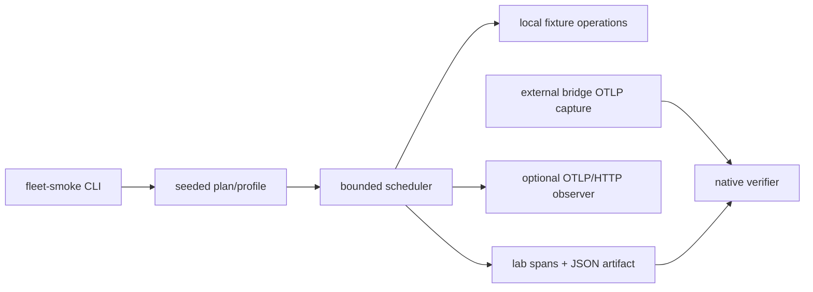
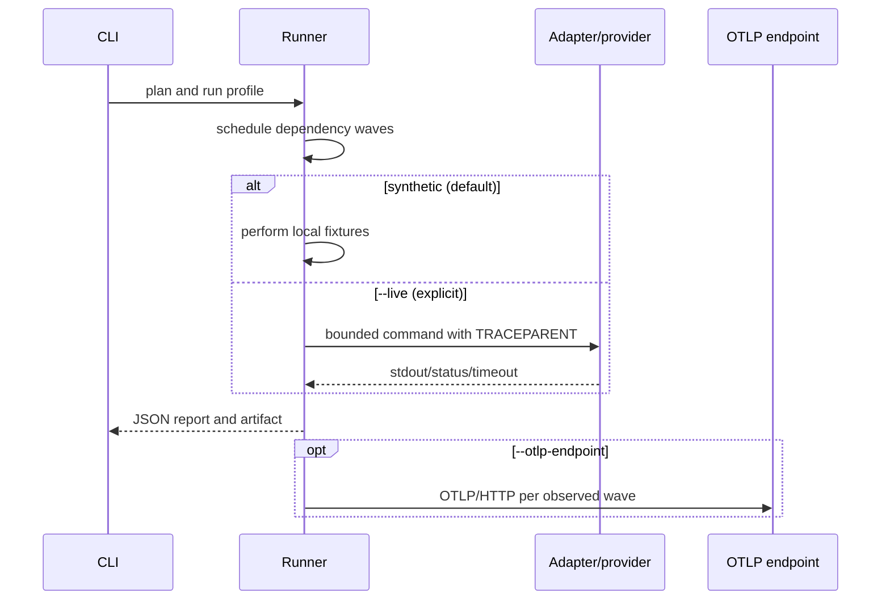

# Fleet smoke laboratory

Current candidate implementation and acceptance: [production-path round](production-path-round.md). Older `perf_loop.py` / `perf_driver.py` preserve historical replay semantics and must not be used to certify the current architecture. The documents linked below retain previous campaign context.

The current contract is [production-path-round.md](production-path-round.md). Antigravity authors the primary changes, smaller Codex models handle bounded integration, and Codex coordinates acceptance. Runtime reports remain transient.

## Current candidate acceptance loop

Stop source writers and run `cargo guardrails`, then build the development examples with `cargo build --release -p agent-otel-fleet-smoke --examples`. Invoke from the repository root:

```text
python dev/fleet-smoke/production_round.py --output-dir <owned-temporary-directory> --attempt 1 --daemon-bin <candidate-bridge> --hook-bin <candidate-hook> --production-bench <production_path> --ipc-bench <performance_ipc> --ipc-load <ipc_load> --seed 502
```

Use absolute candidate executable paths (`target/release` and `target/release/examples`, with `.exe` on Windows). Reserve at most three sequential attempts in the same directory. Review each report before incrementing `--attempt`; retain failed attempts. The controller checks the shared production boundary, architecture scenarios, real-hook delivery, native IPC delivery and established latency/size SLAs. Long-trace backend validation is a separate final step through `long_trace_probe.py` and SigNoz MCP/API. A passed functional verdict does not certify maximum sustained capacity.

## Historical mixed performance loop (replay only)

The following commands and five-attempt ledger belong to the superseded measurement boundary. They are retained for historical reproduction, not current candidate acceptance.

Run from the repository root, with all source writers stopped. Build candidate binaries without installing them:

```text
cargo guardrails
cargo build -p agent-otel-bridge
cargo build --release -p agent-otel-bridge -p agent-otel-client
cargo build --release -p agent-otel-fleet-smoke --examples
python dev/fleet-smoke/perf_loop.py --repeats 3 --timeout 900
```

The controller creates a temporary campaign directory and ledger. An explicit `--campaign-dir` may instead name an owned temporary directory outside the source tree. One ledger limits the entire campaign to five reserved attempts. A failed assertion stops automatic advancement; after reviewing and fixing the candidate, explicitly resume that same ledger:

```text
python dev/fleet-smoke/perf_loop.py --resume-ledger <temporary-directory>/ledger.json --repeats 3 --timeout 900
```

`--observe-hook` adds per-client transport observation for delivery diagnosis on Windows. `--preload-stdin` changes the stimulus and is diagnostic only; neither option turns diagnostic delivery evidence into approval of the original scenario. Do not replace an earlier failed report with a later passing report. The controller preserves attempt identities, source fingerprints, assertions, trace IDs, and bounded cleanup results. Local collector receipts are not proof of SigNoz visibility.

The hook timing campaign uses explicit candidate binaries, a private daemon pipe and a loopback collector. It reports missing observer records as not measured and measures internal hook work separately from external process lifetime. Native Linux/macOS performance and actual harness compatibility require separate evidence. No command above installs binaries, edits global hooks, or launches paid agents. Delete only the owned temporary campaign directory after evaluating its reports; keep the code and contracts in source control.

Performance validation is coordinated primarily by Antigravity, with independent Codex review. See [measurement methodology](performance-validation.md) and [coordination contract](performance-coordination.md). The current local campaign measures Windows; unavailable native platforms are explicitly `not_measured`. Runtime reports remain transient.

`agent-otel-fleet-smoke` is a development-only Rust lab for bounded fleet trace behavior. Its package is `publish = false`; it does not install hooks, activate a runtime, edit harness configuration, or start a campaign. No live fleet run or provider call is claimed here.

## Fixed fleet and profiles

| Harness | Program | Fixed model ID | Reasoning |
|---|---|---|---|
| Codex | `codex` | `gpt-5.6-luna` | `low` |
| Grok | `grok` | `grok-4.5` | `low` |
| Antigravity | `agy` | `gemini-3.8-flash-low` | `low` |

Claude is excluded. These are configured model IDs; an actual model is unknown without provider evidence.

| Profile | Tasks | Total lab spans | Shape |
|---|---:|---:|---|
| `baseline` | 3 | 4 | Codex → Grok → Antigravity |
| `mixed` | 6 | 7 | Codex root, Grok/Antigravity branches, Codex join, recovery/final |
| `long-trace` | 12 | 13 | bounded alternating three-harness lineage |

The default seed is `0x5eed`. `--seed <u64>` changes deterministic fixture assignment; run IDs, trace IDs, span IDs, and temporary artifact names are fresh. `--repeat` accepts `1..=16` and repeats the same stimuli with fresh identities. At most three tasks are ready in a wave.

## Architecture



## Execution flow



Adapters build argument vectors and inject W3C-shaped `TRACEPARENT`; they do not invoke a shell. Live commands are bounded to 90 seconds, stdout to 256 KiB, without automatic retries. Live results use `OK`, `ERROR`, or `UNSET`; exit code zero alone does not prove parsed JSON, propagation, backend visibility, or model identity. Treat missing or unparseable evidence as inconclusive.

## Commands

The [first live execution plan](first-live-run-plan.md) defines the prerequisite checks, adaptive loop of at most five attempts, evidence gates, candidate product fixes, and implementation/runtime model allocation. It is a plan, not an execution record.

Run from the repository root. The Cargo alias is in `.cargo/config.toml`:

```text
cargo fleet-smoke plan
cargo fleet-smoke preflight
cargo fleet-smoke run
cargo fleet-smoke run --profile mixed --seed 42 --repeat 3 --keep-artifact
cargo fleet-smoke run --profile long-trace --live --codex-program C:\path\to\codex.exe --grok-program C:\path\to\grok.exe --antigravity-program C:\path\to\agy.exe
cargo fleet-smoke run --otlp-endpoint http://localhost:4318/v1/traces
cargo fleet-smoke run --output jsonl --trace-url-template "https://observability.example/trace/{trace_id}?from={start_unix_ms}&to={end_unix_ms}"
cargo fleet-smoke verify <artifact.json>
cargo fleet-smoke verify <artifact.json> --observed-otlp <captured-otlp.json>
cargo test --workspace
cargo fmt --check
cargo clippy --workspace --all-targets -- -D warnings
cargo guardrails
```

`plan` prints the seeded plan. `preflight` reports adapter executable discovery and `auth: not_checked`; it performs no provider command or inference. `run` defaults to synthetic mode and emits a JSON array of v2 report items. `--output jsonl` emits `run_started`, `wave_completed`, `export_receipt`, and `run_finished` records with monotonically increasing sequence numbers. `--trace-url-template` accepts only HTTP(S) URLs with `{trace_id}`, `{start_unix_ms}`, and `{end_unix_ms}` placeholders; links are reported but never opened. `--live` explicitly runs configured provider executables. `--otlp-endpoint` posts OTLP/HTTP JSON for each observed wave and records an isolated receipt collection per repetition; HTTP 200 with zero rejected spans means transport acceptance only, while backend visibility remains `not_checked`.

Each run reserves its IDs before execution and reports partial failures with the completed wave evidence, categorized errors, and IDs for cases that never started. Reports and receipts stay in memory/stdout by default; `--keep-artifact` explicitly writes the complete v2 artifact. Ctrl+C requests cooperative cancellation after the current bounded wave and stops further repetitions. Long runs emit at most one progress span every 15 seconds and at most 240 progress spans; the summary reports when the limit is reached. JSONL includes `progress` events. Child spans are exported as waves complete and the root is exported once at terminal finalization. A forced process kill can prevent the final report; there is no durable recovery log.

`verify` checks one trace, unique IDs, parents, dependencies, positive durations, task coverage, expected/observed faults, and lab provenance. `--observed-otlp` requires independently captured external bridge spans with scope `agent-otel-bridge`, `execute_tool ...` or `invoke_agent ...` names, matching parent/trace IDs, and no lab origin. A lab artifact cannot satisfy native verification.

## Case contracts

Each task's `requirement_ref` points to an anchor below. Every case defines input, actual operation, expected fault, result, and verification.

### valid-json
Input: `event.json` with string `event` and numeric `step`. Operation: parse and require both fields. Expected fault: none. Result: `OK`. Verification: missing fields or malformed content is rejected.

### invalid-json
Input: malformed `broken.json`. Operation: parse JSON. Expected fault: `invalid_json`. Result: parser error recorded as expected `ERROR`. Verification: a repaired fixture has no observed fault.

### function-defect
Input: defective `defect.rs` and assertion. Operation: bounded `rustc` compile, then run binary. Expected fault: `test_failure` when assertion fails; compile failure is an operation error. Result: nonzero assertion status is `ERROR`. Verification: expected/observed fault comparison; repaired function is clean.

### mcp-initialize
Input: embedded JSON-RPC initialize request/response. Operation: parse and check method `initialize` and server `fleet-smoke-fixture`. Expected fault: none. Result: local contract `OK`. Verification: offline message contract only, not a real MCP server tool call; native coverage requires captured OTLP parent evidence.

### http-recovery
Input: loopback service returning HTTP 500 then 200. Operation: two bounded TCP requests. Expected fault: `http_500_recovered`. Result: failure followed by recovery. Verification: wire statuses and exactly one 500/200 service count.

### http-timeout
Input: loopback service delayed 500 ms. Operation: read with a 10 ms timeout. Expected fault: `timeout`. Result: timeout with one accepted request. Verification: timeout classification and service evidence.

## Telemetry and evidence limits

The [telemetry refinement plan](telemetry-refinement-plan.md) defines the implemented report contract, partial-failure handling, OTLP metadata parity, progress, backend visibility interface, validation matrix, and fixed implementation models. Exported task attributes are checked against the plan before transmission; injected expected failures can pass case evaluation while retaining technical ERROR status.

Backend visibility has a local fake interface only. Without an authorized real backend query, reports remain `not_checked`; an HTTP response or imported OTLP capture does not prove backend visibility or native bridge propagation. Attribute names and evidence limits are listed in [telemetry-dictionary.md](telemetry-dictionary.md), and the machine-readable contract is [report-v2.schema.json](report-v2.schema.json).

`long-trace` currently extends the task chain, not a configured wall-clock duration. There is no pacing or soak-duration control yet. Live functional result parsing, real MCP tool execution, automatic backend capture, and provider calibration remain separate integration work; the implemented native verifier accepts an explicitly supplied capture. Seed variation rotates fixture assignment; it is not a weighted campaign generator.

Synthetic spans use origin `fleet-smoke-lab.synthetic-fixture`, one trace, fresh IDs, parent/dependency links, positive durations, and fixture-derived status. Progress callbacks observe completed waves; the root is emitted after children. This proves fixture, scheduler, and verifier behavior only, not named pipes, hooks, daemon export, native environment fallback, provider behavior, or backend visibility.

The known native core gap is that the hook forwards stdin while the daemon environment fallback does not read the child environment. Keep native propagation `INCONCLUSIVE` until an independent bridge OTLP capture passes `verify --observed-otlp`. The live route does not turn exit code zero into successful parsed-result evidence.

## Temporary data and boundaries

Explicitly retained artifacts use unique system temporary directories beginning `agent-otel-fleet-report-`. The legacy library `Runner::run` also retains its artifact for compatibility; the CLI uses the memory-only `run_outcome` path. Fixture workspaces begin `agent-otel-fleet-fixture-` and clean up on drop. There is no PowerShell launcher, install command, active runtime change, hook activation, provider calibration, or default network/provider call. CI is configured for three operating systems; only local Windows execution is tested evidence.

Implementation workers are Codex Terra (scheduler/contracts/verifier) and Codex Luna (fixtures/adapters/docs), with distinct runtime roles. The fixed runtime fleet remains Codex Luna, Grok 4.5, and Antigravity Gemini 3.8 Flash Low, all low reasoning. This table does not launch runtime agents.

## Architecture characterization suite

`architecture_suite.py` is a development-only candidate check. From the repository root run `python dev/fleet-smoke/architecture_suite.py --daemon-bin target/release/agent-otel-bridge.exe --hook-bin target/release/agent-hook.exe --seed 42 --repeats 3`. It characterizes end-to-end timing and local synthetic trace lineage. Existing hard SLAs remain binding and require their own evidence; synthetic trace IDs and local receipts do not prove SigNoz visibility, native bridge propagation, or provider/fleet behavior. The report captures the actual Windows environment; Linux and macOS remain `not_measured` without native evidence.

The command does not install, activate, restart, or mutate hooks, daemon state, or global configuration. Source changes remain unshipped, report data is transient unless explicitly written, and QA repair is bounded to five attempts before the result is frozen. See [architecture-report-v1.schema.json](architecture-report-v1.schema.json).

The report records each scenario's batch size, batch timeout, and the fixed 1-second context freshness TTL. The multi-workspace case uses immediate one-event batches because it primes two workspaces sequentially and then requires both final snapshots to remain fresh; the other cases keep their documented profiles. This test setting does not change the product TTL or relax its path, branch, and freshness assertions.
The next bounded campaign is described in [load-loop-plan.md](load-loop-plan.md). Run `python dev/fleet-smoke/load_campaign.py --daemon-bin target/release/agent-otel-bridge.exe --hook-bin target/release/agent-hook.exe` from the repository root. It creates a temporary campaign directory and runs the architecture regression, paced load, existing micro/IPC/internal-hook probes and a 60-second controlled long trace sequentially. Repeat with the printed `--campaign-dir` to consume the next attempt; the same ledger permits at most three, including interrupted attempts. Coordination and surgical refinements happen between invocations.

The long-trace probe forwards its controlled telemetry to the configured `OTEL_EXPORTER_OTLP_ENDPOINT` (or explicit `--endpoint`). It reports transport separately from SigNoz visibility. The coordinator must query the emitted exact trace ID and time window through MCP/API, compare root and descendant identities/parents, and retain that assessment separately. No HTTP success or zero controller exit code is overall performance/SLA approval.
