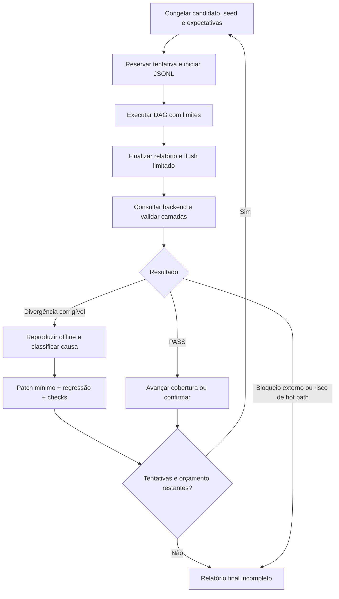

# Primeira execução real: loop de validação com até cinco tentativas

A correção do transporte de contexto tem [plano próprio de implementação e validação](../../docs/native-context-session-plan.md). Esta campanha só será retomada após seus pré-requisitos; suas cinco tentativas não incluem testes determinísticos da correção.

Estado: plano pronto para execução; nenhuma tentativa real foi iniciada por este documento. Escopo: preparar, executar, observar, diagnosticar, refinar a suíte e corrigir defeitos localizados e não bloqueantes do produto. A frota usa os modelos fixados abaixo; Claude permanece excluído.

## Resultado esperado

Demonstrar uma execução real de Codex, Grok e Antigravity com operações verificáveis, falhas inseridas previstas e um trace consultável de ponta a ponta. O relatório deve permitir reconstruir expectativas, resultados, causalidade, versão observada e limitações sem depender da conversa. A campanha encerra ao obter sucesso com confirmação, atingir cinco tentativas, esgotar o orçamento operacional ou encontrar um bloqueio externo que não possa ser resolvido dentro deste escopo.

Sucesso exige simultaneamente: resultado funcional correto; contrato v2 válido; trace do laboratório íntegro; evidência nativa independente por tarefa; visibilidade completa no backend dentro da janela; e confirmação depois da última alteração relevante. Um exit code zero, recibo OTLP ou captura de arquivo isolados não satisfazem esse conjunto.

## Definição de tentativa e limites

- Uma tentativa é uma invocação live de um cenário, com `--repeat 1`, snapshot do candidato, plano e modelos fixos, run ID e trace ID novos. Ela começa no primeiro despacho de execução ao adaptador, inclusive quando o spawn falha; falha de autenticação, quota ou timeout a partir desse ponto também consome a tentativa.
- Preparação, leitura de estado, compilação, testes determinísticos, consultas ao backend e análise não consomem tentativa. Qualquer calibração com inferência real deve estar dentro de uma das cinco tentativas; não criar chamadas de teste pagas fora da contagem.
- Não usar `--repeat 5`: o controlador precisa diagnosticar e decidir entre execuções. Não repetir automaticamente chamadas de agentes ou exportações. Retry de hipótese é uma nova tentativa com motivo explícito.
- Máximo de três processos de agentes em paralelo, 90 segundos por processo e 12 tarefas por tentativa; teto da sequência proposta: 45 invocações de harness. Máximo de 20 minutos por tentativa, incluindo flush e observação. Teto acumulado das tentativas: 75 minutos; ao atingir o teto, cancelar cooperativamente e registrar o que foi observado.
- Preparação/correções: timebox de 60 minutos. Ao consumir esse limite, concluir verificações já iniciadas e reportar trabalho restante; não abrir uma expansão arquitetural para consumir mais tentativas.
- Aplicar limite de output/tokens quando o harness suportar e o preflight confirmar a opção; preservar teto de stdout de 256 KiB e timeout. Registrar custo/tokens efetivos quando houver evidência, senão `unknown`. Não inventar preço máximo em dólares nem interpretar ausência de métrica como consumo zero.
- As tentativas executam em sequência. Cargo/build/test tem um único responsável por checkout: no Windows, testes concorrentes e relink do mesmo executável já causaram bloqueio de arquivo.

## Preparação, antes da tentativa 1

| Passo | Trabalho e evidência | Condição de saída |
|---|---|---|
| P0 — snapshot | Registrar branch, revisão, estado dirty, hash dos arquivos alterados relevantes, versão do laboratório e hashes dos binários candidatos. Registrar manifest/hash da instalação ativa separadamente. Preservar alterações existentes. | Identificar inequivocamente candidato, ativo e origem de cada evidência. |
| P1 — harnesses | Resolver executáveis nativos e versões; conferir `--help`, flags, modelo, reasoning, autenticação e quota por mecanismo sem inferência disponível. Não confiar em existência no PATH como prova de login. | Três harnesses utilizáveis ou bloqueio identificado antes de gastar inferência. Se auth só puder ser comprovada por execução, marcar desconhecida e testar dentro da tentativa 1. |
| P2 — telemetria | Descobrir destino efetivamente usado pelo daemon ativo e destino de exportação do lab; confirmar que são o mesmo backend/tenant. Configurar consulta de leitura real e template de navegação. Valores secretos não entram no relatório. | Endpoint/tenant e superfície de consulta conhecidos, sem confundir variáveis do shell atual com configuração do daemon já iniciado. |
| P3 — instrumentação | Inspecionar hooks sem alterá-los; verificar caminho canônico, quoting, coexistência e mecanismos reais de propagação. Tratar o fallback de ambiente do daemon como insuficiente para provar recebimento do ambiente do filho. | Hipótese e teste para ambiente do filho → hook → IPC → daemon → OTLP definidos. |
| P4 — oráculos live | Preparar validação determinística dos arquivos/resultados e parsing dos envelopes de cada harness. O live atual retorna UNSET após exit 0 e não mantém evidência funcional suficiente: refinar a suíte antes da campanha. Validar arquivos enquanto o workspace ainda existe; reter apenas evidência pequena/hash/resultado. | Cada operação tem oráculo independente; texto final do LLM sozinho não decide PASS. |
| P5 — fixtures reais | Expor fixtures HTTP/MCP locais com ciclo de vida limitado e confirmar que o agente tem ferramenta para acessá-las. O MCP atual valida mensagens offline: não registrá-lo como chamada MCP real. Ajustar o prompt live para permitir somente o loopback dos fixtures quando necessário, pois hoje ele proíbe toda rede. | Cenário demonstra operações reais com contadores/IDs do servidor e efeitos verificáveis; nenhuma configuração global de MCP é necessária. |
| P6 — observação | Implementar adaptador de consulta de leitura do backend escolhido, ou captura externa transitória mais consulta de leitura independente. O `VisibilityBackend` atual tem somente testes locais; não simular uma consulta real. | Consultar spans por trace ID, serviço/scope, janela e tenant, com evidência da resposta. |
| P7 — prova local | Executar testes de regressão dos novos caminhos, schema v2, exportação/rejeição, timeout, cancelamento, IDs, ausência de vazamento e distribuição. Rodar guardrails antes do primeiro live sobre código alterado. | Candidato consistente; nenhum risco conhecido de travar o harness ou misturar traces. |

Não executar `doctor` como se fosse leitura neutra: a implementação atual faz ping IPC e POST no coletor e imprime configuração. Quando usado, identificar esses probes, sanitizar a saída e excluir seus spans/efeitos dos critérios do cenário. O fato de HTTP 4xx/5xx ser descrito como endpoint alcançável não prova aceitação OTLP.

### Consulta SigNoz sem interface gráfica

Usar a conexão MCP autenticada do SigNoz, preferencialmente `signoz_get_trace_details` com o trace ID emitido pelo relatório, `includeSpans=true` e janela explícita em Unix milliseconds. Converter os nanos do relatório por código; ampliar a janela para acomodar ingestão. Não usar a tela para validar telemetria. Uma resposta 401 de HTTP sem credencial não demonstra indisponibilidade da conexão MCP.

Comparar os IDs retornados com o manifesto esperado, conferir `trace_id`, serviço, pais, status e timestamps; identificar separadamente spans do laboratório e spans nativos. Registrar ferramenta/fonte da consulta, instante e janela, IDs esperados/observados/faltantes, duplicatas e `webUrl` retornado sem reconstruí-lo. Consultas e resultados permanecem transitórios. O recibo OTLP é evidência de transporte; somente a resposta da consulta fornece evidência de visibilidade. Uma consulta MCP externa não altera retroativamente o campo `not_checked` do relatório original: registrar sua avaliação complementar explicitamente.

Interromper as consultas ao obter cobertura completa. Consultar novamente apenas se a primeira resposta for insuficiente e houver ingestão ainda pendente; não repetir consultas sobrepostas sem motivo. Falha de consulta vira `query_failed`, não ausência de spans nem falha de autenticação presumida.

### Regressão necessária: ambiente do hook atravessa o IPC

O cliente atual monta o payload como `WireHeader + stdin` em `crates/agent-otel-client/src/main.rs`; o fallback de `TRACEPARENT` em `crates/agent-otel-core/src/trace_id.rs` ocorre no processo que converte o evento, o daemon. Não há herança de ambiente do filho de volta ao daemon. Portanto, um teste que chama diretamente o conversor com a variável definida não cobre esse limite entre processos.

Antes de liberar a campanha live, reproduzir com pipe privado e hook real: daemon/listener sem `TRACEPARENT`, filho com contexto conhecido e JSON sem campo `traceparent`. Exigir que o contexto chegue ao receptor e ao OTLP com o mesmo trace e parent; confirmar a precedência do contexto explícito quando presente. O cliente deve continuar retornando `{}` e exit 0. A captura transitória do frame precisa distinguir ausência de contexto de falha de conexão. O comportamento atual perde o contexto nesse caso, impedindo a prova ponta a ponta; corrigir exige trabalho no hot path e seus benchmarks, não uma mudança nas expectativas da suíte.

Se nenhum backend/canal consultável estiver configurado, preparar os demais passos e registrar bloqueio de visibilidade; não gastar cinco tentativas tentando obter prova que a interface ainda não fornece. Se faltar login/MFA/quota, parar os passos dependentes e preservar o restante do diagnóstico.

## Sequência adaptativa de até cinco tentativas

| Tentativa | Se a anterior passou | Se houve divergência corrigível | Critério para avançar |
|---|---|---|---|
| 1 | `baseline`, seed 42: três tarefas encadeadas, sem falha inserida. Primeira prova real de cada harness/modelo e da propagação. | Não se aplica. | Três resultados verificáveis, root + casos do lab, spans nativos por tarefa, visibilidade completa. |
| 2 | `mixed`, seed 42: seis tarefas, ramificação/junção e falhas esperadas. | Reexecutar o cenário da tentativa 1 com a mesma seed, depois de reproduzir e corrigir a causa. | Falhas inseridas observadas sem falhas inesperadas; dependências e avaliações corretas. |
| 3 | `long-trace`, seed 42: doze tarefas, acompanhar um único trace enquanto cresce. | Reexecutar o último cenário que falhou, mantendo a seed e alterando apenas a causa diagnosticada. | Continuidade nativa e lab, root único, progresso observado e fechamento íntegro. |
| 4 | Confirmação do cenário mais exigente já aprovado, seed 43, sem alterar o candidato. | Nova execução dirigida pela hipótese corrigida; não variar seed junto com a correção. | Segunda seed aprovada, sem regressão; se ainda falta cobertura obrigatória, continuar. |
| 5 | Reserva para confirmação depois da última mudança, ou cenário obrigatório ainda não coberto. | Última tentativa da hipótese já reproduzida e corrigida. | Encerrar com evidências finais, mesmo quando incompletas; não criar uma sexta tentativa. |

Pode encerrar após quatro tentativas se baseline, mixed e long-trace estiverem aprovados e houver confirmação independente sem alteração de código entre os dois últimos sucessos. Se correções consumirem tentativas, reduzir cobertura é permitido somente no diagnóstico: o resultado da campanha permanece incompleto até os critérios obrigatórios serem cumpridos. A quinta tentativa não converte cobertura ausente em PASS.

Para o cenário longo, verificar pelo menos um span de progresso durante trabalho ativo e o root somente ao final. Se os agentes concluírem antes de 15 segundos, isso não é defeito: repetir sem motivo seria desperdício. Acrescentar antes da tentativa longa uma operação determinística de espera/loopback de 30 segundos no laboratório, explicitamente identificada como controle de duração e fora de consumo LLM. Ela precisa manter o root aberto e produzir progresso real; não atribuir essa duração ao modelo nem inventar timestamps. Esta capacidade de duração é um refinamento necessário se a execução natural for curta.

## Loop interno de cada tentativa

1. **Congelar entrada:** escolher cenário/seed conforme a tabela; registrar modelos, hashes, versão ativa/candidata e assertions antes do spawn. Uma tentativa não muda de modelo, código ou expectativa no meio.
2. **Iniciar captura transitória:** reservar campaign ID, attempt index, run ID, trace ID e root span ID. JSONL permite observar início, ondas, progresso, recibos e finalização. Usar `--repeat 1`; reter artefato temporário apenas enquanto necessário à validação.
3. **Executar:** processo por tarefa, ferramentas reais limitadas aos fixtures e workspace; manter dependências, falhas esperadas e identificadores. Sem agentes implementadores editando o código durante o live. Sem alterar falha prevista em resposta ao output observado.
4. **Finalizar:** aguardar a onda ativa em cancelamento cooperativo, fechar root uma vez e gerar relatório parcial se necessário. Não reenviar automaticamente spans cujo recebimento seja desconhecido. Flush/exportação continua limitado pelo timeout existente.
5. **Consultar:** buscar o trace imediatamente e depois nos instantes 2, 5, 10, 20, 40 e 60 segundos após a finalização, no máximo, respeitando deadline global de 65 segundos e timeout de até 5 segundos por consulta. Encerrar cedo ao obter cobertura completa. Isso é espera de ingestão, não nova tentativa de agente.
6. **Validar camadas:** executar a matriz abaixo; comparar IDs e cardinalidade, não só screenshots ou contagem agregada. Guardar IDs faltantes, duplicados, órfãos e resultados divergentes.
7. **Decidir:** PASS avança ou confirma; FAIL com reprodução aciona patch; INCONCLUSIVE por evidência ausente leva a corrigir observação antes de gastar nova tentativa. Repetir só se mudou algo relevante ou se existe hipótese transitória verificável. A mesma causa externa inalterada não justifica retry.
8. **Limpar e resumir:** remover somente temporários próprios depois da análise; manter evidência necessária para a próxima decisão em memória e telemetria. Persistir no Git apenas correções, testes e aprendizados gerais, sem payloads/capturas da campanha.

## Matriz de validação e oráculos

| Camada | Prova necessária | Falha / inconclusão |
|---|---|---|
| Modelo e processo | Executável/versionamento, modelo configurado, resultado de processo; modelo observado apenas quando fornecido pelo harness | Modelo substituído silenciosamente: FAIL; modelo observado ausente: desconhecido, sem inventá-lo; autenticação/quota impedem os casos dependentes |
| Operação | JSON validado; parser rejeita fixture inválido; teste do defeito falha pelo motivo esperado; HTTP registra 500→200/timeout; MCP registra initialize/chamada efetiva quando parte do caso | Narrativa do LLM ou exit 0 sem evidência funcional: INCONCLUSIVE; resultado diferente do oráculo: FAIL |
| Especificação | `requirement_id/ref`, `implementation_ref`, esperado/observado, classificação e versão do plano por assertion | Não alterar especificação para aceitar resultado incorreto; ambiguidade vira revisão explícita |
| Lab | Um trace, root único, IDs válidos/distintos, tarefas esperadas, tempos, links e controle separados; summary/schema/hash consistentes | Duplicatas, pais ausentes, mistura entre tentativas, cobertura incompleta: FAIL |
| Native bridge | Spans externos do bridge, scope/nome corretos, trace compartilhado e causalidade por tarefa; preservar captura original | Spans do lab renomeados não são prova. Se houver intermediários legítimos, validar caminho ancestral documentado, sem relaxar para mera igualdade de trace ID |
| Transporte | Recibos por tentativa/lote, rejeições e resultado desconhecido explícitos | HTTP 200 com partialSuccess não é aceitação total; indisponibilidade não vira ausência de spans de agente |
| Backend | Consulta efetiva ao tenant correto, IDs esperados presentes, janela e fonte registradas; deduplicação por span ID | Captura de arquivo/healthcheck não comprova visibilidade. IDs ainda ausentes no deadline: parcial/not_found; erro de consulta: query_failed |
| Produto/hot path | Harness continua funcional; sem bloqueio por telemetria; SLAs afetados medidos no candidato; hooks de terceiros preservados | Travamento, quebra do fail-open, perda de hooks ou regressão de SLA bloqueiam avanço e exigem classificação separada |

Os 4/7/13 spans dos perfis são a base do laboratório antes de controles adicionais. Não exigir essa contagem como total do trace real: cada harness pode emitir quantidade diferente de spans nativos. Exigir cobertura por tarefa e identidade de todos os spans do lab; documentar spans de controle acrescentados e tolerar somente extras nativos explicáveis.

## Refinar suíte versus corrigir produto

| Classe | Ação permitida dentro do loop | Evidência de correção |
|---|---|---|
| Defeito da suíte | Corrigir parsing de envelopes, fixture, oráculo, metadados, timeout justificado, captura, relatório ou compatibilidade de argumentos. | Reproduzir sem LLM; teste negativo antes do patch, positivo depois; executar teste CLI afetado. |
| Defeito não bloqueante do produto | Patch pequeno e localizado em normalização/atributo, classificação, parser, mensagem de diagnóstico, sanitização ou mapeamento. Preservar APIs, aliases, quotas e comportamento do harness. | Fixture capturada minimizada, teste de regressão no crate afetado, guardrails e evidência do binário candidato. |
| Defeito que invalida a prova principal | Perda de propagação entre processos, trace incorreto, IPC incompatível ou necessidade de redesenho do cliente não é “não bloqueante” só porque o agente segue funcionando. | Parar avanço live; reproduzir e preparar diagnóstico/patch reviewável dentro do timebox. Não declarar sucesso parcial como ponta a ponta. |
| Infraestrutura/acesso | Registrar login, MFA, quota, endpoint/tenant, TLS/rede e disponibilidade real. | Nova tentativa somente após mudança verificável; não alterar o produto para esconder erro externo. |
| Especificação ambígua | Registrar disputa entre esperado e implementação; propor correção explícita do contrato. | Não usar modelo maior como substituto de evidência; manter assertion inconclusiva até resolução. |

O `doctor` merece uma verificação dirigida: hoje descreve resposta HTTP como alcançabilidade e imprime endpoint/resource attributes. Refinar mensagens ou sanitização pode ser correção não bloqueante, **se** um teste comprovar diagnóstico enganoso ou exposição; não assumir bug de exportação a partir desse texto.

Quando houver alteração de cliente/core/IPC, executar benchmarks relevantes aos invariantes do AGENTS.md: cliente <1 ms, RTT p99 <3.000 µs, watchdog 3 ms, harvester <150 µs, parser >50.000 spans/s e binário <300 KB. O guardrail atual imprime limite de 350 KB; a campanha usa o requisito mais estrito de 300 KB e registra a divergência de especificação/implementação. Nunca enfraquecer o requisito para conseguir PASS.

## Candidato e instalação ativa

Correções da suíte são testadas no checkout. Correções do produto são compiladas/testadas como candidato em `target/`; o trace do daemon ativo continua atribuído ao hash da instalação ativa. Não declarar uma correção candidata validada por spans de um daemon antigo.

O contrato [local-runtime-contract.md](../../docs/local-runtime-contract.md), seção 1.6, exige: “Verification of candidate builds occurs strictly within `target/`, and promotion to active is a deliberate action via `agent-otel-bridge local install`.” Portanto, preparar patch, testes, hashes e instruções de rollback antes de qualquer decisão de promoção. Este plano não transforma execução de smoke em instalação automática.

Se for indispensável ativar um candidato para validar um defeito do produto, apresentar o resultado concreto e pedir somente a decisão de promoção naquele ponto, salvo se já houver autorização explícita para a ativação. Enquanto isso, concluir todas as validações independentes. Alternativa preferida: candidato isolado com IPC/endpoint próprios, **somente se** suporte de isolamento for verificado no código e no binário; não assumir que variáveis de ambiente são suportadas pelo cliente ultra-lean.

## Modelos, divisão de trabalho e custo

| Trabalho | Executor fixo | Razão / limite |
|---|---|---|
| Preflight, invocações, limites, parsing, diff e assertions | Rust/Cargo e ferramentas determinísticas; sem LLM adicional | Evita custo e variação em decisões mecânicas. |
| Triagem inicial de cada tentativa | Codex `gpt-5.6-luna`, low | Recebe só resumo, assertions divergentes, IDs e trecho mínimo de evidência. |
| Correção localizada de suíte/produto e teste de regressão | Codex `gpt-5.6-luna`, medium | Uma hipótese e arquivos atribuídos; não expandir escopo para redesign. |
| Causalidade entre processos, concorrência ou finalização ambígua | Codex `gpt-5.6-terra`, medium | Acionar apenas quando Luna não consegue fechar uma hipótese com reprodução ou há risco de IPC/hot path. |
| Revisão independente de patch que toca produto/hot path | Codex `gpt-5.6-terra`, medium | Revisar invariantes e evidência, sem repetir toda a investigação. |
| Relatório final e atualização de aprendizado geral | Codex `gpt-5.6-luna`, low | Compilar evidências estruturadas; nenhuma reinterpretação de PASS. |
| Frota runtime | Codex `gpt-5.6-luna` low; Grok `grok-4.5` low; Antigravity `gemini-3.8-flash-low` low | Confirmar disponibilidade no P1; sem Claude e sem fallback silencioso. |

Máximo de dois workers de implementação simultâneos em arquivos disjuntos durante diagnóstico: por exemplo, Luna analisa envelope e Terra analisa causalidade. Um único responsável executa Cargo e integra. Durante live, pausar edits e builds. Oráculos, seleção de próxima tentativa e critérios de sucesso são determinísticos; o coordenador usa modelos para interpretar divergências, não para fabricar aprovação. Não escalar automaticamente para modelos maiores do que Terra.

## Automação e resultado final

Implementar o controlador em `dev/fleet-smoke`, com máquina de estados `prepare → run → observe → assess → repair → verify → next/stop`, contador máximo 5 e deadline global; sem `.ps1`, cron ou agendamento persistente. Não inventar um comando já disponível: hoje o operador encadeia `cargo fleet-smoke plan/preflight/run/verify`; o controle de campanha é refinamento a implementar antes da automação completa.

Registrar em memória e na telemetria: campaign ID, attempt index, run/trace/root IDs, cenário/seed/hash, hashes candidato/ativo, modelos configurados/observados, tempos, custos conhecidos, assertions por camada, recibos, IDs faltantes, alterações entre tentativas e decisão. Cada tentativa tem trace próprio; correlacionar a campanha por atributo/link, nunca reutilizar trace ID para esconder um retry. `campaign_id` e `attempt_index` ainda precisam ser acrescentados ao contrato do controlador/lab e documentados.

O relatório final informa: tentativas consumidas, cobertura obtida/faltante, links de traces, resultado por camada, correções da suíte, correções candidatas do produto, estado da instalação ativa e limitações. Uma correção feita após a quinta tentativa pode ter testes locais aprovados, mas deve constar como **não revalidada live**. Não persistir arquivos brutos da campanha no repositório nem criar banco local; somente código, testes e notas técnicas generalizáveis permanecem no source.
