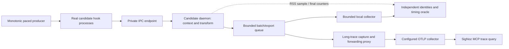

# Three-attempt load and long-trace loop

This extends the passing architecture suite. It does not replace historical benchmarks or change their SLAs. Implementation and execution are authorized on candidate binaries on the current Windows host; the installed runtime and global hooks remain untouched. Source is development-only; local execution data uses an owned temporary directory. Telemetry intentionally submitted to the configured collector follows that backend's retention policy.

## Boundaries and diagnosis

The measured load calls no paid agent. Antigravity leads authoring and result analysis outside the timed workload; Codex integrates and reviews. The long trace represents a controlled orchestration protocol: a declared synthetic controller root lasting at least 60 seconds, with 30 real hook/daemon descendants chained through inherited TRACEPARENT. It does not certify real provider behavior or a paid multi-agent fleet.

| Boundary | Evidence | Acceptance and interpretation |
|---|---|---|
| Generator | Intended/actual offer timestamps, admission skips, lateness p95/p99 | Missed offers are generator limits, never claimed as daemon capacity |
| Hook | Process start to exit p50/p95/p99; exact `{}` and exit 0 | External lifecycle is separate from the internal <1 ms requirement |
| IPC | Existing isolated 0x01/0x04 microbenchmark | Preserve <3,000 us p99 and complete sample counts |
| Parsing/context | Existing historical and resolved-path microbenchmarks, architecture cache cases | Keep >50,000 spans/s and <150 us historical results distinct; no substitution by E2E rates |
| End-to-end | Producer monotonic start to actual collector receipt; offered/completed/delivered rates | All admitted events require exact once-only delivery and correct parent; timing is characterization |
| Queues/export | Final admitted/transformed/accepted/loss counters, peak queued bytes, zero residual items/bytes | Reconcile every logical event; unknown is distinct from confirmed loss; unavailable queue latency is not measured |
| Memory | Daemon RSS sampled every 100 ms, baseline/peak/delta | Characterization; process RSS is not allocator usage or a newly invented SLA |
| Long trace | One trace ID, unique span IDs, exact chain, root timing, first/middle/last progress | At least 60 s root duration; 30 native descendants; no orphan or duplicate identities |
| Backend | Explicit UTC window and exact ID through SigNoz MCP | HTTP acceptance is insufficient; compare observed root and descendant identities/parents |
| Integrity | Before/after source, candidates and actual active installation hashes | Missing identity evidence cannot pass; verified cleanup is mandatory |

## Fixed work distribution

| Task | Dependencies | Files / owner | Exit criterion |
|---|---|---|---|
| L1 | None | This plan; Codex root | Boundaries, budgets, correction rules and stop criteria fixed |
| L2 | L1 | `load_probe.py`; Antigravity Gemini 3.8 Flash high | Four bounded paced load levels, real hook path, timing/queues/RSS evidence |
| L3 | L1 | `long_trace_probe.py`; Antigravity Gemini 3.8 Flash high | Bounded forwarding capture, root and native chain, query-ready identity manifest |
| L4 | L2 | Load integration/schema/tests; Codex GPT-5.6 Sol medium | Actual API contracts, negative oracles, no false pass or process leak |
| L5 | L3 | Long-trace integration/schema/tests; Codex GPT-5.6 Sol medium | Partial OTLP response and invalid chain fail; actual report matches schema |
| L6 | L4,L5 | `load_campaign.py`; Codex root coordination | Exclusive temporary ledger, maximum three attempts, bounded process trees and immutable per-attempt reports |
| L7 | L6 | Measurements; deterministic controller under root supervision | Writers and builds frozen; probes run sequentially to avoid competing benchmark workloads |
| L8 | L7 | Analysis; Antigravity Flash medium/high, root QA | Classify generator, harness, product or backend cause before proposing changes |
| L9 | L8 | Minimal affected files; Antigravity author, Codex integration | Demonstrated regression test before/after; affected checks and candidate rebuild when necessary |
| L10 | L7–L9 | SigNoz MCP and final assessment; root | Report measured/pass/fail/not-measured separately and stop by attempt three |

Antigravity CLI model availability is checked locally. Its source is relayed to Codex for integration if the existing hook prevents reliable tool use; no installation changes or permission bypasses are used. Sol handles integration that previously exceeded mechanical Luna work. Model calls never occur inside a timed probe.

## Attempts

1. **Baseline:** one repetition of the unchanged six-case architecture suite; paced load at concurrency 1/4/8/16 for four seconds each, respectively 96/192/384/768 scheduled events (nominal offers 24/48/96/192 per second, bounded event and outstanding-work counts); historical microbenchmarks and IPC once; 100 internal-hook samples with observer comparison; 60-second long trace. Record actual admitted counts, generator limits and all timings. Query SigNoz for the exact resulting trace after ingestion.
2. **Targeted confirmation:** change only a demonstrated faulty oracle or one identified product boundary. Keep comparable seed, load configuration and instrumentation. Record precisely what changed; rerun the full bounded attempt and affected regression checks. If no defect warrants editing, use this attempt for independent repeatability rather than inventing an optimization.
3. **Final confirmation:** validate the selected candidate or the last justified correction. No further attempt is allowed. A failed or unavailable requirement remains explicit; successful local transport cannot close missing backend evidence.

Preparatory unit tests do not consume measurement attempts. The ledger reserves an attempt before starting any probe, and retains unsuccessful outcomes. The controller itself does not rewrite code or hide previous reports. Refinement is coordinated between invocations. Stop early only if the requested coverage and repeatability evidence are sufficient, or a genuine external blocker prevents dependent work; continue independent checks.

Probes run in private process trees with bounded capture. Each whole attempt is finite; load <=180 s, architecture <=180 s, micro <=90 s, IPC <=50 s, long trace <=100 s for the default 60-second duration. A failed probe does not prevent unrelated probes from gathering evidence. SigNoz uses MCP/API only, a specific trace ID and a finite ingestion wait; no screen automation. Actual native Linux/macOS remains not measured.

## Surgical change rule

Require a reproducible observation, the affected code boundary, a falsifiable expectation, and a before/after comparison. Preserve old benchmark results. Do not infer a parser bottleneck from process-launch saturation, change cache TTL to make a test pass, or relax loss/parent/cleanup checks. Rebuild only if product code changes; one Cargo owner at a time. Run affected tests and final project guardrails. Leave source changes reviewable without installation, commit or publication.

Reports include campaign/run/attempt IDs, model-role provenance, environment, source and binary hashes, profile settings, trace/span/parent IDs, source of each observation, cleanup status and explicit limitations. Runtime captures are removed after final evaluation; the code and this plan remain in the source tree.

## Refinement decisions and reusable backend validation

Keep backend inspection separate from transport: save the exact SigNoz MCP response in the temporary campaign directory, then use `backend_trace_validation.py --report <long-report> --backend <mcp-response>` to reconcile identities, parents, completeness and actual root duration. Preserve the returned backend URL verbatim. An unavailable or incomplete backend query cannot pass this boundary.

Two narrowly scoped harness defects informed this loop: a reused readiness helper requires an absolute deadline rather than a `timeout` keyword, and elapsed monotonic time alone does not guarantee the same wall-clock duration in exported timestamps. Regression tests cover post-spawn exception cleanup and bounded dual-clock completion. Never clamp timestamps or add acceptance tolerance to the minimum trace duration. Model-generated diagnoses are hypotheses: unsupported claims about timeout contention, subprocess use or unrealistic SLAs were rejected during QA. The historical performance requirements remain unchanged.

The development HTTP fixture also avoids a blocking wake-up connection during destruction: its listener is already nonblocking and polls the stop flag. An exited-worker regression covers the closed-port race while preserving the existing one-second cancellation assertion. This change affects only the development fixture, not the installed bridge.
