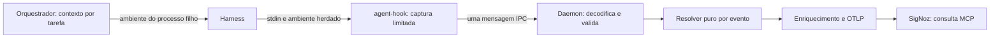

# Correção da propagação nativa: contrato e alternativas

Plano de execução desta correção: [sessão de implementação e validação](../../docs/native-context-session-plan.md). Este documento mantém a análise de alternativas; a execução da campanha da frota é independente.

Estado: contrato implementado em 2026-09-14; as seções abaixo preservam a análise e os critérios de implementação. Evidência, limitações e autorização de publicação/instalação estão no plano da sessão acima. Complementa `first-live-run-plan.md`. A campanha permanece em preflight, com zero tentativas live consumidas.

Escopo confirmado em 2026-09-14: implementar e validar a correção de contexto como entrega independente da campanha de smoke. Fila recuperável, memória compartilhada, guardião e integração opcional com serviço ficam adiados no [backlog RES-001](../../docs/resilience-backlog.md). Não são pré-requisitos desta correção.

## Problema e escopo

Na baseline anterior à correção, o cliente transmitia somente WireHeader e stdin, e o daemon consultava seu próprio ambiente em vez do ambiente do hook. A reprodução com pipe privado confirmou a perda do TRACEPARENT fornecido apenas ao filho. Esse fallback global também podia vincular eventos independentes ao contexto do daemon; o envelope por evento implementado elimina essa dependência no caminho IPC.

A correção deve transportar o contexto da origem por evento, resolver a precedência sem estado global mutável e preservar o fail-open. Não precisa de persistência, serviço adicional, negociação síncrona ou instruções de tracing no prompt. Código de produto necessário fica nos crates existentes; fixtures, probes e campanha ficam no laboratório não distribuído.

Limite da promessa: conectar os eventos nativos ao span da tarefa não cria automaticamente spans de duração real nem uma hierarquia entre todas as ferramentas internas. Um hook filho também não consegue atualizar o ambiente do processo pai. A instrumentação do harness deve fornecer contexto específico quando for necessária causalidade mais profunda. Não chamar uma estrela de spans irmãos de cadeia causal completa.

## Alternativas

| Alternativa | Vantagem | Custo ou limitação | Decisão |
|---|---|---|---|
| A. Mensagem IPC com contexto separado do JSON | Preserva stdin byte a byte; parsing no daemon; distingue contexto ausente; evolução explícita | Exige atualizar receptor e emissor, testar coexistência e rollback | Recomendada |
| B. Inserir traceparent no JSON no cliente | Pode funcionar com o daemon atual | Requer interpretar JSON/aliases/duplicatas no cliente; altera payload e aumenta trabalho no hot path | Reserva apenas se A for inviável e benchmarks aprovarem |
| C. Fazer cada adaptador/harness incluir o campo no payload | Aproveita o campo explícito já suportado | Soluções específicas por fornecedor; cobertura desigual; dependência de APIs dos harnesses | Complementar para hierarquia interna, não correção geral |
| D. Daemon exclusivo por tarefa, iniciado com TRACEPARENT | Contorna o problema em demonstração isolada | Custo de processos/exportadores; não resolve daemon compartilhado nem pais por evento | Diagnóstico, não solução de produto |
| E. Registro externo por PID/conversa ou leitura do ambiente de outro processo | Evita mudar o payload | Corridas, reutilização de PID, permissões, estado e limpeza; inadequado ao caminho crítico | Rejeitada |

Não usar concatenação ingênua de campo JSON: valores existentes, aliases, duplicatas, JSON truncado e escaping tornam a precedência ambígua. Não colocar todos os agentes sob o TRACEPARENT do daemon para fazer a comparação de IDs passar.

## Arquitetura proposta



```mermaid
sequenceDiagram
 participant L as Laboratório
 participant H as Harness e hook
 participant D as Daemon candidato isolado
 participant S as SigNoz
 L->>H: Executa tarefa com TRACEPARENT no ambiente
 H->>D: WireHeader + contexto de origem + stdin original
 Note over H: Sem aguardar resposta; fail-open preservado
 D->>D: Resolve payload válido, contexto de origem, fallback de conversa
 D->>S: Exporta spans nativos
 L->>S: MCP consulta trace ID e janela
 S-->>L: IDs, pais, serviço, status, timestamps
 L->>L: Compara manifesto e evidência nativa
```

### Contrato de transporte

Manter o frame externo atual versão 1 e o HookPayload antigo 0x01. Reservar `HookPayloadWithContext = 0x04` após confirmar ausência de colisão em todos os consumidores. Não mudar silenciosamente a interpretação do corpo 0x01.

Corpo proposto: `WireHeader[3] | envelope_version:u8=1 | context_len:u16 little-endian | context_bytes[context_len] | stdin_bytes[restante]`.

- `context_bytes` contém somente TRACEPARENT, nunca um dump de ambiente. Limite de engenharia: 512 bytes; acima do limite, omitir contexto, nunca truncá-lo. Este limite é local, não uma alegação de limite da especificação W3C.
- Comprimento zero representa contexto ausente ou inutilizável. O cliente novo usa o envelope também nesse caso, para que ausência seja explícita.
- Limite de stdin continua 256 KiB; overhead máximo do corpo é 518 bytes. Uma única mensagem, sem retry/handshake e sem arquivo de configuração.
- O cliente copia os bytes com leitura de ambiente apropriada à plataforma e limitada onde suportado; não adiciona serde, regex, Tokio ou cliente HTTP. Medir a alocação real da API de ambiente utilizada, não apenas limitar o valor depois de uma alocação ilimitada.
- O decoder valida comprimento mínimo, limite, versão e offsets antes de acessar fatias. Envelope estruturalmente inválido é descartado com diagnóstico limitado. TRACEPARENT inválido dentro de envelope válido não invalida um evento JSON utilizável.
- Não transportar tracestate/baggage nesta correção. Documentar o escopo como propagação de TRACEPARENT, sem alegar implementação completa de Trace Context.

### Resolução e enriquecimento

Criar um resolvedor puro que recebe explicitamente contexto do payload, contexto de origem e conversa. Ordem: payload válido > origem válida > fallback de conversa. Payload inválido permite tentar origem; ambos inválidos permitem fallback. Nunca consultar nem modificar o ambiente global nesse caminho do daemon, inclusive para mensagens legadas.

Preservar funções públicas existentes como wrappers de compatibilidade quando necessário; o caminho IPC deve usar a nova API explícita. Atualizar também `auto_enrich`: hoje ele usa presença de TRACEPARENT no ambiente para inferir lineage. Sua variante usada pelo daemon deve receber contexto resolvido e não inferir profundidade exata apenas da existência de um parent. Preservar metadados explícitos do harness; distinguir parent de span de parent de agente.

Usar um parser compartilhado, sem alocação desnecessária, com validação de versão, separadores, hex, IDs não nulos e flags. Preservar o sampled bit; não transformar 00 em 01. Cobrir versões futuras segundo as regras de processamento da referência W3C, dentro do limite de transporte. O parser atual aceita versão/flags malformadas e usa índices de string que merecem teste com Unicode; corrigir sem permitir panic.

Referência normativa: [W3C Trace Context, formato e processamento](https://www.w3.org/TR/trace-context/). As escolhas de envelope, limites e migração acima são decisões do projeto, não exigências desse documento.

## Compatibilidade e ativação

| Emissor / receptor | Comportamento esperado |
|---|---|
| Antigo / novo | JSON legado aceito; contexto explícito respeitado; env-only continua indisponível; sem fallback global do daemon |
| Novo / novo | Envelope aceito; precedência e contexto por evento corretos |
| Novo / antigo | Tipo desconhecido rejeitado; hook continua fail-open, mas perde telemetria: combinação não suportada |
| Antigo / antigo | Sem mudança; permanece o defeito conhecido |

Não enviar duplicado em formato antigo para tentar compatibilidade: produziria eventos extras e associação ambígua. Atualizar receptor primeiro e emissor depois; verificar capacidade do receptor fora do hot path antes da promoção. Trocar arquivos não substitui um daemon já em execução: o procedimento deve parar/reiniciar e confirmar o binário/processo efetivo. Rollback reverte o par e reinicia o receptor correspondente. Registrar a mudança intencional de fallback em notas de compatibilidade.

Primeira validação exclusivamente com binários candidatos em target, pipe privado e coletor de teste. A instalação ativa e hooks de terceiros permanecem intactos. Promoção posterior via `local install`, com hashes, capacidade de protocolo, rollback e autorização de ativação; nunca substituir hooks por caminhos de target.

## Pacotes de trabalho e modelos

| Ordem | Trabalho fechado | Modelo/executor | Entrega verificável |
|---|---|---|---|
| 1 | Fixar contrato e reproduzir perda em subprocesso | Rust/Cargo; Luna medium para fixtures | Teste vermelho para env-only; teste contra contaminação pelo ambiente do daemon |
| 2 | Codec, mensagem nova e decoder compatível | Luna medium | Vetores binários, limites, truncamento e rejeição de versões desconhecidas |
| 3 | Captura no hook, resolver por evento, integração no daemon e lineage | Terra medium | Correção coordenada do limite entre processos, sem estado global; testes verdes |
| 4 | Regressões de parser e relatório, documentação | Luna medium | Assertions ligadas aos requisitos e diagnóstico de origem/ausência |
| 5 | Revisão de diff e caminhos negativos | Luna medium; Terra só para divergência causal | Revisão independente dos testes, precedência e concorrência |
| 6 | Benchmarks, guardrails, probe real e comparação SigNoz | Ferramentas determinísticas | Evidência do candidato e decisão de liberar campanha |

Não paralelizar edits nos mesmos arquivos. Codec e fixtures podem ser trabalhados em paralelo após contrato fechado; Cargo tem um único responsável. Nenhuma inferência de harness é necessária para os testes de protocolo. Modelos live permanecem os já fixados no plano da campanha; não aumentar modelo para encobrir falha de instrumentação.

## Matriz de aceitação

| Requisito | Estímulo | Resultado exigido |
|---|---|---|
| CTX-01, AGENTS 3.4 | Somente env do hook, daemon sem contexto | Trace e parent exatos no frame decodificado e no OTLP |
| CTX-02, precedência | Payload A e ambiente B, ambos válidos | A vence; payload original preservado |
| CTX-03, isolamento | Dois filhos A/B intercalados, daemon com contexto C | Nenhum evento adota C ou contexto do outro filho |
| CTX-04, ausência | Sem contexto, inclusive mensagem legada | Fallback de conversa; sem falso parent do daemon |
| CTX-05, entradas negativas | Unicode, hex inválido, versão ff, IDs zero, flags ruins, comprimentos inválidos | Sem panic; contexto inválido não adotado; fallback documentado |
| CTX-06, transporte | Envelope truncado, versão desconhecida, payload no limite | Rejeição limitada e sem alocação fora dos limites; frame íntegro aceito |
| CTX-07, flags | Contexto válido com sampled 00 e 01 | Bit preservado no contexto/OTLP conforme política explícita, sem promoção implícita |
| CTX-08, compatibilidade | Quatro combinações de versões | Resultado exatamente como matriz; nenhuma duplicação |
| CTX-09, fail-open | Pipe ausente, ocupado, receptor lento | Hook não bloqueia harness; resposta específica do evento e exit 0 preservados |
| CTX-10, backend | Consulta MCP de trace conhecido | Spans nativos no serviço/scope correto, pais esperados e IDs sem mistura |

O teste decisivo inicia processos reais com ambientes distintos; um teste unitário que altera o ambiente do próprio conversor não o substitui. Probes geram somente eventos locais conhecidos, não chamadas pagas. Contexto de teste conhecido não é evidência de uso real de uma ferramenta por LLM.

Comparar baseline/candidato release na mesma máquina: execução cliente <1 ms, RTT p99 <3.000 µs, watchdog 3 ms, binário <300 KB, harvester <150 µs e parser >50.000 spans/s. Publicar amostras, percentis e escopo de medição; separar tempo externo de criação do processo do tempo interno sem usar essa distinção para relaxar o SLA. Se a baseline já falhar, registrar e não declarar SLA aprovado por ausência de regressão.

Executar fmt, clippy workspace/all-targets sem warnings, testes workspace incluindo doc-tests, cargo doc e cargo guardrails. Guardrail de tamanho atual menciona 350 KB: a aceitação continua usando os 300 KB do AGENTS.md. Linux/macOS validam codec/parser e oráculos portáveis; named pipe e watchdog têm validação nativa Windows. Sem scripts ps1.

## Retomada da campanha

Liberar tentativa 1 somente após CTX-01 a CTX-10 e SLAs aprovados, oráculos live integrados e fixtures reais acessíveis. A correção do transporte é necessária, mas não completa os passos P4/P5 da suíte.

Validar inicialmente um par candidato isolado. Quando hooks reais precisarem do cliente corrigido, ativar o par pela rotina canônica antes de executar a frota; atribuir todo resultado ao hash efetivamente executado. SigNoz é consultado por MCP, sem tela. Relatório identifica run/trace/root/task IDs, hashes, versões de protocolo, janela, fonte da consulta, cobertura nativa e IDs faltantes. Dados e capturas são transitórios.

Retomar o loop de até cinco tentativas do plano existente, sem descontar testes determinísticos de protocolo. Parar se houver regressão de SLA, mistura de traces ou perda de fail-open; não alterar expectativas para liberar a campanha.
