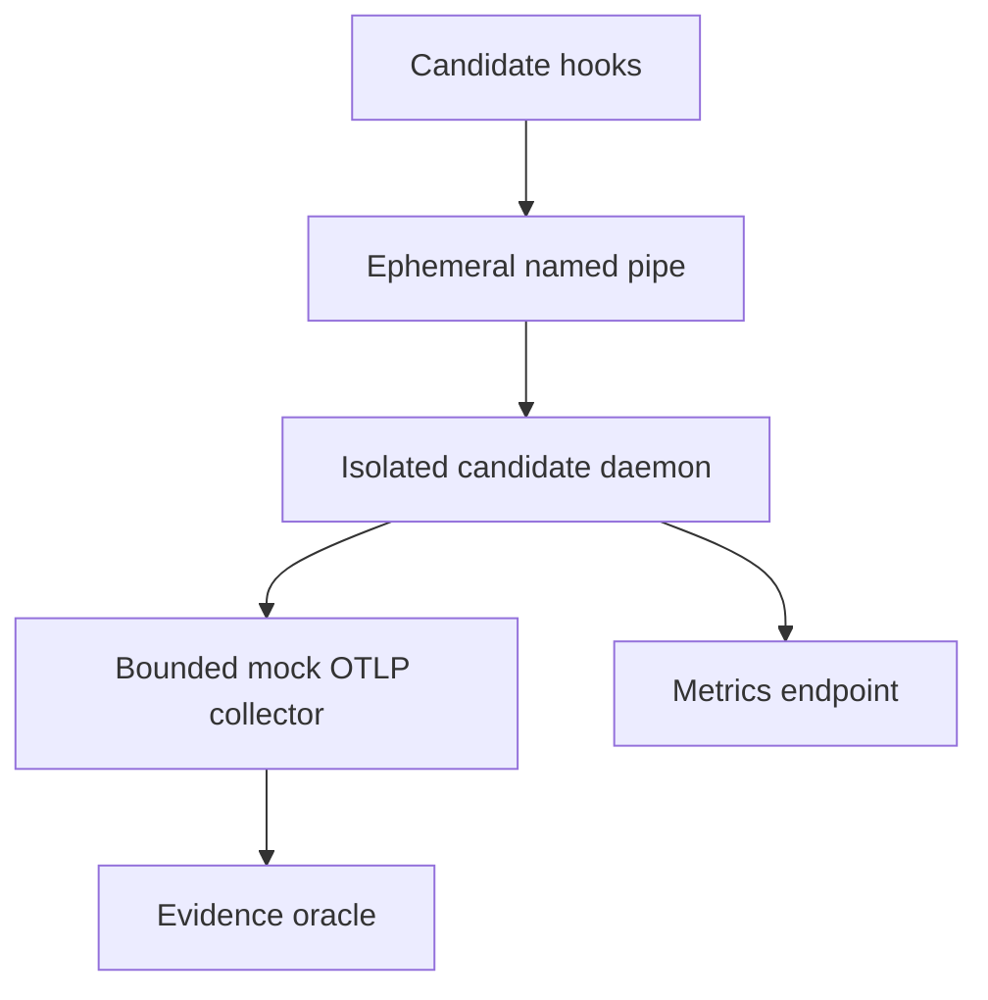
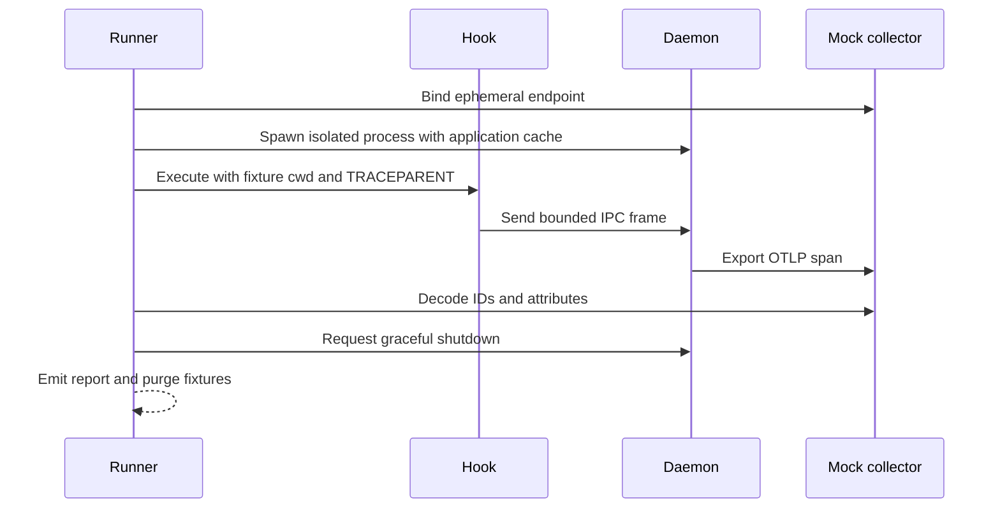

# New Architecture Test Suite Plan & Execution Specification

> Historical protocol. For current implementation and acceptance use [production-path-round.md](production-path-round.md). Mixed compatibility-wrapper throughput and full-harvest <150 us are retired active gates; original observations below remain historical evidence.

This dev-only suite validates isolated candidate daemon and hook processes on Windows. It characterizes end-to-end delivery while preserving existing hard SLAs as normative requirements. E2E timing is empirical characterization; correctness and state transitions are pass/fail assertions.

## Architecture



## Execution flow



## Closed task breakdown

| Task | Dependencies / files | Owner/model | Exit criterion |
|---|---|---|---|
| TASK-01 | None; `architecture_suite.py` collector | Antigravity, Gemini 3.8 Flash medium, high for QA corrections | Decode actual trace/span/parent IDs and attributes; bound bodies and stored evidence |
| TASK-02 | 01; runner lifecycle | Antigravity author; Codex Sol medium integration | Private pipe/endpoint, readiness, bounded capture, daemon drain before collector shutdown, verified cleanup |
| TASK-03 | 02; cold/warm cases | Antigravity Flash medium/high | Cold application cache emits provided/event and no branch; warm probe emits fresh/alpha; no claim of OS cold disk |
| TASK-04 | 03; stale case | Antigravity Flash medium/high | Prime fresh alpha, mutate HEAD, cross fixed 1 s TTL, observe stale alpha then fresh beta |
| TASK-05 | 03; workspace case | Antigravity Flash medium/high | Two temporary workspaces emit their own paths and distinct branches with fresh states; batch size 1 avoids aging the first sequentially primed snapshot beyond the fixed 1 s TTL |
| TASK-06 | 02; exporter case | Antigravity Flash medium/high | Hold actual trace request; receive daemon metrics during hold; release and reconcile exact delivery |
| TASK-07 | 02; concurrent case | Antigravity Flash medium/high | Default 24 events / concurrency 4, all responses valid, no missing/duplicate/unexpected IDs |
| TASK-08 | 03–07; `tests/test_architecture_suite.py`, `architecture-report-v1.schema.json`, README | Codex Luna low extraction/docs; Sol medium final tests/schema | Negative oracle tests execute; schema matches actual report; source/candidate/active identity gates |
| TASK-09 | 08; transient campaign ledger and reports | Codex root QA; Antigravity result analysis | Freeze writers, execute three repetitions, evaluate all assertions, repair measured defects in at most five attempts |

Antigravity supplied the executable scenario implementation through CLI response relay; Codex integrated the files because the existing installed hook prevented reliable Antigravity tool use. No hooks were changed. Luna handled the initial mechanical work; failed integration checks were escalated to Sol medium. This records actual ownership rather than claiming native agent coordination inside the deterministic workload.

## Invariants

1. Freeze writers and candidate binaries; compare identities before and after.
2. Bound campaign execution at 175 seconds and subprocess capture.
3. Existing hard SLAs remain normative: hook <1 ms, watchdog 3 ms, harvester <150 µs, IPC p99 <3 ms, parser >50,000 spans/s, binary <300 KB. This suite does not relax or certify them. Prior failures remain failures pending their own valid measurements.
4. E2E and other timing are characterization; unavailable timing/RSS is `not_measured`.
5. Local decoded spans are synthetic evidence and do not prove SigNoz, native fleet, provider, Linux/macOS, or long-trace completion.
6. Never install, activate, restart, or mutate active runtime/global hooks. Source and reports remain unshipped/transient.
7. No paid provider calls; native fleet work is separate Antigravity-owned work.
8. QA repair is limited to five attempts, then evidence freezes.

Each scenario records its daemon batch size, batch timeout, and the fixed 1-second context freshness TTL. The multi-workspace isolation case uses batch size 1 so collector delivery between its sequential priming probes does not consume the freshness window. Other cases retain the default 50-event/200 ms profile; the blocked-exporter case retains its 1-event/50 ms profile.

## Execution and acceptance loop

1. Run oracle unit tests and schema checks before consuming a measurement attempt. One owner may run Cargo if a product change requires rebuilding; otherwise reuse the identified candidate binaries.
2. Freeze all source writers. Record run/campaign IDs, seed, actual environment, source state, candidate hashes and actual installed hashes. Start a bounded process tree with captures and a transient attempt ledger.
3. Execute all six cases three times using seeded IDs and scenario order. Scenario deadlines are test budgets, not new product SLAs. Record external hook lifecycle and send-to-collector timing separately from unavailable IPC-only/stage/RSS measurements.
4. Require correctness assertions, response validity, exact identity accounting, shutdown reconciliation, cleanup and integrity gates. An exception, absent sample, missing diagnostics or unfinished case cannot become approval.
5. On failure, distinguish harness defect, product defect and environmental limitation. Repair only demonstrated nonblocking defects in scope, rerun affected unit checks, freeze again and consume the next attempt. Never overwrite earlier evidence or continue beyond five attempts.
6. Stop when the round has a defensible conclusion. Report local trace IDs with actual span/parent IDs and explicitly state backend visibility is not checked. Purge owned fixtures and transient captures after evaluation; keep only suite source/specification in the repository.

Throughput saturation, RSS ceilings, per-stage histograms, observer-on/off comparison, native fleet long traces and SigNoz visibility remain separate profiles. SigNoz verification must use MCP/API. Linux/macOS require native hosts and are not measured here. No synthetic collector result closes those requirements.

## Command

```text
python dev/fleet-smoke/architecture_suite.py --daemon-bin target/release/agent-otel-bridge.exe --hook-bin target/release/agent-hook.exe --seed 42 --repeats 3
```
