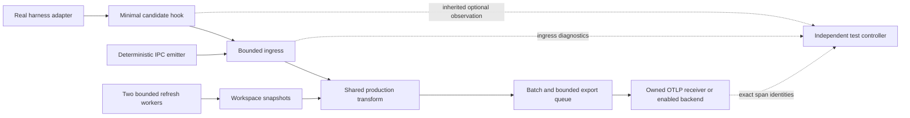

# Production-path acceptance round

Status: implementation and isolated validation authorized on 2026-09-14, following the Codex/Grok architecture review. This is the current execution specification. Previous campaign documents and published release notes are historical evidence; their mixed-parser and synchronous-harvest performance gates do not govern this round.

## Scope and ownership

Candidate source on `codex/production-path-acceptance`, based on release 0.5.2. Implement, validate and refine through at most three measurement attempts. Preserve installed binaries, global hook settings, third-party tools and rollback state. Publication and activation are outside this round. Python/Rust orchestration; no ps1 scripts. Runtime reports use an owned temporary directory; source and specifications remain in Git. SigNoz via MCP/API only.

| Work item | Primary executor | Exclusive edit scope | Acceptance owner |
|---|---|---|---|
| A: production-path extraction, benchmark and deterministic IPC emitter | Antigravity, gemini-3.8-flash-low; medium on concrete review defects | daemon transform extraction/module exports; new dev examples production_path.rs and ipc_load.rs | Codex root |
| B: hook transport observation | Codex gpt-5.6-sol medium (bounded unsafe/I/O task) | client hook_observer.rs/main.rs and observer protocol/probe tests; hook_timing_probe.py as needed | Codex root |
| C: adapter invocation and valid doctor probe | Codex gpt-5.6-luna medium | CLI hooks.rs/doctor.rs and dedicated CLI conformance tests | Codex root |
| D: current policy, report validation and campaign integration | Codex root; Luna for mechanical follow-ups | AGENTS.md, active lab docs, new round controller/schema/tests | Codex root |

Executors report exact model, files, commands, tests and unresolved concerns. One Cargo owner at a time, initially root. Agents implement without Cargo until granted ownership. Agy owns A and recommends experiment/refinement order; root reviews and executes deterministic commands if Agy tools are blocked. A blocked Agy tool is disclosed; resume by evidence/code relay without changing installed hooks. No silent model substitution. Upgrade model only after a specific failed review, not preemptively.

## Architecture and flow



```mermaid
sequenceDiagram
  participant Q as Codex acceptance
  participant A as Agy implementation/execution
  participant S as Smaller Codex tasks
  participant C as Candidate suite
  Q->>A: Fixed contracts and file ownership
  Q->>S: Independent bounded changes
  A-->>Q: Patch and experiment proposal
  S-->>Q: Patch and focused regressions
  Q->>C: Review, build, reserve attempt
  C-->>Q: Source-bound report and identities
  Q->>A: Accepted findings or one causal correction
  Note over Q,C: Maximum three measurements; prior failures remain visible
```

## Contracts and mandatory validations

### A1: measuring production, not compatibility wrappers

Extract the current per-event transformation into a reusable production function used by both daemon and benchmark. Preserve decoding 0x01/0x04, client identity, trace precedence, event normalization, context state/age, metadata, attribute aliases and error outcomes. Keep quota scheduling, clocks, batch/queue side effects at explicit boundaries. A pure helper must not read environment/filesystem. The benchmark must state the exact subset measured; never label transformation-only as full-daemon capacity.

Use one deterministic mixed corpus (workspace provided/missing, tools, agent events, invalid inputs separately), black_box outputs and stable semantic checks. Emit versioned JSON: parser-only parse_slice throughput with strict >50000/s gate; actual shared transformation throughput as baseline; cache fresh-hit, miss+enqueue and stale lookup latency p50/p95/p99/max; direct harvest as diagnostic only. Warmup/counts/seed/profile required. No empty samples, NaN or zero-duration pass. Compare expected semantic outputs against existing functional tests; retain 0x01 compatibility tests without its obsolete throughput gate. Production-path measurement must include decode/resolve/normalize/build/context attributes and explicitly account for any excluded batching/export costs.

### A2: independent load sources

Add deterministic Rust IPC load emitter: bounded threads/connections, precomputed identities, monotonic schedule, finite duration, target and achieved rates, offered/attempted/sent/rejected/late counts, stage+code for errors. Use existing detailed IPC transport; no new retry/timeout policy. Each event retains a unique expected span/trace identity. Generator pressure or incomplete scheduling means capacity not established; never silently lower offered load. Separately retain real process-per-hook load tests. A successful send or exit zero is not receiver acceptance.

### B: independent observation before daemon ingress

Extend optional inherited laboratory observer with versioned fixed-size stage/code fields while supporting old records in decoder. Controller maps PID to attempted event identity. Export SendError stage and OS code rather than reducing it to bool. Missing/malformed/wrong-PID/partial observation is unknown or invalid, never fabricated watchdog evidence. Observer absence leaves default execution behavior unchanged. No synchronous disk logging, no prompt/schema tracing fields, no new hot-path runtime dependency. Bound observer writes; instrumented and non-instrumented timings remain distinguishable. Watchdog must retain 3ms fail-open; safe cancellation ownership preserved. Tests: success, absent receiver, explicit transport error, truncated record, unknown version, missing final record, PID mismatch, observer disabled. Guard hook size <300000 bytes, internal <1000us and IPC p99 <3000us separately.

### C1: real adapter invocation

Reproduce quoted-path invocation using the actual interpreter contract; Grok live review reported PowerShell ParserError while harness continued. Adapter-specific rendering must preserve absolute quoted paths, arguments and stdin. Prefer explicit executable/argv when supported. Validate CMD, PowerShell and POSIX render semantics where available, including paths with spaces/metacharacters. No extra ps1 wrapper. Test real interpreter against owned fixture executable/candidate with stdin and JSON exit0; no global config mutation. Test idempotence, third-party preservation and inherited/duplicate bridge registrations. Do not delete another harness's configuration to deduplicate Grok. If a live harness cannot be isolated, report its live integration validation not_measured, with candidate interpreter evidence separate.

### C2: doctor protocol

Send valid OTLP request with matching Content-Type. Separate HTTP reachability, protocol acceptance and actual backend visibility. Handle partial rejection, invalid response and non-2xx honestly; a generic200 is not trace verification. Validate local receiver capture of method/path/header/body and response classification. Keep endpoint credentials redacted and bounded timeout.

### D: current acceptance and context contract

The approved architecture replaces full direct-harvest <150us as an active release gate. Keep its historical failure in published release notes. Current contract: lookup does no filesystem/subprocess work; miss schedules bounded refresh and never awaits it; first event may lack context and must still export; workspace identities stay isolated; fresh<=1s, stale<=5s, negative<=1s, stuck threshold250ms are policy boundaries, not OS syscall hard deadlines. Two workers/32refresh jobs/128entries/4MiB cached contents/64KiB snapshot remain bounded. Test TTL edges, branch changes, first miss, invalid workspace, oversized snapshots, stalled workers, saturation and shutdown. Record hit/miss/refresh latencies; no replacement numeric SLA invented from the old150us number. A new numeric budget needs workload evidence and explicit contract choice, not automatic pass.

Update AGENTS.md and current lab entrypoints to reference this policy; historical documents get a clear superseded pointer where they otherwise look active. Keep parser >50k strictly parser-only. Retire mixed wrapper metrics from current verdict computation. Report schema distinguishes required correctness/established SLA failures from diagnostic baselines and not-measured scope. Overall functional acceptance and performance certification are separate verdicts.

## Measurement loop and gates

Preparatory compilation/unit tests do not consume attempts. Reserve each attempt before probes start in a temporary ledger. Each report contains run/attempt ID, seed, UTC window, source commit+dirty digest, binary hashes, OS/build/CPU/Rust/profile, executor model, commands, exact expectations and observations, trace/span/parent IDs, offered vs admitted counts, duplicates/missing, stage/code evidence, cleanup and unmeasured fields. Reject source/binary drift during a probe. Backend result must match exact identities, version and ancestry via MCP/API.

1. Baseline after integration: focused regressions then candidate build; shared-path benchmarks, architecture6cases, controlled IPC load c1/4/8/16 and real-hook comparison. Faults: missing receiver, slow reader/exporter, malformed input and bounded shutdown. Record queue wait/RSS/allocations if available; absence explicitly not_measured. Do not infer daemon capacity from a generator-limited run.
2. One causal improvement, only with discriminating evidence: listener pool if connect contention demonstrated; Arc snapshot if clone/allocation profile demonstrates dominant cost. Root approves experiment from evidence; this is internal acceptance, not another user gate. Preserve bounds/deadlines. If no causal change justified, run repeatability confirmation and document that decision.
3. Final confirmation if needed: selected candidate, same corpus/load, all mandatory regressions, one controlled >=60s trace and exact backend validation. Stop at three, including failed probes. Infrastructure failures affect their own coverage; continue independent validation.

Each attempt has a finite <=15minute campaign deadline, each child <=180s except documented build/test timeout. LLM coordination is outside load timing. Preserve unsuccessful observations. Zero unexplained/duplicate IDs required for tested normal-load delivery acceptance; overload requires explicit accounting and fail-open, not unconditional loss-free guarantees. Watchdog/IPC/size regressions reject candidate. Full workspace fmt/clippy/tests/docs/guardrails required before final acceptance. Linux/mac native performance and paid fleet capacity remain not_measured on this Windows host. Installed manifests/hooks must match before/after.

## Completion

### Accepted refinement before attempt 3

Attempts 1 and 2 isolated native-emitter failures before ingress: `WaitForPipe` with Windows error 121, with receiver counts matching successful sends. This justifies a bounded Windows listener-pool experiment, not a larger reader/export queue or relaxed client deadline. Maintain at most `min(4, max_connections)` pending accepts, poll every pending accept, preserve first-instance collision detection, and cancel/drain pending accepts and readers at shutdown. The existing 32-reader and byte budgets remain unchanged. Require burst delivery, duplicate-owner rejection and shutdown/rebind regressions before the final measurement. Passing one final load run is evidence for the tested workload only.

The controller capture budget is 32 MiB per child to retain the declared four-profile real-hook report; overflow still fails the probe. A native-emitter schedule miss is not automatically attributed to the generator: worker occupancy, OS scheduling and receiver pressure require separate evidence.

Deliver reviewed source changes, updated active specifications, exact tests run, per-attempt outcome, unresolved limits and trace link/IDs. No installation or publication. Source-only laboratory remains publish=false. Root accepts each work item only with implementation-reference + executable regression + observed result; an agent's completion statement alone is not evidence.
