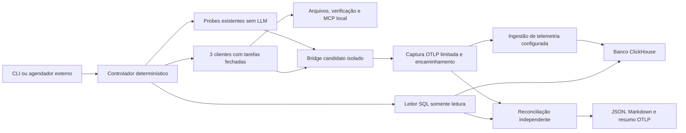

# Benchmark repetível com frota limitada e evidência direta no banco

Estado: especificação para implementação pelo Antigravity. Não é evidência de implementação ou execução. Data: 2026-09-14.

## 1. Mandato e conclusão esperada

Implementar esta especificação no laboratório `dev/fleet-smoke`, executar a validação disponível e refinar em até três tentativas. Antigravity coordena a implementação; a execução recorrente é coordenada por código. Ao terminar, entregar o relatório da seção 12, comandos reproduzíveis, alterações e limitações. Este documento contém o escopo completo para o handoff.

Objetivo: uma única entrada executável para medir o bridge, exercitar clientes reais com poucas inferências, consultar diretamente o banco de telemetria e emitir veredictos verificáveis, sem coordenação conversacional rotineira.

Escopo autorizado para o executor: código do laboratório, contratos, fixtures, documentação, testes e execuções limitadas em recursos próprios. Corrigir defeitos da automação encontrados na validação. Mudanças no produto exigem uma necessidade demonstrada para esta integração e devem ser isoladas, acompanhadas de teste de regressão e registradas no relatório. A perda IPC sob estresse RES-004 continua adiada: reportar, sem tentar corrigi-la nesta entrega.

Preservar instalação ativa, hooks globais e de terceiros, credenciais, bancos e configurações de outros usuários. Sem release, deploy, publicação de pacotes, push ou merge nesta entrega. Não instalar agendamento recorrente: entregar o comando e a receita de integração. Executar apenas o loop limitado abaixo.

Leituras locais obrigatórias antes de editar: `AGENTS.md`, `docs/local-runtime-contract.md`, `docs/resilience-backlog.md`, `dev/fleet-smoke/production-path-round.md`. Estas referências são relativas à raiz do projeto e mantêm os contratos atuais; esta especificação não reabre SLAs aposentados.

Critério de conclusão: todos os aceites implementáveis passam; cada dependência externa indisponível está identificada como `not_measured`, com a informação mínima necessária para desbloquear. Não declarar a integração completa se faltar prova de cliente real ou consulta real ao banco.

## 2. Decisões e limites da evidência

1. Usar ClickHouse HTTP(S) como primeiro adaptador direto ao armazenamento do SigNoz. A documentação oficial confirma ClickHouse como armazenamento de traces. O schema e a conectividade desta instalação ainda não foram verificados nesta especificação.
2. A consulta direta comprova visibilidade no armazenamento consultado. Não comprova API, permissões, cache, dashboards ou interface do SigNoz. Reportar `storage_visibility` e `signoz_api_visibility` separadamente; a segunda fica `not_measured` por padrão.
3. A economia principal vem de consultas e veredictos executados por código. Uma API SigNoz automatizada também poderia operar sem LLM; não atribuir economia exclusivamente ao SQL.
4. Manter adaptadores de evidência separados da reconciliação. Preservar leitores antigos; introduzir schemas novos para os contratos desta campanha. Não transformar uma resposta SQL em um envelope MCP fictício.
5. Não assumir que tabelas v2 citadas em documentos antigos existem, nem que o schema v3 documentado corresponde ao ambiente. Selecionar um mapeamento validado ou terminar a integração como `unsupported_schema`.
6. A consulta começa após a medição de desempenho, evitando carga de leitura durante o benchmark. O tempo de ingestão/consulta não entra na latência interna do hook ou do parser.



Não inserir eventos diretamente no banco para provar o bridge. A emissão passa pelo caminho OTLP configurado; SQL é leitura. Uma fixture de banco comprova o leitor, não o pipeline de produção.

## 3. Base existente e divisão de implementação

Confirmar o conteúdo atual antes de editar; reaproveitar estas responsabilidades:

| Componente existente | Uso / alteração necessária |
|---|---|
| `production_round.py`, `production_ipc_probe.py` | Probes e snapshots do candidato; integrar resultados sem inferir aceite de exit code zero |
| `stall_round.py`, `load_probe.py`, `perf_campaign.py` | Repetições, carga, afinidade, cleanup e contabilidade; reutilizar funções, não duplicar subprocessos |
| `src/runner.rs`, `src/adapters.rs`, `src/plan.rs` | Cliente real e DAG; substituir prompt genérico por contratos; normalizar resultado live |
| `backend_trace_validation.py` | Extrair reconciliação de IDs/pais/duração do parser específico MCP, preservando compatibilidade |
| `src/visibility.rs` | Não usar presença de IDs como prova suficiente de completude; manter contrato antigo e oferecer leitor/resultado novo explícito |
| `long_trace_probe.py` e schemas existentes | Reutilizar raiz temporizada e cadeia controlada; distinguir spans authored e nativos |

Arquivos novos propostos, todos sob `dev/fleet-smoke`:

- `benchmark.py`: CLI, orçamento, lock e máquina de estados.
- `benchmark_config.py`: configuração validada e plano resolvido.
- `telemetry_backends/base.py`, `clickhouse.py`, `schema_maps.py`: leitura e normalização.
- `benchmark_verifier.py`: reconciliação pura e veredictos por fronteira.
- `benchmark_report.py`: JSON, Markdown, redaction e pacote de melhoria.
- `profiles/repeatable-v1.json`: perfis e referências a contratos, sem segredos.
- `schemas/benchmark-config-v1.schema.json`, `handoff-v1.schema.json`, `benchmark-report-v1.schema.json`.
- `prompts/*.txt`: prompts curtos versionados para cada função, sem dados privados.
- `tests/test_benchmark_*.py` e testes Rust afetados.

Preferir Python stdlib para coordenação, HTTP e processos já encapsulados; Rust para fixtures/medição existentes. Uma dependência de validação de JSON Schema pode ficar restrita ao desenvolvimento e fixada em versão. Não adicionar dependências ao cliente/core nem distribuir o laboratório nos pacotes instalados.

Implementação: Antigravity executa integração, leitor SQL e o primeiro run. Codex Luna pode implementar schemas, fixtures de respostas e renderizador do relatório em tarefas independentes. Solicitar Codex Sol apenas para um problema concreto que Luna não resolva; sem fallback automático. Modelos são escolhas configuradas, não promessa de disponibilidade ou de preço mínimo de mercado. Não iniciar uma frota de arquitetos para cada falha.

## 4. Interface, perfis e orçamento

Interface a implementar; os comandos abaixo ainda não existem:

```text
python dev/fleet-smoke/benchmark.py plan --config <config.json> --profile quick
python dev/fleet-smoke/benchmark.py preflight --config <config.json> --profile fleet
python dev/fleet-smoke/benchmark.py run --config <config.json> --profile fleet --seed 502
python dev/fleet-smoke/benchmark.py run --config <config.json> --profile stress --seed 502
python dev/fleet-smoke/benchmark.py verify --report <report.json>
python dev/fleet-smoke/benchmark.py render --report <report.json> --shareable
```

`plan`, `verify` e `render` não fazem inferência. `preflight` verifica binários, flags suportadas, arquivos, backend e limites; não faz teste de autenticação por inferência. Credenciais de provedor presentes não comprovam autenticação funcional: confirmar somente na chamada real.

| Perfil | Conteúdo | Inferências máximas | Prazo global padrão |
|---|---|---:|---:|
| quick | Contratos, seis casos de arquitetura, parser, transformação, contexto, hook e IPC existentes | 0 | 900 s |
| fleet | quick + cadeia de três clientes + consulta direta do trace longo | 3 | 1.200 s |
| stress | Carga nativa 1.000 ofertas/s, 15 s, concorrências 1/4/8/16, 10 repetições por perfil; hook real 5/20/50 ofertas/s, 15 s, 10 repetições | 0 | 1.800 s |

Executar carga serialmente entre perfis e entre campanhas no mesmo host. O orçamento temporal inclui drenagem e cleanup; se insuficiente, marcar casos restantes `not_measured`. Não exceder o prazo para completar a matriz. O operador pode fixar outro contrato antes de iniciar; o plano resolvido registra todos os valores.

O perfil stress mantém as regras de integridade e reporta falhas de admissão, inclusive conhecidas. Não executa modelos por repetição. O perfil fleet cobre integração real, sem certificação da capacidade dos provedores.

Chamadas live: uma por plataforma; teto de 90 s por chamada, saída de processo 256 KiB, JSON final 8 KiB, prompt renderizado 8 KiB; até quatro chamadas de ferramenta por participante. Modelo/esforço iniciais: Codex `gpt-5.6-luna`/low, Grok `grok-4.5`/low, Antigravity `gemini-3.8-flash-low`/low. São defaults do código atual, a validar no cliente instalado. Congelar seleção no plano resolvido. Substituição exige configuração explícita antes do run.

Solicitar teto de 1.024 tokens de saída quando o cliente suportar; registrar limites solicitados e efetivamente aplicáveis. O limite de bytes/tempo não equivale a um limite de tokens do provedor. Ao observar violação de ferramentas, cancelar a chamada e registrar `budget_exceeded`; preferir restrição nativa do cliente. Se não houver mecanismo observável para um limite obrigatório, o caso não pode receber aceite de orçamento completo.

Não executar retry de inferência. Orçamento financeiro é opcional e depende de tabela de preços configurada com moeda/data/fonte ou uso reportado pelo provedor. Uso ausente é `null`, não zero; custo estimado não é custo faturado. Para créditos de assinatura, registrar a fonte disponível, sem inventar conversão para dinheiro.

Configuração mínima: `schema_version`, `profile`, `seed`, `candidate_paths`, `provider_programs`, `models`, `limits`, `backend`, `telemetry`, `retention`. Backend contém endpoint, banco, identificador de schema, tenant quando aplicável e nomes das variáveis que contêm credenciais. Nenhum segredo em JSON versionado, argv, prompt ou relatório.

## 5. Máquina de estados, identidade e cleanup

Estados: `preflight -> prepare -> deterministic_probes -> live_fleet -> drain -> storage_query -> verify -> report -> cleanup -> terminal`. Cada transição produz um registro JSONL com sequência monotônica, timestamp UTC e tempo monotônico relativo. Estados pulados preservam razão. Publicar `run_started` com identidade antes da primeira operação.

Reservar `campaign_id`, `run_id`, `attempt_id` e IDs de trace/span uma única vez. A mesma seed reproduz fixtures, atribuição e ordem; identidades são novas. Guardar hashes do plano, corpus, prompts, código, binários e contratos. Não usar seed como identidade nem reaproveitar IDs em outra tentativa.

Lock de execução local por host usando mecanismo de biblioteca portável/lock de SO com liberação ao término; não usar arquivo existente como prova de processo vivo. Colisão encerra com `already_running`, sem matar execução alheia. A retomada após crash cria tentativa nova ligada à anterior: nunca redisparar uma inferência cujo resultado é desconhecido como se fosse a mesma tarefa. Sem estado durável não prometer exactly-once entre crashes.

Criar diretório temporário exclusivo e processos próprios; manter ledger em memória e artefatos temporários mínimos. Cancelamento impede novos despachos, encerra árvores próprias, drena dentro do prazo e tenta fechar a raiz como cancelada. `SIGKILL`/encerramento forçado pode impedir o fechamento: consumidor deve reconhecer run incompleto pela ausência do terminal.

Teto de artefatos: 256 MiB por campanha, com escrita incremental limitada. Eventos medidos não podem desaparecer por truncamento silencioso; atingir limite torna a evidência incompleta. `--retain-report <destino>` grava somente pacote sanitizado escolhido pelo usuário; default imprime JSONL/JSON, exporta resumo de telemetria e limpa temporários. Limpeza remove apenas caminhos próprios com ownership/escopo verificados. Registrar falhas de cleanup.

Agendador futuro chama o mesmo comando e interpreta exit codes: 0 todos os aceites requeridos passaram; 1 falha medida, inclusive conhecida; 2 execução incompleta/pré-requisito ausente; 3 configuração inválida; 4 lock ocupado; 130 cancelado. Uma falha conhecida pode ter notificação reduzida por política explícita, mas não muda seu veredicto. Para alertar apenas mudanças entre execuções, consultar histórico no backend ou usar estado do agendador; sem histórico declarar comparação indisponível.

## 6. Casos live e handoffs determinísticos

O controlador possui o oráculo dos testes e não entrega a resposta esperada no prompt. Workspaces contêm apenas fixtures necessárias e wrappers de ferramentas permitidos. Os clientes não recebem credenciais SQL. Usar capacidades do cliente para restringir ferramentas/configuração, verificadas via CLI local.

| Caso | Operação solicitada ao cliente | Oráculo e evidência |
|---|---|---|
| F1 / Codex | Ler `input.json`, selecionar registros ativos, ordenar IDs e gravar `selection.json` no schema fornecido | Controlador calcula seleção; verifica conteúdo, hash, caminho e leitura/ferramenta observada |
| F2 / Grok | Consumir seleção validada e executar wrapper de teste Rust local sobre função com defeito inserido | Wrapper invoca rustc e teste finito; compilação deve passar e assertion deve falhar; recibo contém status e hashes. Relato do modelo sozinho não serve |
| F3 / Antigravity | Consumir recibo normalizado, invocar `fixture_echo` em servidor MCP local e gravar `final.json` com digest retornado | Servidor registra método, request ID e argumentos; digest é recalculado. Exige chamada MCP real, não parse de mensagens estáticas |

F1, F2 e F3 são as três inferências do perfil fleet. A falha esperada em F2 passa a validação do caso quando comprovada, preservando status técnico ERROR e `injected=true`. Timeout do cliente ou falha de compilação não substitui a assertion esperada. O controlador só libera F3 após validar F2; falha imprevista bloqueia dependentes, que ficam `not_measured`.

Variação seeded altera dados, posição do defeito e conteúdo do echo dentro do contrato; mudanças na classe de falha exigem outro perfil versionado. HTTP 500/recuperação, timeout e JSON inválido continuam cobertos pelas fixtures determinísticas existentes. Não aumentar inferências para reproduzir cada falha de infraestrutura.

Handoff v1 obrigatório:

```json
{
  "schema": "aob-handoff/v1",
  "run_id": "<fresh-id>",
  "task_id": "F2",
  "attempt": 1,
  "operation": "run_fixture_assertion",
  "dependencies": [{"task_id": "F1", "receipt_sha256": "<sha256>"}],
  "inputs": [{"path": "selection.json", "sha256": "<sha256>"}],
  "output_schema": "fixture-assertion-result/v1",
  "deadline_ms": 90000,
  "allowed_tools": ["fixture_test"],
  "max_tool_calls": 4
}
```

Saída normalizada: schema, task ID, outcome declarado, referências de artefatos, hashes, recibos de ferramentas e erro estruturado. O controlador valida schema, identidade, paths confinados, ausência de symlink escapando do workspace, limites, conteúdo e recibos. Hash comprova integridade, não veracidade; o oráculo é independente. Texto livre de uma saída nunca é concatenado como instrução da tarefa seguinte. Resultado inválido encerra o caso; não consumir uma chamada extra para reformatação.

A normalização por cliente extrai JSON do evento final correto de sua saída estruturada, valida o encerramento do processo e mantém erros de parse separados de falhas da operação. Registrar versão do cliente, modelo solicitado e modelo observado quando disponível. Zero no exit code não prova função, ferramenta, modelo ou telemetria.

Injetar `TRACEPARENT` no ambiente antes de cada spawn. Usar configuração temporária por processo/workspace suportada pelo cliente para apontar ao candidato. Nunca reescrever hooks globais para viabilizar o teste. Se o cliente só usar instalação ativa, registrar alvo `active` separado e não atribuir seus spans ao candidato; para aceite candidato desse cliente, marcar `not_measured` até haver isolamento suportado.

## 7. Trace longo e fronteiras de contagem

Raiz de orquestração com duração mínima de 60 s e máxima de 300 s, incluindo as três tarefas live e pacing determinístico. Se as tarefas acabarem antes de 60 s, o controlador aguarda; se demorarem mais, a duração real é reportada. A raiz fecha após seus filhos e drenagem prevista. O pacing não mantém um LLM em conversação.

Modelar spans irmãos sob raiz e links de dependência entre tarefas, coerente com o runner atual; spans nativos devem descendender do contexto da tarefa correspondente. Não exigir que toda dependência de DAG seja parent-child direto. Raiz authored é explicitamente sintética; nunca chamar esse span de prova nativa.

Dois conjuntos de expectativas: (a) spans controlados, IDs exatos prealocados; (b) spans nativos observados independentemente na captura OTLP, com IDs definidos pelo cliente/bridge. Para (b), validar também cobertura semântica mínima das operações de fixture e recibos: um span ausente antes da captura não pode ser ocultado usando a captura como único oráculo.

Captura limitada encaminha ao endpoint OTLP configurado. Registrar export attempts, HTTP requests e logical spans separadamente. Uma retransmissão de HTTP não equivale a evento novo. Registrar oferecidos, admitidos, send-completed, recebidos na captura, persistidos no banco, IDs duplicados, faltantes, inesperados e skips do gerador, com denominador em cada taxa. Para stress, a reconciliação local cobre todos os eventos; por padrão a consulta SQL cobre apenas o trace longo, não promete consultar centenas de milhares de traces de carga.

Não alterar de forma silenciosa buffering/retry/exportação ao inserir captura. Configuração e presença do intermediário fazem parte do workload. Benchmarks isolados não incluem consultas ao banco ou inferência concorrente.

## 8. Adaptador ClickHouse direto

### Preflight e descoberta

Configurar explicitamente URL HTTP(S), banco, tenant e credencial de leitura por referência de ambiente. HTTP sem TLS apenas para loopback ou rede privada explicitamente aceita pela configuração; TLS valida certificado. Não descobrir segredos nem abrir portas/alterar ACLs automaticamente. Sem endpoint ou permissão: `not_measured` com dependência precisa, mantendo os testes offline executáveis.

Usar HTTP com parâmetros tipados e SQL fixo versionado. Identificadores de banco/tabela/coluna vêm de mapping allowlisted e validado; dados de trace/tempo são parâmetros. Nenhum SQL fornecido pelo LLM. Nunca usar SELECT * nem operações de escrita, DDL ou grant.

Ler versão e metadados estritamente necessários (`system.columns`/metadados permitidos) para validar mapping. Fingerprint do schema deve incluir nomes, tipos, engine/topologia relevante e mapping version. Mapping v3 é o primeiro alvo; v2 somente quando implementado/testado explicitamente. Desconhecimento de campo necessário falha fechado, sem convertê-lo em vazio.

Em cluster, selecionar tabela distribuída adequada, evitando contar réplicas como eventos e evitando consultar apenas um shard. Em ambiente com tenant, o predicado deve fazer parte de todas as consultas; se o isolamento não puder ser demonstrado, não consultar spans. Campos de recurso por join exigem chave não multiplicadora, conforme schema real.

### Consulta e normalização

Objeto normalizado por linha: `trace_id`, `span_id`, `parent_span_id`, `start_unix_ns`, `duration_ns`, `name`, `kind`, `status`, `service_name`, `service_version`, `scope_name`, `provenance`, `task_id` quando presente. Campo ausente é null com capability correspondente. IDs hex normalizados e validados; timestamps e duração inteiros em nanos (strings decimais no JSON portátil para evitar perda de precisão). Não usar float para identidade temporal.

Predicados: trace exato, tenant quando aplicável e janela fixa do run com margem de 30 s em cada lado. Aplicar predicado de bucket coerente com o mapping validado; não presumir que o bucket usa a mesma unidade do timestamp. Relógio do root/probes usa âncora UTC e monotônico; skew desconhecido consta no relatório. Não ampliar janela indefinidamente para obter aprovação.

Para a primeira versão, consultar um trace completo por tentativa de leitura, sem paginação: até 10.000 linhas físicas, requisição de limite 10.001 como sentinela, até 16 MiB de resposta. Ordenação estável para digest. Se houver sentinela, overflow ou truncamento, `inconclusive` com `result_limit_exceeded`, nunca `visible_complete`. Assim evitamos páginas inconsistentes durante ingestão. Futura paginação exige protocolo próprio testado.

Prazos: conexão 3 s, requisição 10 s, execução SQL 5 s, limite global de espera do backend 60 s após drenagem. Poll em offsets 0/2/5/10/20/35/50 s dentro desse prazo, sem sobreposição e com timeout reduzido ao tempo restante. Espera por ingestão só repete leitura, não reenvia eventos nem chama LLM.

Configurar limites de linhas/bytes/memória/execução no servidor quando permitidos ao usuário de leitura: max_execution_time=5, max_result_rows=10001, max_result_bytes=16777216, max_memory_usage=134217728, overflow em modo throw. Validar suporte/efetividade e não remover limites silenciosamente em caso de rejeição. Deadline e cap local permanecem obrigatórios. Credencial deve ter permissões restritas; um SELECT fixo não substitui essa restrição.

Validar corpo inteiro, metadados e erros do ClickHouse, incluindo exceção após HTTP 200. Não aceitar prefixo JSON válido seguido de erro/truncamento. Capturar query ID, duração, linhas/bytes lidos quando disponíveis, mapping hash e estado final; redigir mensagens de erro que possam conter dados/credenciais.

### Completude, duplicatas e veredicto

Após raiz enviada e produtor drenado, exigir duas leituras completas consecutivas com mesmo digest, separadas por pelo menos 2 s, contendo os spans esperados e invariantes válidas. Registrar como completude observada nessa janela, não garantia de que jamais chegará dado tardio. Nenhuma linha até o deadline é `not_found`; parte é `visible_partial`; erro de conexão/autorização é `query_failed`; mapping desconhecido é `unsupported_schema`.

Preservar multiplicidade física retornada. Repetições idênticas do mesmo (trace_id, span_id) devem ser contadas separadamente de IDs lógicos; conflito de conteúdo para o mesmo ID é falha. A semântica de engine pode deduplicar na leitura/merge: registrar esse limite e não inferir ausência histórica de retransmissão. Não usar DISTINCT, FINAL ou GROUP BY para esconder duplicatas; quando necessário por schema, registrar transformação e limitação explicitamente. Gates de unicidade lógica e duplicação de armazenamento são distintos.

Comparar IDs controlados exatos, IDs nativos capturados, pais/links, raiz única, origem, versão do candidato e cobertura de operações. Reportar spans adicionais do cliente separadamente: só tolerar extras cujo tipo e ancestralidade estejam declarados no contrato, nunca descartar todos os inesperados por interseção de conjuntos. Pais de spans obrigatórios devem ser verificáveis; capacidade ausente impede aceite dessa dimensão.

Não fabricar URL de trace a partir do host ClickHouse. Link só existe quando um template HTTP(S) de navegação foi configurado e validado; trace ID e janela sempre estão no relatório mesmo sem link.

## 9. Aceites e validação negativa

Cada assertion contém ID estável, `spec_ref`, `implementation_ref`, expectativa, observação, unidade, denominador, evidências e verdict (`passed`, `failed`, `not_measured`, `inconclusive`). `known_issue_id` é anotação, não quinto veredicto.

| ID | Critério obrigatório | Teste negativo mínimo |
|---|---|---|
| B01 | Mesmo plano/seed reproduz estímulos, com novas identidades | Trocar seed, hash do corpus ou reusar ID |
| B02 | quick/stress não despacham inferência; fleet no máximo três | Quota, timeout e saída inválida não provocam retry |
| B03 | Handoff só segue após validação independente | JSON adulterado, path traversal, symlink externo, hash errado e instrução em texto livre |
| B04 | F2 comprova assertion esperada | Falha de compile, resultado inventado e ausência de execução não passam |
| B05 | F3 comprova chamada MCP real | JSON MCP estático e alegação do modelo não passam |
| B06 | Spans nativos correspondem ao alvo e aos recibos | Misturar instalação ativa, raiz authored ou span de outro trace |
| B07 | SQL é limitado, somente leitura, parametrizado e tenant correto | Injeção de identificador/valor, credencial ausente, TLS inválido, permissão negada |
| B08 | Resposta completa e schema conhecido | HTTP 200 com exceção, linha 10.001, corpo truncado, campo pai ausente, versão desconhecida |
| B09 | Reconciliação distingue multiplicidade e perdas | Duplicata idêntica, duplicata conflitante, pai errado, extra, span tardio e duração incorreta |
| B10 | Cleanup e deadline limitados | Cliente pendurado, descendente segurando pipe, cancelamento, lock concorrente |
| B11 | Relatório portátil, sem segredos, valores ausentes explícitos | Endpoint autenticado, home path, env secreto e custo/uso ausente |
| B12 | Contratos de desempenho atuais preservados | Resultado histórico não aprova parser puro nem capacidade total |
| B13 | Documentação e schemas refletem comportamento | Schema rejeita versão desconhecida, NaN, contagens negativas e zero substituindo desconhecido |

B12 referencia estritamente `production-path-round.md` e AGENTS.md: hook interno <1 ms, binário <300.000 bytes, IPC p99 <3.000 us, parser puro >50.000 inputs/s, contexto sem filesystem/espera no event path com freshness/limites corretos. Reportar ciclo externo, transformação e capacidade separadamente. Amostras pequenas não permitem afirmar p99 robusto: declarar N, método e incerteza. Não criar novo gate numérico para contexto ou capacidade global.

Executar testes unitários sem rede/provedor; integrar contra servidor HTTP simulado com fixtures de schemas e falhas. Integração real usa endpoint de leitura fornecido; sem ele, B07-B09 live ficam não medidos, mesmo com testes offline aprovados. Não exigir instalar banco local ou container para concluir partes independentes.

Checks de repositório: `cargo fmt --check`, `cargo clippy --workspace --all-targets -- -D warnings`, `cargo test --workspace`, `cargo doc --workspace --no-deps`, `cargo guardrails`, `python -m unittest discover -s dev/fleet-smoke/tests`. Testar schema/renderizador com exemplo completo e parcial. Plataformas nativas não disponíveis não são certificadas; CI offline multi-OS é evidência distinta de benchmark de performance.

## 10. Loop de implementação e primeira execução

1. Inventariar código, branch/worktree, runtime, CLI/modelos, backend e permissões sem expor segredos. Final: plano resolvido, riscos concretos e mapa de capacidades; não pressupor que MCP SigNoz concede acesso SQL.
2. Implementar contratos/verificador/relatório com fixtures. Final: B01-B13 offline e compatibilidade de leitores anteriores testados.
3. Implementar leitor SQL e preflight real quando houver conexão. Final: schema mapeado e consulta limitada validada, ou bloqueio externo específico preservado.
4. Integrar entrada única e clientes limitados. Final: zero chamada de inferência nos testes quick e contador global de despacho cobrindo todos os adaptadores.
5. Executar tentativa 1: quick, fleet e stress dentro de seus prazos. Registrar baseline da nova automação, consumo real e limitações. Build e checks acontecem antes de medir, uma vez por candidato.
6. Se houver defeito na automação, isolar causa e aplicar uma alteração por hipótese. Tentativas 2 e 3 repetem apenas os casos afetados e dependências; repetir workload comparável quando avaliar diferença numérica. Máximo de nove inferências reais somadas nas três tentativas. Pré-requisito externo ausente não justifica consumir tentativas pagas repetidas.
7. Encerrar assim que os aceites requeridos passarem, ou após terceira tentativa. Registrar todas as tentativas, inclusive abortadas e falhas. Não selecionar apenas a melhor amostra. Entregar diff, relatório preenchido, comandos de reprodução e backlog residual. RES-004 não dispara novo ciclo de correção.

Uma repetição estatística não é nova tentativa de implementação. Mudança de código/configuração/modelo cria fingerprint novo; dados anteriores permanecem identificáveis e só entram em comparação quando os contratos forem compatíveis.

## 11. Automação recorrente e diagnóstico futuro

Entregar receita que permite a qualquer usuário chamar o executável pelo seu agendador ou CI, sem ps1 e sem agente coordenador em sessão. Manter uma execução por host e não executar benchmark sob outro build/carga de teste concorrente. Registrar interferência observável; não afirmar host ocioso sem evidência.

Sugestão operacional, não ativação: quick por mudança relevante; fleet sob demanda ou numa cadência escolhida pelo usuário; stress quando houver investigação de capacidade. A primeira implementação não precisa de daemon de agendamento próprio.

Falha nova gera relatório e pacote de melhoria determinísticos. Um LLM pode analisar esse pacote em sessão separada e autorizada, recebendo somente metadados sanitizados, assertions falhas, comparação, trechos de código pertinentes e evidências compactas. Ele não aprova o próprio patch: aceites continuam executáveis. O pacote distingue fato, hipótese, proposta e teste capaz de refutar a hipótese.

## 12. Contrato de relatório e template de melhoria

Produzir `aob-repeatable-benchmark/v1` em JSON e Markdown derivado do mesmo objeto, sem resumo LLM obrigatório. Datas UTC RFC3339, durações e unidades explícitas; nanos/contadores que excedam precisão JSON interoperável são strings decimais. Versão de schema, tipos, enums e required devem estar no JSON Schema implementado. Dados desconhecidos são null acompanhados de motivo; não preencher com estimativa não identificada.

Campos JSON obrigatórios: `schema`, `campaign`, `environment`, `build`, `workload`, `providers`, `budgets`, `attempts`, `assertions`, `delivery`, `telemetry`, `comparison`, `cleanup`, `privacy`, `improvement`. Seção `campaign` inclui run/attempt IDs, start/end, estado, seed e todos os hashes. `assertions` segue seção 9. Cada referência a evidência contém origem, hash, tamanho, disponibilidade e retenção, sem depender de caminho temporário de outro usuário.

Metadados de ambiente necessários: OS/versão/kernel, arquitetura, virtualização quando detectável, CPU modelo/físicos/lógicos, CPUs permitidas e afinidade aplicada, RAM, modo energia quando disponível, toolchains, versões de CLI, timezone, características do endpoint local/remoto, RTT de backend separado da medição do produto. Host é pseudônimo; usuário/home/hostname real não são necessários. Dados sensíveis ausentes por redaction devem permanecer distinguíveis de dados não medidos.

Build: repo/ref/commit, dirty flag, hash do diff quando dirty, versão do bridge, SHA-256 por binário, target triple, perfil/flags, alvo candidato/ativo por caso. Hash do diff sozinho não reproduz código dirty: marcar reprodução parcial sem patch sanitizado anexado. Estado ativo antes/depois e origem dos snapshots precisam constar.

Consumo: por cliente e agregado, número de despachos, inferências, tool calls, tokens input/output/cache/reasoning disponíveis, timeout/cancelamento e motivo. Diferenciar observado/estimado/indisponível. Custo inclui moeda e fonte de preço, ou null. Não inferir modelo efetivo do nome configurado.

Comparação: requer fingerprint de workload, corpus, versão dos testes, modo da medição, alvo e ambiente compatíveis. Reportar resultados por repetição e mediana/faixa, método de percentil e N; diferença entre ambientes é diagnóstico, não regressão automaticamente. RES-004 recebe referência explícita e status adiado.

Template Markdown integral a gerar (substituir placeholders; preservar seções vazias com razão):

```markdown
# Resultado do benchmark e insumo para melhoria

## Conclusão
- Estado da execução: <completed|failed|incomplete|cancelled>
- Aceites: <passed / failed / not_measured / inconclusive por dimensão>
- Principal achado: <fato demonstrado em uma frase>
- Impacto: <efeito observado; sem extrapolação para produção>
- Pendência conhecida: <RES-004 ou outra; estado e decisão>
- Recomendação para próxima sessão: <investigar / corrigir / nenhuma ação>

## Identidade e reprodução
| Campo | Valor |
|---|---|
| Schema / versão da suíte | <...> |
| Campaign / run / attempt IDs | <...> |
| Início / fim UTC / duração | <...> |
| Perfil / seed / plan hash / corpus hash | <...> |
| Repo / commit / dirty / diff hash | <...> |
| Bridge / SHA-256 dos binários / target / build flags | <...> |
| Comando sanitizado / config hash | <...> |
| Pré-requisitos e reprodução completa ou parcial | <...> |

## Ambiente
| Campo | Valor observado | Fonte / motivo se ausente |
|---|---|---|
| OS / kernel / arquitetura / virtualização | <...> | <...> |
| CPU / núcleos físicos e lógicos / RAM | <...> | <...> |
| CPUs permitidas / afinidade daemon e emissor | <...> | <...> |
| Energia / interferência conhecida | <...> | <...> |
| Rust / Python / versões dos clientes | <...> | <...> |
| Host pseudônimo / timezone | <...> | <...> |
| Backend local/remoto / versão / schema fingerprint | <...> | <...> |
| Candidato ou instalação ativa por caso | <...> | <...> |

## Workload e custo
- Eventos/tamanho/corpus; taxa oferecida; concorrência; pacing; warmup; repetições: <...>
- Batching, queues, TTL, retries, captura intermediária, drain: <...>
- Limites de tempo, memória, saída e inferência solicitados/aplicados: <...>

| Cliente | Modelo solicitado / observado | Chamadas / tools | Tokens por tipo | Custo e fonte | Estado |
|---|---|---:|---|---|---|
| <...> | <...> | <...> | <null se ausente> | <null se ausente> | <...> |

## Aceites e desempenho
| ID / requisito | Implementação | Esperado | Observado / unidade / N | Verdict | Evidência |
|---|---|---|---|---|---|
| <...> | <arquivo:função> | <...> | <...> | <...> | <hash/ref> |

Separar parser puro, transformação, cache hit/miss/refresh, hook interno,
ciclo de processo, IPC, entrega e latência de consulta. Explicitar método de p99.

## Entrega e rastreabilidade
| Fronteira | Contagem | Denominador | IDs ausentes/duplicados | Limitação |
|---|---:|---:|---|---|
| Oferecido / admitido / send-completed | <...> | <...> | <...> | <...> |
| Captura / eventos lógicos / tentativas HTTP | <...> | <...> | <...> | <...> |
| Persistido físico / lógico | <...> | <...> | <...> | <...> |

- Trace ID / root span ID / janela UTC / link configurado: <...>
- Fonte: <clickhouse_direct|signoz_api|signoz_mcp|local_capture>
- Query IDs / mapping hash / tenant isolado / caps e completude: <...>
- Raiz, pais, links, origem e versão do candidato: <...>
- Storage visibility: <...>; API SigNoz: <not_measured ou prova separada>
- Espera de ingestão / observações estáveis / limitações de deduplicação: <...>

## Tentativas e comparação
| Tentativa | Hipótese / alteração | Fingerprint | Casos executados | Resultado |
|---|---|---|---|---|
| <...> | <...> | <...> | <...> | <...> |

Baseline: <referência ou indisponível>. Comparabilidade: <sim/não e motivo>.
Diferenças por repetição, dispersão e incerteza: <...>.

## Pacote para sessão de melhoria do produto
1. Problema observado: <fronteira e sintoma concreto>.
2. Evidência mínima: <assertions, IDs, contagens e amostras sanitizadas>.
3. Hipóteses, ainda não conclusões: <lista ordenada>.
4. Experimento que distingue/refuta cada hipótese: <entrada, controle, medida>.
5. Componentes e arquivos candidatos: <...>.
6. Mudança cirúrgica proposta: <ou nenhuma antes de investigar>.
7. Critérios de aceite e não regressão: <IDs e contratos>.
8. Escopo excluído: <incluindo RES-004 se continuar adiada>.
9. Informação faltante para decidir: <...>.
10. Próxima ação e autorização necessária: <...>.

## Integridade, limpeza e compartilhamento
- Instalação ativa / hooks antes e depois: <...>.
- Processos próprios encerrados / temporários removidos: <...>.
- Evidências incluídas, hashes e retenção: <...>.
- Campos removidos por privacidade: <categorias, sem valores>.
- Verificações não executadas e motivo: <...>.
```

O pacote compartilhável preserva IDs de trace/span e metadados técnicos úteis, mas remove credenciais, prompts livres, stdout completo, atributos não allowlisted, nomes de usuário, caminhos pessoais e endpoints privados por padrão. URLs internas são omitidas no modo shareable; continuam disponíveis no relatório local se configuradas. Repetir varredura de segredos e teste de redaction sobre Markdown e JSON. Não anexar dump de banco.

O resumo enviado à telemetria contém apenas agregados, IDs da execução, hashes, veredictos e evidência de origem. Publicá-lo após o conjunto de spans verificado, em trace separado, evitando que o próprio relatório altere a contagem do trace medido. Alta cardinalidade fica em traces/logs, não em labels de métricas. Falha ao exportar o resumo não apaga o resultado local e é reportada separadamente.

## 13. Fontes técnicas e atualização

Consultadas em 2026-09-14. São referências de implementação, não prova do schema instalado:

- [SigNoz: schema de traces e consultas ClickHouse](https://signoz.io/docs/userguide/writing-clickhouse-traces-query/): validação do mapping e seleção das tabelas distribuídas.
- [ClickHouse: interface HTTP e parâmetros tipados](https://clickhouse.com/docs/interfaces/http): cliente de leitura e tratamento do corpo completo.
- [ClickHouse: limites de complexidade](https://clickhouse.com/docs/operations/settings/query-complexity): limites de execução e resultados.

Na entrega, atualizar somente a documentação operacional afetada, removendo afirmações históricas que contradigam comportamento atualmente comprovado. Preservar release notes como registro histórico. Registrar divergências entre esta especificação e capacidades reais como decisão explícita, sem substituição silenciosa de backend, modelo ou critério de aceite.
