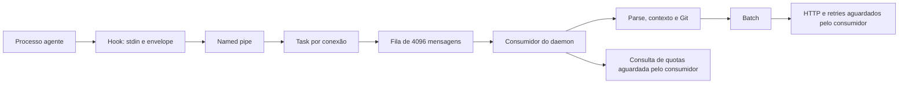
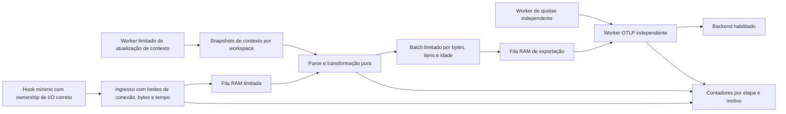
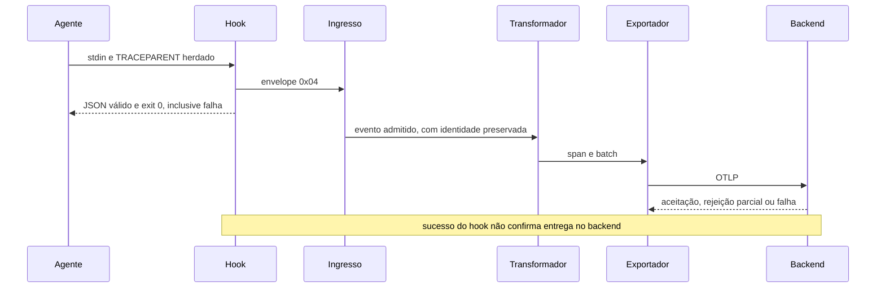

# Arquitetura Rust e realismo das metas de desempenho

Data: 2026-09-14. Estado: análise e proposta; sem alteração de produção ou instalação. Fonte inspecionada: HEAD `66ba326`, com modificações da suíte de desenvolvimento. Instalação ativa de referência: `0.5.1-a27470c`. As medições abaixo pertencem ao candidato da campanha anterior nesta tarefa, não certificam a instalação ativa. Linux e macOS nativos: não medidos.

## 1. Parecer

As metas não são todas meramente teóricas, mas também não estão todas demonstradas. Tamanho do hook e latência IPC têm evidência local favorável. Processamento acima de 50 mil spans/s é uma hipótese de engenharia plausível, ainda reprovada pelo benchmark existente. Coleta completa de contexto abaixo de 150 µs não é sustentada pelas medições desta máquina. Execução interna do hook abaixo de 1 ms continua não medida.

Não há fundamento para atribuir essas reprovações à linguagem Rust. A inspeção revela operações de filesystem e subprocessos, acoplamento do consumidor com exportação HTTP e fronteiras de medição diferentes. Há também problemas de contrato de I/O que devem preceder otimizações de throughput.

Os SLAs vigentes continuam valendo. Uma futura revisão precisa especificar fronteira, percentil, payload, carga, máquina e condições de cache; renomear uma operação ou medir apenas um cache hit não torna o harvester atual aprovado.

## 2. Evidência e classificação das metas

| Meta vigente | Evidência local da campanha | Parecer |
|---|---|---|
| Hook <300 KB | 150.016 bytes | Demonstrada para o binário medido; tamanho não prova tempo de criação do processo |
| IPC p99 <3.000 µs | Legado 129,2 µs; envelope 0x04 105,6 µs; 1.000 recebimentos de cada | Demonstrada para envio até recepção em servidor isolado, sem ACK de ida e volta |
| Parser >50.000 spans/s | JSON + construção: 42.226–42.568; legado: 22.055–43.125; 0x04: 15.772–22.405 | Reprovada nessa fronteira; não equivale a JSON puro nem capacidade final do daemon |
| Contexto <150 µs | p99 sem Git 743,6–765,7 µs; Git/worktree 2.249,1–2.708,6 µs | Reprovada; p99 é a operacionalização conservadora usada pela suíte |
| Hook interno <1 ms | Sem medição interna válida | Não medido; duração externa não substitui essa medida |
| Watchdog 3 ms | Deadline implementado por thread e sleep | Configuração não demonstra limite máximo de execução |
| Entrega concorrente íntegra | Debug 23/24, 24/24, 24/24; release 72/72; diagnóstico debug serial 24/24 | Falha reproduzida uma vez; mecanismo ainda desconhecido |

Os valores de throughput variam bastante entre repetições de algumas variantes. Não subtrair resultados de variantes executadas em momentos distintos para estimar o custo isolado do envelope. O valor histórico de 37.231,6 spans/s também não permite afirmar melhoria causal sem reproduzir suas condições.

A execução contém apenas 72 eventos release: zero perdas nessa amostra não demonstra confiabilidade universal. Sob a hipótese simplificadora de falhas independentes e probabilidade constante, a regra aproximada de três daria limite superior de cerca de 4,2% para a probabilidade de perda com 95% de confiança. Correlação em rajadas torna essa aproximação inadequada; o teste precisa exercitar rajadas explicitamente.

Os relatórios brutos foram transientes. Estes números resumem a execução registrada na tarefa; a reprodução deve gerar novos relatórios com hashes e ambiente, conforme [protocolo de validação](performance-validation.md).

## 3. Comparação com implementações de mercado

Não foi encontrada uma medição pública equivalente ao nosso hook Windows: processo curto, stdin, named pipe, fail-open e contexto de agentes. SDK em processo e collector persistente respondem a problemas diferentes.

| Referência | Evidência pública | O que podemos concluir |
|---|---|---|
| OpenTelemetry Collector | Projeto mantém testes de carga do binário com configurações distintas, executados continuamente | Adotar metodologia de regressão por configuração; não extrair um SLA universal de spans/s |
| Rotel, implementação Rust | Relato do fornecedor de janeiro de 2026: 3,7 milhões spans/s em gateway de 8 vCPUs, 462,5 mil/vCPU; comparação com Collector de 1,1 milhão total | Demonstra viabilidade de throughput elevado nesse sistema; não demonstra que nosso parser deveria atingir o mesmo número |
| Vector, implementação Rust | Descreve microbenchmarks e testes de caixa-preta com carga, configurações e hardware | Usar dois níveis de avaliação, pois microbenchmarks não substituem comportamento operacional |

Fontes: [Collector benchmarks](https://opentelemetry.io/docs/collector/benchmarks/), [benchmark Rotel](https://rotel.dev/blog/otel-to-rotel-petabyte-scaling-tracing-4x-greater-throughput/), [metodologia Vector](https://vector.dev/blog/how-we-test-vector/).

O ensaio Rotel utiliza Kafka, Protobuf e batches para ClickHouse em AWS/Linux. Sua evolução foi investigada com profiling; a fase inicial usa o engine Null, seguida por uma avaliação de escrita. Trata-se de resultado do próprio fornecedor, não reprodução independente nossa. A divisão 3,7/1,1 é aproximadamente 3,36: o título “4x” não deve substituir os números publicados. Não converter essa comparação em promessa de ganho para Windows, outro allocator ou eventos individuais. [Condições do ensaio](https://rotel.dev/blog/otel-to-rotel-petabyte-scaling-tracing-4x-greater-throughput/).

Para comparar de forma justa: mesmo corpus sanitizado, tamanho e atributos por span, mesmas transformações, mesma política de perda/retry, mesma máquina e limites de CPU/RAM, transporte e endpoint equivalentes. Reportar bytes/s, spans/s, CPU-segundos por milhão de spans, memória máxima, latência p99 e perdas. Um teste de collector não inclui criação de processo por evento; registrar essa diferença, sem esconder seu custo.

### Derivação do orçamento local

50.000 spans/s correspondem a 20 µs por span em um estágio serial saturado. A taxa observada de aproximadamente 42.500 corresponde a 23,5 µs/span: alcançar a meta exigiria cerca de 15% menos tempo nessa mesma fronteira. Isso é uma distância de engenharia investigável, não prova de que uma otimização específica será suficiente.

O orçamento deve também atender à carga real: `eventos/s = agentes ativos × eventos por agente por segundo`, incluindo rajadas. Por exemplo, 100 agentes a 10 eventos/s produzem 1.000 eventos/s; é um cenário de dimensionamento, não uma medição do usuário. Headroom de parser não resolve exportação parada, nem uma meta de 50 mil demonstra necessidade de negócio sem essa distribuição de carga.

## 4. Arquitetura atual e pontos de acoplamento

### 4.1 Segurança de memória e prazo do IPC — prioridade P0 de investigação

Em `crates/agent-otel-ipc/src/client.rs:242` e `:258`, o cliente solicita `CancelIoEx` e retorna sem comprovar conclusão. O frame e o `OVERLAPPED` locais deixam de existir. A API exige que a estrutura e os buffers permaneçam válidos até o término, e cancelamento não espera esse término. Há uma violação aparente do contrato de lifetime no caminho pendente; corrupção ou relação com a perda não foram demonstradas. [CancelIoEx](https://learn.microsoft.com/en-us/windows/win32/fileio/cancelioex-func), [WriteFile](https://learn.microsoft.com/en-us/windows/win32/api/fileapi/nf-fileapi-writefile).

O desenho da correção precisa preservar ownership da operação até sua conclusão. Apenas adicionar uma espera infinita resolveria um problema criando outro: violaria fail-open. Separar explicitamente a API reutilizável de transporte da política do processo descartável; avaliar estado de operação com endereço estável e responsável por sua conclusão, incluindo cancelamento, fechamento e descarte. Não aceitar simplesmente leak permanente por timeout em um processo persistente. Revisão especializada do unsafe e teste nativo de cancelamento são gates.

Em `client.rs:192`, uma duração positiva inferior a 1 ms torna-se zero por truncamento. Para `WaitNamedPipeW`, zero seleciona o timeout padrão do servidor. Portanto a conversão não preserva o orçamento restante. A política deve decidir falhar imediatamente quando não houver unidade representável dentro do orçamento; arredondar para cima também pode excedê-lo. [Semântica de WaitNamedPipeW](https://learn.microsoft.com/en-us/windows/win32/api/namedpipeapi/nf-namedpipeapi-waitnamedpipew).

Também é necessário validar bytes transferidos e conservar códigos de falha internamente. `Result<(), ()>` e descarte do resultado escondem a etapa da falha. Não emitir logs síncronos ou gravar arquivos no hook para resolver observabilidade.

### 4.2 Consumidor único aguarda serviços lentos

`daemon.rs:190` e `:215` aguardam exportação no próprio consumidor. O exporter configura timeout de 5 s e até três tentativas. Uma indisponibilidade pode interromper o consumo por segundos, mesmo com IPC de dezenas de microssegundos. `biased` em `daemon.rs:76` coloca recepção antes de timers e cancelamento; com recepção continuamente pronta, essa ordem pode prejudicar manutenção e shutdown. Tokio documenta que os ramos de `select!` compartilham a mesma task e que a ordem biased exige cuidado explícito com fairness. [Tokio select](https://docs.rs/tokio/latest/tokio/macro.select.html).

Com 4.096 posições e chegada de 50 mil mensagens/s, uma fila inicialmente vazia representa apenas 81,92 ms de absorção sem consumo. É um cálculo de capacidade, não previsão de quando ocorreu a perda. Aumentar a fila não corrige indisponibilidade prolongada.

### 4.3 Contexto e subprocessos

`daemon/git.rs:57` e `:81` executam `git` com `.output()` síncrono, sem timeout efetivo. A chamada ocorre no evento Stop do consumidor (`daemon.rs:149`). Isso contraria a proibição do projeto de subprocessos no caminho de telemetria.

`core/model.rs:507` coleta o contexto do diretório atual quando parte do contexto está ausente. Um evento com workspace próprio mas sem raiz precisa ser resolvido nesse workspace, não misturado ao cwd do daemon. A construção do span também pode consultar filesystem para email (`core/otlp.rs:251`), contaminando o benchmark apresentado como parser.

Proposta: builder puro recebe contexto resolvido; daemon mantém snapshots por identidade de workspace, com refresh limitado fora do consumidor. Registrar idade, origem e ausência de contexto. Git worktree, mudança de branch, remoção e credenciais sanitizadas devem continuar corretos. Cache global único de workspace/email seria uma otimização incorreta. O custo de miss permanece medido e não pode ser escondido pelo hit.

### 4.4 Memória, backpressure e entrega

O servidor cria tasks de leitura sem limite explícito de conexões (`ipc/server.rs:69`), permite frames de até 16 MiB e aguarda leitura sem deadline. Uma fila de 4.096 limita quantidade, mas não todo o volume residente: somente os payloads máximos na fila poderiam representar 64 GiB, além dos leitores em andamento. O limite do cliente atual de 256 KiB não protege o servidor contra outros emissores.

O batch é retirado da memória antes da exportação; falha final gera log e descarte (`daemon/batch.rs:40`). O exporter trata qualquer resposta HTTP 2xx como sucesso e ignora sucesso parcial. OTLP permite HTTP 200 com spans rejeitados; exige interpretação da resposta e não repetir um resultado parcial. Sua tabela de retry inclui 429, 502, 503 e 504, enquanto o código tenta genericamente 5xx e não 429. [Contrato OTLP/HTTP](https://opentelemetry.io/docs/specs/otlp/).

Fail-open, RAM limitada e ausência de persistência não permitem garantir ausência de perdas sob indisponibilidade ilimitada. O contrato realista é entrega de melhor esforço, com limites explícitos e perdas contabilizadas. Retries após resposta perdida também podem duplicar; não prometer exactly-once.

## 5. Arquitetura proposta

Usar ownership explícito e filas bounded antes de considerar estruturas lock-free. Começar com um transformador; adicionar workers somente se profiling demonstrar saturação dessa etapa. Limitar também workers e bytes em voo: spawn por evento não cria capacidade gratuita. Manter runtime e HTTP no daemon, nunca acrescentá-los ao core ou hook.

Shutdown: parar admissão, terminar ou cancelar leitores com ownership seguro, drenar filas dentro de orçamento, tentar flush e contabilizar resíduos. A fila de quotas não pode impedir exportação de spans. Não alterar semântica de parentesco ao paralelizar: preservar trace ID e parent span ID, tolerar ordem de chegada distinta.

O release já usa LTO, uma unidade de codegen e otimização; recomendar apenas ativar esses flags não muda a arquitetura. SIMD, allocator alternativo, shared memory ou host persistente para substituir hooks são opções posteriores, com custo de compatibilidade e implantação. Não há perfil local que justifique adotá-las agora.

## 6. Experimentos e critérios de decisão

Cada experimento registra commit, diff digest, hashes dos binários, Rust/target/profile, SO/build, CPU, energia quando disponível, corpus/seed, tamanhos, concorrência, warmup, amostras e fronteira temporal. Distinguir dado indisponível de zero. Usar executáveis candidatos e endpoints próprios, sem modificar instalação ativa. Scripts de controle em Python e testes em Rust/Cargo.

| Experimento | Comparação controlada | Validação e decisão |
|---|---|---|
| Decomposição do parser | JSON somente; builder com email/contexto fornecido; enrichment; encode OTLP; legado e 0x04 | Corpus idêntico, equivalência semântica; localizar CPU/alocações antes de otimizar |
| Contexto | Sem Git, Git, worktree; hot/miss; snapshot por workspace | p50/p95/p99/max, reads/evento; validar troca de branch e isolamento; manter reprovação do harvester se >150 µs |
| Hook | Tempo interno separado de criação/espera externa | Não usar spans com duração construída artificialmente; medir overhead do instrumento; aprovação <1 ms depende de contrato explícito |
| Cancelamento IPC | Servidor que aceita e deixa de ler; pipe ocupado; deadline sub-ms | Operação não perde ownership antes de completar; saída válida; prazo observado, códigos e bytes registrados |
| Exportação lenta | Receiver rápido versus atraso, 429, 503, 400 e sucesso parcial | Consumo independente; retry correto; memória limitada; perdas/rejeições reconciliadas |
| Rajadas | 1, 4 e concorrência maior limitada; debug/release separados | IDs esperados, recebidos, duplicados e desaparecidos por etapa; não considerar exit 0 evidência de entrega |
| Longo trace | Root de campanha, filhos nativos e falhas injetadas | trace/parent IDs consistentes, nenhum órfão inesperado; resultado consultado via API/MCP do backend |

Para taxas, alternar ordem A/B/B/A com seed registrada, mantendo a mesma configuração. Relatar todas as repetições e intervalos; uma repetição boa não apaga falhas. Warmup não deve mascarar um cenário declarado cold. Não limpar caches do sistema nem desativar proteção da máquina para fabricar aprovação. Profiling é uma execução separada: seu overhead não deve ser misturado ao número de certificação.

O próximo loop admite até cinco tentativas, cada uma com hipótese discriminante: (1) baseline decomposto, (2) I/O pendente e cancelamento, (3) contexto fornecido versus coletado, (4) exportação lenta e rajadas, (5) confirmação de uma mudança isolada, se houver candidato autorizado. Não executar a quinta por rotina. Falha de infraestrutura interrompe o caso; insuficiência de evidência vira não medido. Esta análise não executou uma nova campanha nem reiniciou o orçamento anterior.

## 7. Telemetria necessária para provar o resultado

O relatório deve incluir `run_id`, `case_id`, tentativa, seed, agente/modelo, ambiente, hashes, `trace_id`, `span_id`, `parent_span_id`, janela UTC da consulta, backend consultado e IDs ausentes/duplicados. Trace IDs ficam em logs/relatórios e spans, não como labels de métricas de alta cardinalidade. Não capturar prompts ou credenciais para diagnosticar latência.

Contadores propostos: recebidos, admitidos, rejeitados por motivo, transformados, enfileirados para exportação, aceitos pelo backend, rejeitados parcialmente e descartados após retry. Registrar bytes e ocupação máxima. Em cada estágio, reconciliar entradas com saídas, descartes e itens ainda em voo. Não somar contagens de tentativas de exportação como eventos únicos.

O hook que termina sem informar resultado deixa uma região de incerteza antes do ingresso; instrumentação somente do daemon não consegue explicar tudo. O harness de teste conhece os eventos tentados e compara essa lista ao ingresso e ao coletor. Para o evento debug ausente, `936d80cb93bb3f11cae9c0dfea18f271` é um ID da captura local anterior, não uma afirmação de existência no SigNoz.

Um trace longo contém um span raiz e filhos nativos; distinguir duração total do cenário da duração de cada hook. A consulta no backend confirma exportação e parentesco, mas não substitui relógio monotônico de microbenchmark. A duração aproximadamente fixa criada pelo daemon não pode certificar o SLA interno do hook.

## 8. Sequenciamento e responsabilidade

1. Antigravity coordena a decomposição dos contratos e corpus; Codex revisa equivalência, fontes e critérios. Preservar o modo relay enquanto o hook do Antigravity bloquear suas ferramentas.
2. Corrigir ownership/deadline IPC em alteração isolada, com revisão de unsafe e regressões de tamanho/prazo. Esta é a primeira proposta de implementação, sem assumir que explica a perda.
3. Retirar subprocessos do caminho e separar resolução de contexto da construção pura; testar identidade, worktrees e sanitização.
4. Desacoplar exportação/quotas e impor limites completos de RAM/conexões; implementar resultados OTLP e contabilidade.
5. Fazer profiling e só então otimizar alocações/cópias ou paralelismo; validar contra a mesma linha de base e SLAs.

Usar Gemini Flash de menor custo que complete os casos mecânicos no Antigravity; a configuração já utilizada, `gemini-3.8-flash-medium`, serve ao coordenador para síntese e contestação. Não é necessário LLM para gerar carga, injetar falhas ou verificar IDs: Rust/Python fazem isso deterministicamente. Escalar revisão de unsafe e decisões arquiteturais quando houver ambiguidade técnica concreta. Preços não foram pesquisados nesta análise; “menor custo” é política de seleção, não cotação comercial.

Nenhuma meta deve ser relaxada automaticamente para fazer a suíte passar. Se a medição interna mostrar que o contrato original exige um limite incompatível com o modelo de processo/OS, apresentar uma revisão explícita com impacto para o agente: percentil operacional, condições e fallback. A decisão deve ser sustentada por experimento, não pela comparação com marketing de collectors.

## 9. Revisão crítica e limites

Antigravity revisou os fatos por relay na conversa `2f8e58cb-d231-4696-9f66-7bd6c14e1a77`, sem acesso direto a ferramentas nesta revisão. Codex confrontou suas conclusões com o código e a documentação primária. Não foram aceitas como fatos as afirmações de que o fallback de email explica toda a reprovação, que filtros antivírus causam o custo observado ou que 150 µs é impossível sem cache.

Contar conexões aceitas também não prova recebimento de frames completos: a reconciliação precisa distinguir conexão, frame validado, admissão, transformação e exportação. Uma variante com email fornecido que passe comprova essa variante; não demonstra que todo o custo residual era filesystem nem aprova automaticamente o caminho original. Teste de cancelamento deve observar ownership e conclusão com instrumentação controlada; ausência de crash não demonstra segurança de memória.

Esta revisão produziu somente este documento. Não executou novos benchmarks, alterações de produção ou instalação. Não foi feita comparação local contra binários de mercado. As fontes públicas sustentam contratos e contextualizam implementações; a certificação dos SLAs continua dependente de medições reproduzíveis do candidato.
