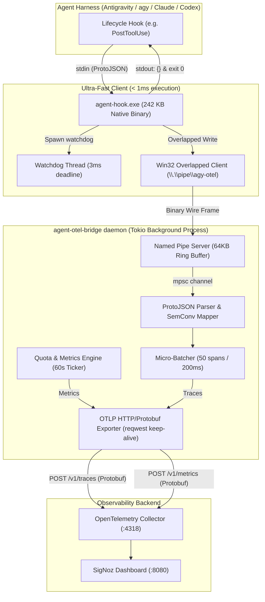

# Architecture Design: agent-otel-bridge

`agent-otel-bridge` is a native, high-performance OpenTelemetry instrumentation bridge engineered for autonomous AI CLI agent harnesses (Google Antigravity / `agy`, Claude Code, OpenAI Codex CLI, Aider, etc.).

---

## 1. Problem Statement & Invariants

AI coding agents execute dozens to hundreds of tool calls per session (`read_file`, `grep_search`, `run_command`, `replace_file_content`). Modern agent architectures invoke lifecycle hooks synchronously on hot paths:
- `PreToolUse`
- `PostToolUse`
- `PreInvocation`
- `PostInvocation`
- `Stop`

### Traditional Approaches vs Invariants

Traditional telemetry scripts (Python, Node.js, PowerShell) impose massive latency penalties on Windows:
- **PowerShell cold start**: 400ms – 1,200ms per tool invocation.
- **Python cold start**: 150ms – 280ms per tool invocation.
- **Direct HTTP/TCP POST**: 10ms – 40ms TCP socket setup + HTTP handshake. If the collector hangs, the hook blocks the developer's agent loop.

In a session with 200 tool calls, a script hook wastes **30 to 120 seconds of pure idle latency**, violating workstation invariants:

> **Workstation Invariant**: *"A hook command is a declared dependency: it must resolve, and a hook on a per-tool-call event must be a native binary."* ([`AGENTS.md`](file:///C:/Users/samue/code/environment-contract/AGENTS.md))

---

## 2. Core Architecture

`agent-otel-bridge` decomposes telemetry into an ultra-fast, zero-overhead client and a persistent background daemon communicating over high-speed Win32 Named Pipes:

---

## 3. IPC Protocol & Framing

The transport layer uses a zero-copy binary wire framing protocol:

| Offset | Field | Type | Description |
|---|---|---|---|
| `0..2` | `MAGIC` | `[u8; 2]` | Magic bytes `['A', 'G']` (`0x41`, `0x47`) |
| `2` | `VERSION` | `u8` | Protocol version (`0x01`) |
| `3` | `MSG_TYPE` | `u8` | `0x01`: HookPayload, `0x02`: QuotaPing, `0x03`: HealthPing, `0xFF`: Shutdown |
| `4..8` | `LEN` | `u32` (LE) | Little-endian payload length |
| `8..` | `PAYLOAD` | `[u8]` | Event tag (byte 0) + raw JSON payload |

### Fail-Open Guarantees

1. **Win32 Overlapped I/O**: `agent-hook.exe` issues asynchronous writes using Windows `CreateFileW(..., FILE_FLAG_OVERLAPPED, ...)`.
2. **2ms Wait Budget**: `GetOverlappedResultEx` waits at most 2ms. If the daemon is busy or offline, `CancelIoEx` is triggered, and the handle is closed.
3. **Hard Watchdog Thread**: A secondary thread sleeps for 3ms. If the main thread hangs on an OS call, the watchdog outputs `{}` to `stdout` and exits with code 0.

---

## 4. OpenTelemetry Semantic Conventions (v1.28+ / v1.36)

`agent-otel-bridge` complies with canonical OpenTelemetry GenAI standards while preserving legacy aliases for SigNoz dashboard compatibility:

### Spans & Attributes

| OTel Canonical Attribute | Value / Format | SigNoz Compatibility Alias |
|---|---|---|
| `gen_ai.operation.name` | `execute_tool`, `invoke_agent`, `agent.stop` | — |
| `gen_ai.provider.name` | `"google"`, `"anthropic"`, `"openai"` | `gen_ai.system = "antigravity"` |
| `gen_ai.agent.name` | `"antigravity"` | `service.name = "antigravity-cli"` |
| `gen_ai.conversation.id` | Session UUID | `gen_ai.conversation.id` |
| `gen_ai.tool.name` | `run_command`, `grep_search`, etc. | `gen_ai.tool.name` |
| `gen_ai.tool.call.id` | Tool call identifier | `gen_ai.tool.call.id` |
| `gen_ai.request.model` | Model name (e.g. `gemini-2.5-pro`) | `gen_ai.request.model` |
| `agy.hook.event` | `PostToolUse`, `PostInvocation`, `Stop` | `agy.hook.event` |
| `agy.step.index` | Integer turn index | `agy.step.index` |
| `agy.execution.num` | Execution sequence number | `agy.execution.num` |
| `agy.fully_idle` | Boolean | `agy.fully_idle` |

### Deterministic Trace & Span ID Correlation

- **`trace_id`**: Deterministic SHA-256 hash of `conversationId` truncated to 16 bytes. All hook events within the same Antigravity session automatically group into a single trace in SigNoz without cross-process context propagation.
- **`span_id`**: Deterministic SHA-256 hash of `(conversationId, stepIdx, event, toolName, salt)` truncated to 8 bytes.

### Station Quota Gauges

- `agy.quota.remaining_fraction`: Gauge, unit `"1"`, value `0.0..=1.0`, attributes: `bucket="gemini-weekly"`, `group="gemini"`.
- `agy.quota.seconds_to_reset`: Gauge, unit `"s"`, value `>= 0.0`, attributes: `bucket="gemini-weekly"`, `group="gemini"`.
