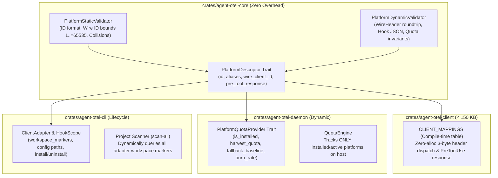

# AI Agent Harness Integration Guide

`agent-otel-bridge` is designed to provide zero-overhead OpenTelemetry observability across modern AI CLI agent harnesses and custom developer agent loops.

> 💡 **Architectural Guides**:
> - For an in-depth comparison of `agent-otel-bridge` vs. native harness telemetry (including multi-agent unification, tokenomics, and W3C distributed tracing), see [Why agent-otel-bridge vs. Native Harness Telemetry](WHY_AGENT_OTEL_BRIDGE.md).
> - For architectural constraints, fail-open trade-offs, and project shadowing solutions, see the [System Limitations & Mitigations Guide](LIMITATIONS.md).

---

## 1. Supported Client Overview & Scope Architecture

Every AI harness has a distinct configuration resolution model when resolving user global settings versus project workspace settings:

| Harness | Scope Architecture | Configuration Location (Global) | Configuration Location (Project) | Resolution Behavior |
|---|---|---|---|---|
| **Google Antigravity (`agy`)** | `NamespaceMerged` | `~/.gemini/config/hooks.json` | `.gemini/hooks.json` | **Namespace Merged**: Projects preserve sibling keys. Global bridge remains active unless explicitly overwritten by `"agent-otel-bridge"`. |
| **Claude Code / Desktop** | `ProjectShadowsGlobal` | `~/.claude/settings.json` | `.claude/settings.json` | **Array Override**: If a project defines `"hooks"`, it **completely shadows** user global hooks. Requires project synchronization. |
| **OpenAI Codex CLI** | `GlobalOnly` | `~/.codex/hooks.json` | N/A (Global-first) | **Purely Global**: Always evaluates global hooks. Projects do not shadow telemetry. |
| **xAI Grok CLI** | `GlobalOnly` | `~/.grok/hooks/agent-otel.json` | N/A (Dedicated) | **Isolated File**: Dedicated to the bridge. Completely global. |
| **Pi CLI (`pi.dev`)** | `GlobalOnly` | `~/.pi/agent/extensions/agent-otel-bridge.ts` | N/A (Dedicated) | Native event extension; legacy JSON retained for compatibility. |
| **Custom Agent Harness** | Custom | Environment / Custom Config | Custom Config | Direct Process Execution (`agent-hook.exe`). |

---

## 2. Automated Hook Registration & Workspace Synchronization

### 2.1 Global Machine Configuration
The fastest way to configure all installed AI agents on your machine:

```powershell
# Automatically detect installed agents and register global hooks
agent-otel-bridge install-hooks

# Or target a specific client
agent-otel-bridge install-hooks --client antigravity
agent-otel-bridge install-hooks --client claude
agent-otel-bridge install-hooks --client codex
agent-otel-bridge install-hooks --client grok
agent-otel-bridge install-hooks --client pi

# Force configure all 5 clients
agent-otel-bridge install-hooks --client all
```

### 2.2 Workspace Synchronization (`hooks sync`)
When working in repositories that define project-level configurations (such as repositories with custom `.claude/settings.json` validation scripts), global hooks are shadowed by design in Claude Code.

To align your current workspace without manually editing JSON files:

```powershell
# Inspect and synchronize the current workspace directory
agent-otel-bridge hooks sync

# Or target an explicit repository workspace path
agent-otel-bridge hooks sync --path "C:\Users\username\code\my-repo"
```

The `hooks sync` command:
1. Iterates over all registered client adapters.
2. Identifies any harness whose project configuration shadows global telemetry (`ProjectShadowsGlobal`).
3. If a project configuration file exists without the bridge hook, safely and idempotently injects `agent-hook.exe` while **strictly preserving all existing third-party and project scripts intact**.
4. Skips harnesses that are purely global (`GlobalOnly`) or already up-to-date.

### 2.3 Workstation Multi-Project Scanner (`hooks scan-all`)
To discover all projects and repositories on your machine and align or synchronize hooks across all of them in a single command:

```powershell
# Scan common developer folders (~/code, ~/projects, ~/dev, C:\code) and sync
agent-otel-bridge hooks scan-all

# Alias via sync command
agent-otel-bridge hooks sync --scan

# Preview discovered projects and changes without modifying files
agent-otel-bridge hooks scan-all --dry-run

# Scan specific directory roots
agent-otel-bridge hooks scan-all --roots "C:\Users\samue\code" "D:\projects"

# Scan entire local drives (with strict safety exclusions)
agent-otel-bridge hooks scan-all --all-drives
```

**Non-Silent Transparency & Safety Guarantees:**
- **Explicit Execution**: Never runs secretly or without user invocation.
- **High-Performance Pruning**: Automatically prunes heavy directories (`.git`, `node_modules`, `target`, `vendor`, `.cargo`, `AppData`, `Windows`, `Program Files`) to finish in seconds without freezing.
- **Real-Time Progress**: Emits live progress for each detected repository and client status (`[ok]`, `[synced]`, `[clean]`), concluding with a clear summary.
- **Non-Destructive**: Leaves clean repositories untouched (they inherit global hooks automatically) and non-destructively upgrades repositories whose local configs shadow global telemetry.

To verify registration status across global settings and current workspace overrides:
```powershell
agent-otel-bridge hooks status
```

---

## 3. Harness Configuration Details

### 3.1 Google Antigravity (`agy`)

Antigravity executes hook commands configured in `hooks.json`. When lifecycle events occur, `agy` streams a JSON payload to `stdin`.

**Global Config**: `~/.gemini/config/hooks.json` (or `%USERPROFILE%\.gemini\config\hooks.json`)

```json
{
  "agent-otel-bridge": {
    "PreToolUse": [
      {
        "matcher": ".*",
        "hooks": [
          {
            "type": "command",
            "command": "agent-hook PreToolUse",
            "timeout": 5
          }
        ]
      }
    ],
    "PostToolUse": [
      {
        "matcher": ".*",
        "hooks": [
          {
            "type": "command",
            "command": "agent-hook PostToolUse",
            "timeout": 5
          }
        ]
      }
    ],
    "PreInvocation": [
      {
        "type": "command",
        "command": "agent-hook PreInvocation",
        "timeout": 5
      }
    ],
    "PostInvocation": [
      {
        "type": "command",
        "command": "agent-hook PostInvocation",
        "timeout": 5
      }
    ],
    "Stop": [
      {
        "type": "command",
        "command": "agent-hook Stop",
        "timeout": 5
      }
    ]
  }
}
```

**Payload Schema streamed to `stdin`:**
```json
{
  "conversationId": "38d58ff9-8e43-43cf-bf24-e9188be08a1c",
  "stepIdx": 42,
  "toolCall": {
    "id": "call_12345",
    "name": "run_command",
    "arguments": {
      "CommandLine": "cargo test"
    }
  },
  "modelName": "gemini-2.5-pro",
  "executionNum": 1,
  "fullyIdle": false
}
```

---

### 3.2 Claude Code

Claude Code registers lifecycle hooks under the `"hooks"` key in `settings.json`.

**Global Config**: `~/.claude/settings.json` (or `%USERPROFILE%\.claude\settings.json`)

```json
{
  "hooks": {
    "PreToolUse": [
      {
        "matcher": "",
        "hooks": [
          {
            "type": "command",
            "command": "agent-hook PreToolUse"
          }
        ]
      }
    ],
    "PostToolUse": [
      {
        "matcher": "",
        "hooks": [
          {
            "type": "command",
            "command": "agent-hook PostToolUse"
          }
        ]
      }
    ],
    "Stop": [
      {
        "matcher": "",
        "hooks": [
          {
            "type": "command",
            "command": "agent-hook Stop"
          }
        ]
      }
    ]
  }
}
```

**Payload Schema streamed to `stdin`:**
```json
{
  "session_id": "9a12c8b0-51ea-4bb3-93cf-7e3f8ba01c22",
  "turn_index": 12,
  "tool_use_id": "toolu_01ABCD1234",
  "tool_name": "Bash",
  "tool_input": {
    "command": "git status"
  },
  "tool_result": {
    "output": "On branch main\nnothing to commit"
  },
  "model": "claude-3-5-sonnet"
}
```
`agent-otel-bridge` automatically parses both camelCase and snake_case representations, normalizes `session_id` into `gen_ai.conversation.id`, and maps `Bash` tool calls to canonical OpenTelemetry spans.

---

### 3.3 OpenAI Codex CLI

OpenAI Codex CLI hooks are configured via `~/.codex/hooks.json`.

```json
{
  "hooks": [
    {
      "event": "PreToolUse",
      "command": "agent-hook PreToolUse"
    },
    {
      "event": "PostToolUse",
      "command": "agent-hook PostToolUse"
    },
    {
      "event": "Stop",
      "command": "agent-hook Stop"
    }
  ]
}
```
Spans emitted from Codex sessions automatically receive:
- `gen_ai.provider.name`: `"openai"`
- `gen_ai.agent.name`: `"codex"`
- `gen_ai.request.model`: e.g. `gpt-4o`, `o1-preview`, `o3-mini`

---

### 3.4 xAI Grok CLI

xAI Grok CLI hooks are configured via `~/.grok/hooks.json`.

```json
{
  "hooks": [
    {
      "event": "PreToolUse",
      "command": "agent-hook PreToolUse"
    },
    {
      "event": "PostToolUse",
      "command": "agent-hook PostToolUse"
    },
    {
      "event": "Stop",
      "command": "agent-hook Stop"
    }
  ]
}
```
Spans emitted from Grok sessions automatically receive:
- `gen_ai.provider.name`: `"xai"`
- `gen_ai.agent.name`: `"grok"`
- `gen_ai.request.model`: e.g. `grok-2`, `grok-beta`

---

### 3.5 Pi CLI (pi.dev)

[Pi CLI](https://pi.dev/) loads the managed native extension at
`~/.pi/agent/extensions/agent-otel-bridge.ts`. It forwards `tool_call`,
`tool_result`, `session_start`, `session_shutdown`, and `agent_end` to the
canonical hook executable with client tag `pi`. It returns no tool decisions
or model-visible content. The installer retains `~/.pi/hooks.json` for older
consumers, but that JSON file alone does not activate telemetry in Pi 0.85.1.

```json
{
  "hooks": [
    {
      "event": "PreToolUse",
      "command": "agent-hook PreToolUse"
    },
    {
      "event": "PostToolUse",
      "command": "agent-hook PostToolUse"
    },
    {
      "event": "Stop",
      "command": "agent-hook Stop"
    }
  ]
}
```
Spans emitted from Pi sessions automatically receive:
- `gen_ai.provider.name`: `"pi"`
- `gen_ai.agent.name`: `"pi"`

---

## 4. Custom LLM Agents & Developer Harnesses

You can instrument any custom agent loop (Python, Node.js, Go, Rust, or Bash) using `agent-hook.exe`.

### How It Works
1. When your agent executes a tool or completes a turn, spawn `agent-hook.exe <EventName>` as a child process.
2. Write the JSON payload to the child's `stdin` and close it.
3. Read `stdout` (`{}`) and exit code (`0`).
4. `agent-hook.exe` executes in **< 1ms**, writes to the local Named Pipe asynchronously, and never blocks your agent.

### Python Example

```python
import subprocess
import json

def emit_agent_hook(event: str, session_id: str, tool_name: str, args: dict, model: str = "custom-agent"):
    payload = json.dumps({
        "conversationId": session_id,
        "toolCall": {
            "name": tool_name,
            "arguments": args
        },
        "modelName": model
    }).encode("utf-8")

    try:
        proc = subprocess.run(
            ["agent-hook.exe", event],
            input=payload,
            capture_output=True,
            timeout=0.010 # 10ms hard timeout guard
        )
    except Exception as e:
        # Fails open: Telemetry must never crash or block agent execution
        pass

# Example usage during tool execution
emit_agent_hook("PostToolUse", "sess-123", "grep_search", {"Query": "pattern"})
```

### Node.js Example

```typescript
import { spawn } from "child_process";

function emitHook(event: string, payload: Record<string, any>): void {
  try {
    const child = spawn("agent-hook.exe", [event], {
      stdio: ["pipe", "ignore", "ignore"],
      windowsHide: true,
    });

    child.stdin.write(JSON.stringify(payload));
    child.stdin.end();

    // Do not wait for exit - allow agent event loop to continue uninterrupted
    child.unref();
  } catch (err) {
    // Fail open
  }
}
```

---

## 5. Platform Architecture & Extensibility

`agent-otel-bridge` uses a decoupled, contract-oriented architecture (**Platform Provider & Descriptor Pattern**) designed for zero-overhead performance, modular extensibility, and total isolation between harnesses.



### 5.1 Machine-Adaptive Quota Monitoring
Unlike traditional monitoring agents that emit static, phantom metrics for tools you do not use, `QuotaEngine` operates **dynamically**:
1. At startup, the daemon scans your local environment (`dirs_fallback()`) across all registered `PlatformQuotaProvider` implementations.
2. Only harnesses that return `is_installed(&home) == true` (e.g. config directory exists, session logs present, or CLI binary in PATH) are loaded into the quota monitoring set.
3. If Claude Code is the only AI harness installed on your workstation, the OTLP exporter emits **strictly Claude metrics** — completely avoiding phantom gauges for Gemini, Codex, or Grok.
4. Quotas are keyed by `bucket`, ensuring custom override files in `~/.agent-otel/quotas/<name>.json` cleanly update live state without ID duplication.

### 5.2 The Platform Contract Suite

To integrate any AI coding agent harness, three decoupled contracts are implemented:

| Layer | Contract | Responsibility |
|---|---|---|
| **Core** (`agent-otel-core`) | `PlatformDescriptor` | Primary ID, aliases, wire client ID (`1..=65535`), and hook response contract (`AllowJson` vs `EmptyJson`). |
| **Daemon** (`agent-otel-daemon`) | `PlatformQuotaProvider` | Host installation probe (`is_installed`), dynamic state harvesting (`harvest_quota`), baseline headroom, and token burn rate. |
| **CLI / Hooks** (`agent-otel-cli`) | `ClientAdapter` | Hook scope, workspace directory markers (`workspace_markers`), global and project config resolvers, idempotent install/uninstall. |

---

## 6. Adding a New AI Agent Harness (Step-by-Step Blueprint: "Hermes")

To illustrate how seamless adding a new agent harness is, here is the complete blueprint for adding **Hermes AI Agent**:

### Step 1: Define the Core Descriptor
In `crates/agent-otel-core/src/platform.rs`:
```rust
pub struct HermesDescriptor;

impl PlatformDescriptor for HermesDescriptor {
    fn id(&self) -> &'static str { "hermes" }
    fn display_name(&self) -> &'static str { "Hermes AI Agent" }
    fn aliases(&self) -> &'static [&'static str] { &["hermes-cli", "nous-hermes"] }
    fn wire_client_id(&self) -> u16 { 6 } // Next available ID in 1..=65535
    fn pre_tool_response(&self) -> HookResponse { HookResponse::AllowJson }
}
```
Add `&HermesDescriptor` to `BUILTIN_PLATFORMS`.

### Step 2: Implement the Quota Provider
In `crates/agent-otel-daemon/src/platforms/hermes.rs`:
```rust
use std::path::Path;
use agent_otel_core::platform::PlatformDescriptor;
use agent_otel_core::quota::QuotaSnapshot;
use crate::platform::PlatformQuotaProvider;

pub struct HermesQuotaProvider;

impl PlatformDescriptor for HermesQuotaProvider {
    fn id(&self) -> &'static str { "hermes" }
    fn display_name(&self) -> &'static str { "Hermes AI Agent" }
    fn aliases(&self) -> &'static [&'static str] { &["hermes-cli", "nous-hermes"] }
    fn wire_client_id(&self) -> u16 { 6 }
}

impl PlatformQuotaProvider for HermesQuotaProvider {
    fn is_installed(&self, home: &Path) -> bool {
        home.join(".hermes").exists() || which::which("hermes").is_ok()
    }

    fn harvest_quota(&self, home: &Path) -> Option<QuotaSnapshot> {
        let p = home.join(".hermes").join("quota.json");
        if p.exists() {
            crate::quota::read_quota_file(&p)
        } else {
            None
        }
    }

    fn fallback_baseline(&self) -> QuotaSnapshot {
        QuotaSnapshot {
            remaining_fraction: 1.0,
            seconds_to_reset: 3600.0,
            observed_at_unix_nano: crate::quota::current_unix_nano(),
            bucket: "hermes".to_string(),
            group: "nous".to_string(),
        }
    }

    fn burn_per_token(&self) -> f64 {
        1.0 / 10_000_000.0 // Custom context headroom
    }
}
```
Register in `crates/agent-otel-daemon/src/platforms/mod.rs` inside `BUILTIN_PROVIDERS`.

### Step 3: Register in the Client Mapping Table
In `crates/agent-otel-client/src/main.rs`:
```rust
ClientMapping {
    aliases: &["hermes", "hermes-cli", "nous-hermes"],
    wire_id: 6,
    allow_pre_tool: true,
},
```

### Step 4: Register in CLI Adapters & Workspace Scanner
In `crates/agent-otel-cli/src/hooks.rs`:
```rust
ClientAdapter {
    id: "hermes",
    display_name: "Hermes AI Agent",
    aliases: &["hermes-cli", "nous-hermes"],
    client_tag: Some("hermes"),
    scope: HookScope::GlobalOnly,
    workspace_markers: &[".hermes", "hermes.json"],
    global_config_fn: || get_hermes_config_path(false),
    project_config_fn: get_hermes_project_path,
    install_fn: install_standard_hooks,
    uninstall_fn: uninstall_standard_hooks,
    is_registered_fn: is_hermes_registered,
},
```
*Note: Because `workspace_markers` is specified, `agent-otel-bridge hooks scan-all` immediately and automatically detects `.hermes` repositories without editing the scanner engine!*

---

## 7. Static and Dynamic Conformance Validation

To ensure every contributed harness conforms to production SLAs before merging, `agent-otel-bridge` includes an automated **Conformance Harness**:

```powershell
# Run the platform conformance suite
cargo test -p agent-otel-core --test platform_conformance

# Run the complete automated guardrails verification
cargo guardrails
```

### What the Conformance Validator Verifies:
1. **Static Conformance (`PlatformStaticValidator`)**:
   - **ID Hygiene**: ID is non-empty, lowercase ASCII alphanumeric with hyphens/underscores.
   - **Wire Bounds**: `wire_client_id` is strictly within `1..=65535` (occupies 16 bits of the 3-byte wire header; ID 0 is reserved for `Unspecified`).
   - **Zero Collision**: Primary IDs, wire IDs, and aliases never collide across harnesses.
2. **Dynamic Invariants (`PlatformDynamicValidator`)**:
   - **Wire Framing Roundtrip**: 3-byte `WireHeader` (`[u8 event_id, u16 client_id (LE)]`) packs and unpacks identically across all `HookEvent` variants.
   - **Valid PreToolUse Response**: `pre_tool_response()` evaluates to valid JSON (`{"decision":"allow"}` or `{}`).
   - **Quota Bounds**: `remaining_fraction` is finite and in $[0.0, 1.0]$, `seconds_to_reset` $\ge 0.0$.
   - **Non-blocking Probe SLA**: Probes execute in $< 150\ \mu\text{s}$ and never spawn subprocesses on the telemetry path.

