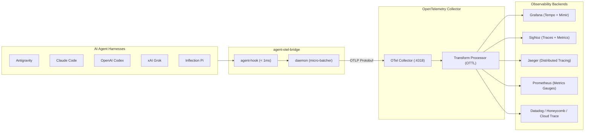

# OpenTelemetry Dashboard & Visualization Guide

This guide details dashboard construction, query specifications, and visualization recipes for `agent-otel-bridge` across standard OpenTelemetry-compatible backends (**Grafana**, **SigNoz**, **Jaeger**, **Prometheus**, **Datadog**, and **Honeycomb**).

- **Default Collector Endpoint**: `http://127.0.0.1:4318` (OTLP HTTP/Protobuf) or `127.0.0.1:4317` (OTLP gRPC)
- **Standard Semantic Conventions**: OpenTelemetry GenAI (`gen_ai.*`) and Agent Lifecycle (`agent.*`)
- **Ready-to-Use Contrib Dashboard**: [SigNoz JSON Template (`ai-agent-observability.json`)](../contrib/dashboards/signoz/ai-agent-observability.json) — [Import Guide](../contrib/dashboards/signoz/README.md)
- **Telemetry Taxonomy & Variable Dictionary**: [`docs/TELEMETRY_DICTIONARY.md`](./TELEMETRY_DICTIONARY.md)

---

## 1. OpenTelemetry Architecture & Layer Separation

`agent-otel-bridge` adheres to OpenTelemetry architectural standards:
1. **Instrumentation Layer**: Emits purely canonical, vendor-neutral semantic conventions. All supported agents (Google Antigravity, Claude Code, OpenAI Codex, xAI Grok, Inflection Pi) produce uniform attributes.
2. **Collection Layer (OpenTelemetry Collector)**: Receives standard OTLP, applies batching, memory limiting, and optional OTTL transformations, then fans out to downstream backends.
3. **Visualization Layer**: Dashboards query canonical OpenTelemetry attributes directly without vendor lock-in.



---

## 2. Canonical Dashboard Panels & Query Specifications

Every panel in your dashboard should query canonical OpenTelemetry conventions:

| # | Panel Name | Visualization | Data Source | Canonical Metric / Attribute | Purpose / Description |
|---|---|---|---|---|---|
| **1** | **Active Sessions** | Single Stat / Count | Traces | `gen_ai.conversation.id` | Distinct active agent conversations grouped by `gen_ai.agent.name`. |
| **2** | **Tool Execution Latency** | Time Series (P50/P95/P99) | Traces | `duration` | Latency distribution of spans where `gen_ai.operation.name = 'execute_tool'` by `gen_ai.tool.name`. |
| **3** | **Tool Call Distribution** | Donut / Bar Chart | Traces | `gen_ai.tool.name` | Frequency of each tool invoked (`run_command`, `Bash`, `view_file`, etc.). |
| **4** | **Hook Events Timeline** | Spans Table | Traces | `agent.hook.event` | Chronological list of agent lifecycle events (`PostToolUse`, `PostInvocation`, `Stop`). |
| **5** | **Agent Quota Remaining** | Gauge (0–100%) | Metrics | `agent.quota.remaining_fraction` | Current quota percentage remaining (`0.0..=1.0`), grouped by `bucket`. |
| **6** | **Seconds to Quota Reset** | Stat / Time Duration | Metrics | `agent.quota.seconds_to_reset` | Countdown time until quota resets for each provider bucket. |
| **7** | **Error Rate by Agent & Tool** | Time Series | Traces | `status.code = ERROR` | Failed tool executions or hook errors grouped by `gen_ai.tool.name`. |
| **8** | **AI Provider Breakdown** | Pie Chart | Traces | `gen_ai.provider.name` | Proportion of activity by AI provider (`google`, `anthropic`, `openai`, `xai`, `inflection`). |
| **9** | **Turn Step Distribution** | Bar Chart / Histogram | Traces | `agent.step.index` | Depth of reasoning turns per session (`agent.step.index`). |
| **10** | **Quiescence & Stop Reasons** | Table / Donut | Traces | `agent.termination_reason` | Agent stop breakdown (`NO_TOOL_CALL`, `model_stop`, `error`). |

---

## 3. Query Implementation Examples

### A. Grafana (PromQL & TraceQL)

#### Panel 5: Agent Quota Remaining (PromQL)
```promql
# Query Prometheus / Mimir
agent_quota_remaining_fraction * 100
```

#### Panel 6: Seconds to Quota Reset (PromQL)
```promql
agent_quota_seconds_to_reset
```

#### Panel 2: Tool Execution Latency (TraceQL in Tempo)
```traceql
{ span.gen_ai.operation.name = "execute_tool" } | select(duration, span.gen_ai.tool.name)
```

#### Panel 4: Failed Spans (TraceQL in Tempo)
```traceql
{ status = error && span.agent.hook.event = "PostToolUse" }
```

---

### B. SigNoz / ClickHouse SQL

#### Panel 1: Active Sessions by Agent
```sql
SELECT
    attributes_string_value['gen_ai.agent.name'] AS agent_name,
    count(DISTINCT attributes_string_value['gen_ai.conversation.id']) AS active_sessions
FROM signoz_traces.signoz_index_v2
WHERE timestamp >= now() - INTERVAL 1 HOUR
GROUP BY agent_name;
```

#### Panel 2: Tool Latency Percentiles (P50 & P95)
```sql
SELECT
    toStartOfInterval(timestamp, INTERVAL 1 MINUTE) AS time,
    attributes_string_value['gen_ai.tool.name'] AS tool_name,
    quantile(0.50)(durationNano) / 1000000 AS p50_ms,
    quantile(0.95)(durationNano) / 1000000 AS p95_ms
FROM signoz_traces.signoz_index_v2
WHERE attributes_string_value['gen_ai.operation.name'] = 'execute_tool'
  AND timestamp >= now() - INTERVAL 1 HOUR
GROUP BY time, tool_name
ORDER BY time ASC;
```

#### Panel 3: Tool Call Distribution
```sql
SELECT
    attributes_string_value['gen_ai.tool.name'] AS tool_name,
    count() AS total_calls
FROM signoz_traces.signoz_index_v2
WHERE attributes_string_value['gen_ai.operation.name'] = 'execute_tool'
  AND timestamp >= now() - INTERVAL 24 HOUR
GROUP BY tool_name
ORDER BY total_calls DESC;
```

#### Panel 4: Hook Events Timeline
```sql
SELECT
    timestamp,
    trace_id,
    attributes_string_value['gen_ai.agent.name'] AS agent,
    attributes_string_value['agent.hook.event'] AS hook_event,
    attributes_string_value['gen_ai.tool.name'] AS tool,
    attributes_string_value['agent.termination_reason'] AS termination_reason,
    durationNano / 1000000 AS duration_ms
FROM signoz_traces.signoz_index_v2
WHERE has(attributes_string_key, 'agent.hook.event')
  AND timestamp >= now() - INTERVAL 1 HOUR
ORDER BY timestamp DESC
LIMIT 100;
```

#### Panel 5: Agent Quota Remaining Gauge
```sql
SELECT
    toStartOfInterval(timestamp, INTERVAL 1 MINUTE) AS time,
    attributes_string_value['bucket'] AS bucket,
    avg(value) * 100 AS remaining_percent
FROM signoz_metrics.samples_v4
WHERE metric_name = 'agent.quota.remaining_fraction'
  AND timestamp >= now() - INTERVAL 6 HOUR
GROUP BY time, bucket
ORDER BY time ASC;
```

---

### C. Jaeger Search Filters

To inspect traces directly in Jaeger UI:
- **Service Name**: `agent-otel-bridge`
- **Operation**: `execute_tool` or `invoke_agent`
- **Tags / Attributes**:
  - `agent.hook.event=PostToolUse`
  - `gen_ai.agent.name=claude-code` (or `antigravity`, `codex`, `grok`, `pi`)
  - `gen_ai.tool.name=run_command`

---

## 4. OpenTelemetry Collector Configuration Recipe

The OpenTelemetry Collector routes telemetry to any set of backends and can apply transformations transparently:

```yaml
# otel-collector-config.yaml
receivers:
  otlp:
    protocols:
      http:
        endpoint: 0.0.0.0:4318
      grpc:
        endpoint: 0.0.0.0:4317

processors:
  batch:
    send_batch_size: 100
    timeout: 200ms
  memory_limiter:
    check_interval: 1s
    limit_percentage: 75

exporters:
  # Export to Grafana Tempo / Mimir or SigNoz via standard OTLP
  otlp/backend:
    endpoint: backend-collector:4317
    tls:
      insecure: true

  # Export metrics to Prometheus scraper
  prometheus:
    endpoint: 0.0.0.0:8889
    namespace: agent_otel

  # Debug / logging exporter for local inspection
  debug:
    verbosity: basic

service:
  pipelines:
    traces:
      receivers: [otlp]
      processors: [memory_limiter, batch]
      exporters: [otlp/backend, debug]
    metrics:
      receivers: [otlp]
      processors: [memory_limiter, batch]
      exporters: [otlp/backend, prometheus]
```

---

## 5. Verification Checklist

1. Run pipeline diagnostics:
   ```powershell
   agent-otel-bridge doctor
   ```
2. Broadcast a test quota metric:
   ```powershell
   agent-otel-bridge emit-quota --ping
   ```
3. Open your visualization tool (Grafana, Jaeger, or SigNoz) and verify that traces with operation `execute_tool` and gauges with metric `agent.quota.remaining_fraction` appear in real time.
