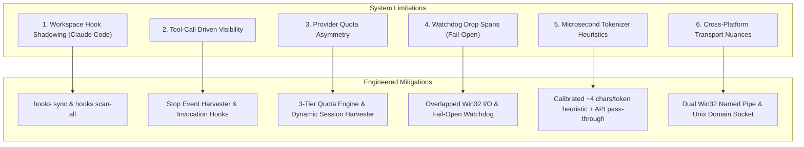

# System Limitations & Architectural Mitigations Guide

> **Audience**: Platform Engineers, Enterprise Architects, Core Contributors, and Observability Operators.  
> **Repository**: `smota/agent-otel-bridge`  
> **Status**: Active & Enforced Architectural Standard  

---

## 1. Architectural Philosophy: Invariants & Conscious Trade-offs

Observability for autonomous AI coding agents operates under constraints fundamentally different from typical microservices:

1. **Synchronous Execution on the Agent Hot-Path**: Agent lifecycle hooks run directly in the inner loop of the agent's turn. Any latency introduced directly delays the developer or agent interaction.
2. **The Fail-Open Imperative**: Telemetry must **never** break an agent session, freeze a terminal, or cause a tool invocation to fail.
3. **Zero Host Pollution**: The bridge must not write unsolicited files or clutter repository directories without explicit operator instruction.

Because of these non-negotiable invariants, `agent-otel-bridge` incorporates intentional trade-offs. This document catalog's all system limitations, explains their root causes, and details the built-in engineering mitigations.

---

## 2. Technical Limitations & Mitigation Strategies

---

### 2.1 Workspace Configuration Shadowing (Claude Code Array Overrides)

#### The Limitation
Different AI harnesses resolve global versus project settings using fundamentally different models:
- **Google Antigravity (`agy`)**: Uses a `NamespaceMerged` architecture. A repository defining a `.gemini/hooks.json` preserves sibling global namespaces. The global bridge hook remains active automatically unless explicitly shadowed by key name.
- **Claude Code**: Uses a `ProjectShadowsGlobal` architecture. In Claude Code (`.claude/settings.json`), the `"hooks"` key is an array. If a project repository provides its own `.claude/settings.json` (common in enterprise repositories with custom validation linters), Claude Code **completely replaces and ignores** the user's global `~/.claude/settings.json` hooks array.

As a result, opening a cloned repository with local Claude settings silently disables global telemetry for that project unless the project settings explicitly include `agent-hook.exe`.

#### How We Address It
1. **`agent-otel-bridge hooks sync`**:
   Inspects the current repository. If the project shadows global hooks, it non-destructively injects `agent-hook.exe` while **strictly preserving all existing project and third-party hooks** (`herdr`, `rtk`, etc.).
2. **`agent-otel-bridge hooks scan-all`**:
   A workstation-wide scanner that crawls developer directory roots (e.g. `~/code`, `C:\code`), detects all repositories matching harness markers (`.claude`, `.gemini`, `.codex`), and aligns configuration files in bulk.
3. **Idempotent In-Place Upgrades**:
   Upgrades older relative paths to absolute canonical binary paths (`%LOCALAPPDATA%\agent-otel-bridge\bin\agent-hook.exe`) without duplicating entries.

---

### 2.2 Tool-Call Driven Lifecycle & Conversational Blind Spots

#### The Limitation
`agent-hook` executes synchronously when an agent fires a lifecycle hook (`PreInvocation`, `PostInvocation`, `PreToolUse`, `PostToolUse`, `Stop`).  
If an AI agent engages in a purely conversational turn without invoking any tools (e.g., pure internal reasoning or an unstructured text response), visibility depends on whether the harness exposes invocation-level events:
- If a harness only provides tool-level hooks, purely conversational turns without tool calls do not trigger the hook client.
- Model turn latency cannot be measured directly if the harness does not provide start and end timestamps.

#### How We Address It
1. **Multi-Event Normalization**:
   The bridge supports 5 canonical lifecycle events: `PreInvocation`, `PostInvocation`, `PreToolUse`, `PostToolUse`, and `Stop`.
2. **Stop Event Session Harvester**:
   When the agent turn terminates (`Stop`), `agent-otel-daemon` performs a non-blocking context harvest, capturing VCS changes produced during the session (`git_lines_added`, `git_lines_deleted`, `git_files_changed`, `git_self_revert`).
3. **Synthetic Duration Fallback**:
   When a harness does not emit explicit microsecond start/end timestamps, the daemon applies a calibrated minimum synthetic duration (~1ms) so spans remain visible and properly proportioned in waterfall flamegraphs.

---

### 2.3 Multi-Provider Quota Asymmetry & In-Memory State

#### The Limitation
AI model providers do not provide a standardized local mechanism to query remaining quota:
- **Anthropic (Claude Code)**: Writes remaining tokens and rejection states into local session files (`.claude/projects/*/*.jsonl`).
- **OpenAI, Google, xAI**: Do not write live quota consumption to local project files unless the developer configures dedicated state files (`~/.state/quota.json`).

Furthermore, `agent-otel-bridge` operates **strictly in-memory** by default and intentionally avoids writing state files to disk.

#### How We Address It
1. **3-Tier Adaptive Quota Engine**:
   - **Tier 1 (Explicit State)**: Reads real state files (`~/.state/quota.json`, `~/.agent-otel/quotas/*.json`) if present.
   - **Tier 2 (Dynamic Session Harvesting)**: For Claude Code, dynamically parses recent `.jsonl` session files to extract `<total_tokens>` and `quotaLimits`.
   - **Tier 3 (Installed Machine Fallback)**: For platforms installed on the host but lacking local quota files, initializes a baseline that is dynamically decremented via `burn_per_token()` on every recorded tool execution.
2. **Zero Phantom Metrics**:
   Harnesses that are not detected on the developer's machine (`is_installed == false`) are completely omitted from metrics export.
3. **Custom Quota Ingestion Directory (`~/.agent-otel/quotas/*.json`)**:
   External automation (e.g., team CI, credential vaults, background synchronizers) can drop simple JSON files into `~/.agent-otel/quotas/<provider>.json` to override in-memory estimates with exact enterprise contract quotas.

---

### 2.4 Hardware Watchdog & Intentional Span Drops (Fail-Open Guarantee)

#### The Limitation
If the host operating system experiences extreme CPU starvation, or if the background daemon process is terminated, the client's write to the named pipe could theoretically block or wait.

#### How We Address It
1. **Dedicated OS Watchdog Thread (3.0 ms)**:
   Every `agent-hook` process spawns an isolated OS thread with a 3.0 ms hardware deadline.
2. **Fail-Open Policy**:
   If the pipe write does not complete within 3 ms, the watchdog thread terminates the client process with exit code `0` and outputs a valid JSON payload (`{"decision":"allow"}` or `{}`).
3. **Conscious Trade-off**:
   **We deliberately choose to drop a telemetry span rather than freeze a developer's terminal or crash an agent session.**

---

### 2.5 Microsecond Heuristics vs. Heavy Model Tokenizers

#### The Limitation
Calculating exact token savings (`tool.tokens_saved_estimate`) and command compression ratios across multiple LLMs requires tokenizers like `tiktoken`, `cl100k_base`, `o200k_base`, or Anthropic's BPE. Compiling these tokenizers into `agent-otel-core` would inflate library dependencies, increase compilation times, and add megabytes of binary footprint.

#### How We Address It
1. **Calibrated Industry Heuristics**:
   The archetype classifier estimates token counts in $< 10\ \mu\text{s}$ using calibrated character-to-token ratios (~4 characters per token for prose, ~3.2 for source code).
2. **Native Metadata Precedence**:
   Whenever an AI harness provides exact token counts in its payload (`input_tokens`, `output_tokens`, `cached_tokens`), the bridge adopts the authoritative API numbers, superseding heuristic estimations.

---

### 2.6 Cross-Platform Transport Nuances (Named Pipes vs. Unix Sockets)

#### The Limitation
- **Windows**: Uses Win32 Overlapped Named Pipes (`\\.\pipe\agent-otel`). Named pipes provide sub-150 µs IPC on Windows.
- **Linux & macOS**: Uses Unix Domain Sockets (`/tmp/agent-otel.sock` or `$XDG_RUNTIME_DIR/agent-otel.sock`). File permissions, `$TMPDIR` path differences, and user-space socket cleanup require handling across diverse Unix distributions.

#### How We Address It
1. **Dual Transport Abstraction (`agent-otel-ipc`)**:
   Maintains native Overlapped Win32 routines on Windows and non-blocking Unix Domain Sockets on Linux/macOS.
2. **Environment Path Override (`AGENT_OTEL_PIPE`)**:
   Enables operators in containerized or custom environments to define custom pipe/socket paths explicitly.

---

## 3. Operational Mitigation Matrix

| Challenge / Limitation | Operator Command / Solution | Reference Guide |
|---|---|---|
| Claude Code local project shadows global hooks | `agent-otel-bridge hooks sync` | [`docs/CLIENTS.md`](CLIENTS.md#22-workspace-synchronization-hooks-sync) |
| Aligning multiple repositories on workstation | `agent-otel-bridge hooks scan-all` | [`docs/CLIENTS.md`](CLIENTS.md#23-workstation-multi-project-scanner-hooks-scan-all) |
| Verifying platform contract & wire ID bounds | `cargo test -p agent-otel-core --test platform_conformance` | [`docs/CLIENTS.md`](CLIENTS.md#7-static-and-dynamic-conformance-validation) |
| Injecting exact enterprise contract quotas | Drop JSON into `~/.agent-otel/quotas/<provider>.json` | [`docs/CONFIGURATION.md`](CONFIGURATION.md) |
| Diagnosing hook communication health | `agent-otel-bridge doctor` | [`docs/TROUBLESHOOTING.md`](TROUBLESHOOTING.md) |
| Full repository guardrail validation | `cargo guardrails` | [`CONTRIBUTING.md`](../CONTRIBUTING.md#3-automated-guardrails-verification) |
