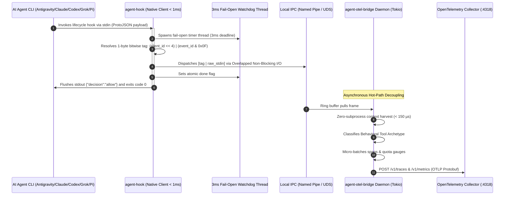

# Native CLI Instrumentation Architecture & Design

`agent-otel-bridge` solves the **synchronous hot-path latency bottleneck** in autonomous AI CLI agent harnesses (**Google Antigravity**, **Anthropic Claude Code**, **OpenAI Codex**, **xAI Grok**, **Pi [pi.dev]**, and custom LLM agents).

This document details the engineering principles, zero-copy IPC protocol, and fail-open guarantees that make this native instrumentation engine achieve **sub-millisecond execution (< 1.0 ms)** with **zero LLM prompt pollution**.

---

## 1. The Core Problem: Hook Cold-Start Latency

Autonomous coding agents invoke synchronous lifecycle hooks (`PreToolUse`, `PostToolUse`, `PreInvocation`, `PostInvocation`, `Stop`) continuously throughout a pairing session. In a typical session with 200 tool invocations:

| Hook Implementation | Cold Start per Tool Call | 200 Tool Calls Accumulated Latency | Developer Experience Impact |
|:---|:---:|:---:|:---|
| **PowerShell Script (`.ps1`)** | **450 ms – 1,200 ms** | **90 – 240 seconds** | Severe lag; breaks developer focus |
| **Python Script (`.py`)** | **150 ms – 280 ms** | **30 – 56 seconds** | Sluggish terminal responsiveness |
| **Node.js Script (`.js`)** | **180 ms – 350 ms** | **36 – 70 seconds** | Noticeable delay per shell command |
| **`agent-hook` (Native Rust)** | **< 1.0 ms (Observed: ~150 µs)** | **< 0.3 seconds** | **Imperceptible, instant execution** |

Script-based hooks force the operating system to spawn heavy interpreter runtimes, initialize memory heaps, load dynamic standard libraries, and parse JSON payloads on every single tool execution.

`agent-otel-bridge` eliminates this overhead entirely by decoupling telemetry into:
1. **`agent-hook`**: A microscopic, statically-linked native PE32/ELF executable (< 300 KB) running on the synchronous hot path.
2. **`agent-otel-bridge daemon`**: An asynchronous Tokio background daemon maintaining persistent connection pools to the OpenTelemetry Collector.

---

## 2. End-to-End Sequence & Architecture



---

## 3. Seven Architectural Pillars

### 3.1 ⚡ 1-Byte Bitwise Tag Protocol
To eliminate serialization and JSON deserialization on the client hot path, `agent-hook` encodes both the agent harness identity and the lifecycle hook event into **a single byte**:

$$\text{Tag Byte} = (\text{client\_id} \ll 4) \mid (\text{event\_id} \ \& \ 0\text{x}0\text{F})$$

#### Client Identity Nibble (High 4 bits: `tag >> 4`)
| Client ID | Agent Harness | Configuration Location |
|:---:|:---|:---|
| `0` | Unknown / Generic Agent | Custom stdin / CLI flag |
| `1` | **Google Antigravity (`agy`)** | `~/.gemini/config/hooks.json` |
| `2` | **Anthropic Claude Code** | `~/.claude/settings.json` |
| `3` | **OpenAI Codex CLI** | `~/.codex/hooks.json` |
| `4` | **xAI Grok CLI** | `~/.grok/hooks/agent-otel.json` |
| `5` | **Pi (`pi.dev`)** | `~/.pi/hooks.json` |

#### Event Type Nibble (Low 4 bits: `tag & 0x0F`)
| Event ID | Lifecycle Hook Event | Description |
|:---:|:---|:---|
| `1` | `PreInvocation` | Turn starts before prompt execution |
| `2` | `PostInvocation` | Model response received |
| `3` | `PreToolUse` | Approval gate before executing a tool |
| `4` | `PostToolUse` | Tool execution completed with output |
| `5` | `Stop` | Session completion or quiescence |

The client simply allocates a vector with `1 + stdin.len()`, writes the tag byte at position 0, appends the raw stdin bytes, and writes to the IPC channel. **Zero JSON parsing is performed on the synchronous path.**

---

### 3.2 🛡️ OS Watchdog Fail-Open Backstop
The client must **never block, freeze, or break** an AI developer pairing session under any circumstances (e.g. pipe buffer full, collector unavailable, network partition).

At process start, `agent-hook` spawns a dedicated OS thread with a strict deadline:
```rust
fn spawn_watchdog(done: Arc<AtomicBool>, tag: u8) {
    thread::spawn(move || {
        thread::sleep(Duration::from_millis(WATCHDOG_MS));
        if !done.load(Ordering::Acquire) {
            finish_ok(tag);
        }
    });
}
```
If the pipe I/O or stdin read does not complete within the deadline, the watchdog thread triggers `finish_ok(tag)`, immediately emitting the required approval JSON to stdout and exiting with `code 0`.

---

### 3.3 🤝 Synchronous Protocol Handshake Negotiation
Different agent harnesses expect distinct handshake responses from hook commands:
- **`PreToolUse`**: Agent frameworks (such as Antigravity and Claude Code) require permission validation. Returning an empty string or error halts execution. `agent-hook` synchronously flushes:
  ```json
  {"decision":"allow"}
  ```
- **`PostToolUse`, `PostInvocation`, `Stop`**: Frameworks expect an empty JSON payload:
  ```json
  {}
  ```
Because `finish_ok` inspects the event byte (`tag & 0x0F`), the proper handshake response is guaranteed even if the watchdog terminates early.

---

### 3.4 🚀 Zero-Copy Local IPC (Win32 Overlapped & Unix Domain Sockets)
Communication between `agent-hook` and the background daemon uses native operating system IPC:
- **Windows**: Win32 Named Pipe (`\\.\pipe\agent-otel`) opened with `FILE_FLAG_OVERLAPPED`. Writes are asynchronous fire-and-forget; the client never waits for daemon flush.
- **Linux & macOS**: POSIX Unix Domain Sockets (`/tmp/agent_otel_bridge.sock`) configured with `SO_SNDTIMEO` and non-blocking sockets.

Wire framing is compact and platform-independent:
```
+---------------+----------------+--------------------+------------------+
| Magic (4B)    | MsgType (1B)   | Payload Length(4B) | Payload (NB)     |
| [0x41, 0x47,  | 0x01 = Hook    | Big-Endian u32     | Tag (1B) + stdin |
|  0x30, 0x31]  | 0x02 = Ping    |                    |                  |
+---------------+----------------+--------------------+------------------+
```

---

### 3.5 🌐 Zero LLM Prompt Pollution (W3C Distributed Tracing)
Traditional agent tracing often instructs the model to append tracing parameters or CLI flags (e.g. `--traceparent`). This pollutes model system prompts, wastes context tokens, and degrades model reasoning.

`agent-otel-bridge` enforces **Zero LLM Prompt Pollution**:
1. Trace context propagates strictly through process environment variables:
   - **PowerShell**: `$env:TRACEPARENT = "00-4bf92f3577b34da6a3ce929d0e0e4736-00f067aa0ba902b7-01"`
   - **Bash/Zsh**: `export TRACEPARENT="00-4bf92f3577b34da6a3ce929d0e0e4736-00f067aa0ba902b7-01"`
2. When a lead agent (e.g. Google Antigravity) invokes a subagent (e.g. Claude Code or OpenAI Codex), the child process inherits `$env:TRACEPARENT`.
3. The background daemon extracts the W3C traceparent and links spans into a continuous distributed trace DAG in SigNoz.

---

### 3.6 ⚡ Sub-150µs Context Harvesting (Zero Subprocesses)
Observability spans are enriched with workspace path, repository branch, project type, and VCS origin. Spawning external tools (such as `git.exe status` or `git.exe rev-parse`) requires **30ms to 80ms** per execution.

`agent-otel-bridge` harvests context using direct filesystem stat/read operations in **< 150 µs**:
- Reads `.git/HEAD` directly:
  - If `ref: refs/heads/<name>`, extracts the active branch.
  - If 40-character hex, treats as detached HEAD commit.
- Inspects project files (`Cargo.toml` $\rightarrow$ `rust`, `package.json` $\rightarrow$ `node`, `go.mod` $\rightarrow$ `go`, `pyproject.toml` $\rightarrow$ `python`).
- Sanitizes embedded credentials from `.git/config` (`https://token@...` $\rightarrow$ `https://...`).
- **`git.exe` is NEVER spawned on the telemetry path.**

---

### 3.7 🔬 Preference-Agnostic Behavioral Execution Archetypes
Different developers and organizations use different CLI tools for the same objective: some use `rtk` for filtering, others use `jq`, `bat`, `delta`, or custom python scripts.

Instead of hardcoding developer-specific utilities into the core bridge, commands are categorized into **Behavioral Execution Archetypes**:
1. **`FilterCompressor`**: Token-reducing filters (`rtk`, `grep`, `head`, `tail`, `awk`).
2. **`StructuredParser`**: JSON/YAML/data extractors (`jq`, `yq`, `fx`).
3. **`InspectorDiff`**: Visual inspectors and file comparison tools (`bat`, `delta`, `git diff`).
4. **`SearchRetrieval`**: Code search engines (`ripgrep`, `fd`, `fzf`).
5. **`BuildTestVerify`**: Compilers, linters, test runners (`cargo`, `npm test`, `pytest`, `go test`).
6. **`GenericExec`**: Standard system commands and general execution.

This allows dashboards to objectively compute **Tokens Saved**, **Compression Ratios**, and **Schema Tax** regardless of the specific tools chosen by developers.
