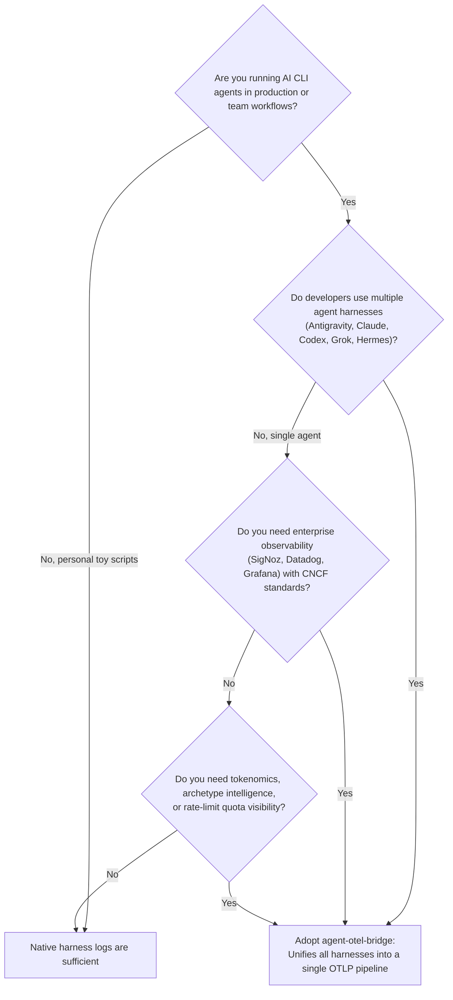

# Architectural Guide: Why agent-otel-bridge vs. Native Harness Telemetry

> **Audience**: Enterprise Architects, Principal Engineers, Platform Teams, and Observability Leads evaluating observability strategies for AI CLI agents.  
> **Status**: Enforced Architectural Standard  

---

## 1. Executive Summary: The Observability Gap in Modern AI Agents

As AI coding agents transition from experimental toys to critical engineering tools, teams encounter a common dilemma:

> *"Each AI harness (Claude Code, Antigravity, OpenAI Codex, Grok, Pi) already has some native hooks or local logs. Why do we need `agent-otel-bridge` instead of relying on each platform's built-in telemetry or custom ad-hoc scripts?"*

The short answer: **Native harness telemetry is siloed, raw, unstandardized, and blind to multi-agent distributed execution.**

Native client telemetry gives you fragmented data dumps (e.g. raw JSON strings in `.claude/projects/` or isolated Antigravity hook events) without semantic standardization, without token economics intelligence, without cross-agent distributed tracing, and with severe latency penalties if custom scripts are used.

`agent-otel-bridge` was engineered as a **zero-overhead, high-performance bridge** that transforms disparate agent hooks into standardized, actionable, enterprise-grade OpenTelemetry GenAI observability.

```mermaid
graph LR
    subgraph Siloed["Native Harnesses (Fragmented & Raw)"]
        A1["Antigravity (.gemini JSON)"]
        A2["Claude Code (.jsonl session logs)"]
        A3["Codex CLI (raw tool strings)"]
        A4["Custom / Hermes Agents"]
    end

    subgraph Bridge["agent-otel-bridge (Intelligence Layer)"]
        direction TB
        P1["Sub-ms Client (agent-hook < 1ms)"]
        P2["Behavioral Archetype Classifier"]
        P3["Capability & MCP Waste Engine"]
        P4["W3C Traceparent Propagation"]
        P5["Adaptive Quota & Fleet Bottleneck"]
    end

    subgraph Backend["Observability Platforms (Single Pane of Glass)"]
        O1["SigNoz"]
        O2["Datadog"]
        O3["Prometheus / Grafana"]
        O4["OpenTelemetry Collector"]
    end

    Siloed --> Bridge
    Bridge --> Backend
```



---

## 2. Comparative Matrix: Native Telemetry vs. `agent-otel-bridge`

| Capability Dimension | Native Harness Telemetry (Ad-Hoc) | `agent-otel-bridge` | Architectural Impact |
|:---|:---|:---|:---|
| **Multi-Agent Unification** | ❌ **Siloed**: Each tool emits incompatible formats to different locations. | ✅ **Unified**: Single OTLP collector endpoint for all agents on the workstation. | Eliminates tool-specific dashboard sprawl; unifies developer observability into a single pane of glass. |
| **Semantic Standards** | ❌ **Proprietary**: Vendor-specific schemas, inconsistent attribute naming. | ✅ **CNCF OpenTelemetry GenAI v1.28+**: Canonical `execute_tool`, `invoke_agent`, `gen_ai.usage.*`. | Guarantees vendor independence and out-of-the-box compatibility with SigNoz, Datadog, and Honeycomb. |
| **Tool Intelligence & Archetypes** | ❌ **Opaque**: Tool execution is labeled as generic `bash` or `exec` with a raw string. | ✅ **Behavioral Archetypes**: Classified as `FilterCompressor`, `StructuredParser`, `InspectorDiff`, `BuildTestVerify`. | Identifies what the agent is *actually doing* (testing vs. filtering vs. diffing) without human inspection. |
| **Tokenomics & Prompt Waste** | ❌ **Absent**: Only logs total input/output tokens per session. | ✅ **Token Waste Metrics**: Emits `tool.tokens_saved_estimate`, `tool.compression_ratio`, and schema bloat waste. | Reveals whether tools like `rtk` or `jq` are saving context tokens or if verbose commands are bloating LLM costs. |
| **Capability Decomposition** | ❌ **Flat**: MCP tools, skills, and subagents are treated as identical flat tool names. | ✅ **Decomposed**: Hierarchical extraction into `capability.kind` (`mcp`, `skill`, `subagent`, `native`) and namespace. | Enables precise monitoring of MCP server reliability, subagent recursion depth, and skill failure rates. |
| **Cross-Agent Lineage** | ❌ **Zero**: When Agent A invokes CLI Agent B, distributed trace context is lost. | ✅ **W3C Distributed Tracing**: Auto-propagates `$env:TRACEPARENT` across child processes and subagents. | End-to-end distributed traces across parent agents, delegated subagents, and background scripts. |
| **Quota & Headroom Visibility** | ❌ **Reactive**: Developer only finds out about rate limits after receiving HTTP 429 errors. | ✅ **Proactive Fleet Intelligence**: Real-time remaining fractions, reset countdowns, and fleet bottleneck gauge. | Prevents pipeline halts by forecasting quota exhaustion across OpenAI, Anthropic, Google, and xAI. |
| **Execution Hot-Path SLA** | ⚠️ **150ms – 1,200ms**: Custom Python/Node.js hook scripts cause noticeable agent hesitation. | ⚡ **< 1.0 ms**: Static native PE32 binary (`agent-hook.exe`, 145 KB) with 3ms hardware watchdog. | Zero developer perceptible latency. Complete fail-open safety guarantee. |

---

## 3. The 5 Architectural Pillars of `agent-otel-bridge`

### Pillar 1: From Raw Strings to Semantic Intelligence
When an AI agent executes a command, native harnesses record only the literal command line:
```json
// Native Claude Code or Antigravity raw payload
{ "tool": "bash", "command": "git diff | grep -E '^[+-]' | wc -l" }
```
In traditional dashboards, this appears as an unindexable string. `agent-otel-bridge` classifies this in **< 10 µs** using its compiled archetype engine into:
- `agent.tool.archetype`: `"InspectorDiff"`
- `agent.tool.binary`: `"git"`
- `agent.tool.wrapped_binary`: `"grep"`
- `agent.tool.pipeline_depth`: `3`
- `tool.tokens_saved_estimate`: `1450`

Architects can instantly query: *"What percentage of our agents' tool executions are verifying builds vs. searching code?"*

### Pillar 2: Cross-Agent Distributed Tracing & Lineage
In modern workflows, agents invoke other agents:
1. Google Antigravity starts a feature task.
2. It invokes a subagent to search documentation.
3. The subagent executes a CLI command that triggers Claude Code or Codex CLI.

Without `agent-otel-bridge`, this produces **three disconnected traces** with no causal relationship.  
With `agent-otel-bridge`, tracing context propagates seamlessly:
- The bridge injects standard W3C `TRACEPARENT` environment variables (`00-{trace_id}-{span_id}-01`).
- Child processes automatically adopt the parent's `trace_id` and attach under the correct `parent_span_id`.
- The collector renders a single, unified flamegraph showing the full agent lineage tree (`gen_ai.agent.depth`, `gen_ai.agent.parent_name`, `gen_ai.agent.root_id`).

### Pillar 3: Machine-Adaptive Quota Intelligence
Traditional monitoring either tracks nothing or emits hardcoded synthetic numbers.  
`agent-otel-bridge` introduces **Machine-Adaptive Quota Monitoring**:
- The daemon detects which AI harnesses actually exist on the developer's machine (`is_installed`).
- If you only use Claude Code and Antigravity, **only Claude and Gemini metrics are emitted**. You will never see phantom gauges for absent tools.
- Emits `gen_ai.client.quota.fleet_bottleneck_ratio`, giving team leads an immediate gauge of the most constrained provider in their developer fleet.

### Pillar 4: Universal Capability Decomposition & Waste Detection
With the explosion of Model Context Protocol (MCP) servers and reusable agent skills, prompt schemas are growing exponentially. `agent-otel-bridge` decomposes tool calls:
- Identifies whether a tool is `mcp`, `skill`, `subagent`, or `native`.
- Measures schema token consumption (`capability.schema_tokens`).
- Detects retry waste (`capability.consecutive_retries`, `capability.is_waste`), flagging when an agent is stuck in an expensive failure loop calling faulty MCP servers.

### Pillar 5: Sub-Millisecond, Fail-Open Engine
Observability must never degrade the user experience or crash an agent session.
- **Microsecond Cold-Start**: `agent-hook.exe` is a tiny 145 KB static PE32 binary. It performs zero disk reads and zero external network calls on the hot path.
- **Overlapped Named Pipes**: IPC writes directly to the Win32 Named Pipe in $< 150\ \mu\text{s}$.
- **Hardware Watchdog**: An OS background thread enforces a strict **3.0 ms** deadline. If the daemon is busy or the pipe stalls, the client exits immediately with code `0` and `{}`.
- **Fail-Open**: An agent turn will **never** fail or freeze due to telemetry.

---

## 4. Architectural Decision Framework: When to Adopt



---

## 5. Summary

| Architectural Need | With Native Telemetry | With `agent-otel-bridge` |
|:---|:---|:---|
| **Fleet Standardization** | High custom maintenance | Out-of-the-box CNCF GenAI v1.28+ |
| **Developer Turn Latency** | Degraded by slow custom scripts | Sub-millisecond (< 1.0 ms), zero impact |
| **Distributed Lineage** | Broken at process boundaries | Full W3C distributed trace tree |
| **Token Optimization** | Invisible | Precise tokenomics & compression metrics |
| **Rate Limit Prevention** | Reactive 429 errors | Proactive multi-provider headroom gauges |
