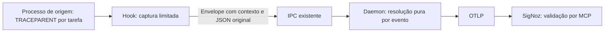

# Plano da sessão: implementar e validar propagação de contexto

Estado: implementação realizada em 2026-09-14, com prova de propagação no Windows e consulta MCP ao SigNoz. O usuário autorizou documentação, commit, push, merge e instalação local; a nova execução de testes será solicitada em outra thread. Essa autorização não equivale à aprovação dos SLAs ou da matriz Linux/macOS. A instalação registra a revisão e os hashes efetivos em seu manifesto local.

Validação já realizada: `cargo guardrails` e doc-tests aprovados; teste de processos release aprovado, com reprodução negativa usando hook antigo; sete spans nativos conferidos por MCP, incluindo precedência e fallback. O hook mediu 150.016 bytes e o benchmark IPC p99 145 µs. Permanecem pendentes: parser mediu 37.231,6 spans/s (abaixo de 50.000); tempo externo de criação/execução do processo não comprovou cliente <1 ms; harvester e execução nativa Linux/macOS não foram comprovados. Um ensaio com daemon debug perdeu um dos cinco eventos; a investigação permanece no RES-002. A campanha live continua em 0/5 tentativas.

Implementado: envelope 0x04 com contexto limitado; captura compartilhada por `agent-hook` e `agent-otel-bridge hook`; resolução por evento no daemon, parser seguro e flags preservadas; seleção do socket Unix consistente com o cliente. O teste de processo reproduz a falha com o hook antigo. CI nativa foi preparada em `.github/workflows/native-context.yml`, mas criar o workflow não comprova sua execução.

Reprodução local do teste de integração: compilar cliente release, definir `AGENT_OTEL_TEST_HOOK` com caminho absoluto desse candidato e executar `cargo test --release -p agent-otel-bridge --test native_context_process -- --ignored --nocapture`. O teste é explicitamente opt-in e não é executado pelo guardrail padrão. A captura de backend pode ser gerada por `python dev/fleet-smoke/native_context_probe.py`; seu relatório continua sem avaliação de visibilidade até uma consulta independente ao SigNoz.

## Entrega e limites

Corrigir ambiente do hook → IPC → daemon → OTLP, preservando o JSON de origem, precedência, isolamento entre processos, compatibilidade de mensagens antigas e fail-open. Validar com processos reais e consultar o resultado no SigNoz via MCP, sem tela. Não exige inferência de agentes para demonstrar o protocolo.

Fora desta entrega: fila recuperável, guardião, memória compartilhada, journal, retries novos e serviço adicional. Estão no [RES-001](resilience-backlog.md). A [campanha da frota](../dev/fleet-smoke/first-live-run-plan.md), seus oráculos live e fixtures HTTP/MCP têm execução própria e não bloqueiam a conclusão desta correção do produto.

Base técnica: [alternativas e contrato proposto](../dev/fleet-smoke/native-context-fix-plan.md). Este plano prevalece quanto ao escopo da sessão: validar contexto não significa aprovar a campanha nem prometer recuperação de eventos.

## Fluxo final



```mermaid
sequenceDiagram
 participant T as Teste de integração
 participant H as Hook candidato
 participant D as Daemon candidato isolado
 participant C as Coletor
 T->>H: stdin conhecido + ambiente A
 H->>D: Contexto A e payload original
 H-->>T: Resposta do evento, exit 0
 D->>D: Payload válido > contexto de origem > conversa
 D->>C: Span com trace e parent esperados
 T->>C: Captura local; depois consulta SigNoz por MCP
 T->>T: Valida IDs, isolamento e limites
```

## Sequência fechada

| Etapa | Trabalho | Executor | Critério de saída |
|---|---|---|---|
| 1. Congelar baseline | Inspecionar branch/dirty, preservar trabalho alheio, registrar hashes de candidato e instalação; ler AGENTS e contrato local | Ferramentas determinísticas | Estado e origem de evidência inequívocos |
| 2. Fixar contrato e testes vermelhos | Confirmar ID de mensagem disponível; fechar envelope/limites e matriz de compatibilidade; reproduzir env-only e contaminação pelo ambiente do daemon em subprocessos | Antigravity para levantamento e fixtures; responsável principal fecha ambiguidades do contrato | Falhas reproduzidas sem invocar harnesses nos testes |
| 3. Implementar codec | Mensagem nova, envelope versionado, decoder limitado, suporte legado | Antigravity, após contrato fechado | Vetores binários positivos/negativos aprovados |
| 4. Integrar contexto | Captura limitada no hook, resolução pura no daemon, remover dependência do ambiente do daemon também no enriquecimento | Terra medium | Processo A não adota contexto B/C; payload preservado; fail-open intacto |
| 5. Completar regressões | Parser W3C, flags, aliases, compatibilidade de APIs, lineage sem profundidade inventada, docs e semconv quando necessário | Antigravity para trabalho definido; Luna para revisão independente | Assertions rastreáveis aos requisitos |
| 6. Revisar e medir | Revisão independente; baseline/candidato release; testes e guardrails | Luna medium para revisão; ferramentas para execução | Sem defeitos pendentes de correção e SLAs aprovados |
| 7. Validar ponta a ponta | Hook e daemon candidatos em pipe próprio; coletor local determinístico; depois exportação ao backend configurado e consulta MCP | Ferramentas determinísticas | IDs e atributos observados correspondem ao manifesto |
| 8. Fechar entrega | Resumo do diff, comandos/resultados, hashes, plataformas verificadas, limitações e instruções de ativação/rollback | Responsável da sessão | Candidato reviewável; nenhum PASS sem evidência |

Implementadores têm arquivos atribuídos e não editam simultaneamente o mesmo arquivo. No checkout, somente um responsável executa Cargo. A validação mecânica não requer inferência de harnesses; o uso de Antigravity abaixo é para construir o produto, não executar a campanha da frota.

### Política de delegação e custo confirmada pelo usuário

- Antigravity é o executor preferencial para buscas extensas no código/documentação e implementações com contrato e arquivos bem definidos. Usar o modelo Gemini econômico já selecionado, `gemini-3.8-flash-low`, verificando disponibilidade antes do despacho. Não permitir seleção automática de Claude nem substituição silenciosa do modelo.
- Codex `gpt-5.6-luna`, low, para triagem, comparação de resultados e tarefas simples; medium para patches delimitados e revisão independente. Usar como fallback quando Antigravity estiver indisponível, sem bloquear trabalho que possa ser feito com segurança por Luna.
- Codex `gpt-5.6-terra`, medium, somente para a integração entre processos/concorrência que exige raciocínio adicional ou uma hipótese que o executor menor não conseguiu resolver. Atribuições mecânicas restantes continuam nos modelos menores.
- Responsável principal reserva seu trabalho para fechar arquitetura e invariantes, resolver evidências conflitantes, delimitar patches e decidir aceite final. Não repetir levantamentos ou implementação já entregues: verificar evidências e revisar o diff relevante.
- Todo despacho contém objetivo, arquivos de propriedade, contrato, casos negativos, critérios de aceite, limite de escopo e resultado esperado. Preferir ferramentas determinísticas a LLM para buscas exatas, execução de testes e comparação de IDs/hashes.
- Limitar a três executores simultâneos, somente para subtarefas independentes. Não criar tarefas novas na interface: delegar dentro desta sessão. Para Antigravity, usar invocação CLI limitada, sem alterar configuração global, sem subdelegação automática e sem autorização de instalar/publicar.
- Autenticação/quota/modelo indisponíveis não justificam retries cegos. Registrar indisponibilidade e usar o fallback Codex econômico quando aplicável. Registrar modelo solicitado e observado quando disponível, sem inventar custo ou consumo.

## Decisões técnicas a cumprir

- Manter transporte pipe/socket, orçamento do watchdog e resposta específica de cada hook. Não adicionar negociação ou espera por ACK ao cliente.
- Nova mensagem distingue contexto de origem do JSON sem reescrever stdin. Preservar mensagem antiga; novo cliente com daemon antigo é incompatibilidade explícita, sem envio duplicado automático.
- Precedência por contexto válido: payload > origem > conversa. Remover ambiente global do daemon do caminho IPC, inclusive no enriquecimento; manter wrappers públicos quando necessários para compatibilidade.
- Ausência, contexto inválido e envelope estruturalmente inválido são casos distintos. Limitar leitura, offsets e alocação; sem panic por Unicode ou truncamento.
- Manter IDs e flags corretos e evitar inferir profundidade de agente a partir de parent span. Contexto herdado associa eventos à tarefa; não inventa hierarquia interna do harness.
- Nenhuma alteração incidental no exportador/fila entra neste patch. Defeitos adjacentes encontrados viram backlog com evidência, salvo se forem indispensáveis à validação desta correção.

## Validação obrigatória

1. **Protocolo:** roundtrip de ambas as mensagens, limites, versão desconhecida, truncamento, UTF-8/hex inválido, IDs zero, flags e precedência. JSON original byte a byte.
2. **Processos reais:** daemon sem contexto e hook com A; daemon com C e filhos intercalados A/B; payload D prevalece sobre ambiente A; contexto ausente usa conversa. Não substituir por testes que mudam o ambiente do próprio processo de teste.
3. **Falhas:** pipe/socket ausente, ocupado e lento; emissor encerrado; mensagem incompleta. Não misturar trace nem aumentar watchdog. Perda permitida pelo fail-open continua identificada como perda, não sucesso de entrega.
4. **Compatibilidade:** antigo/novo receptor aceita legado; novo/novo propaga; novo/antigo falha aberto sem promessa de telemetria. Testar APIs existentes e atributos legados.
5. **Desempenho:** cliente <1 ms, watchdog 3 ms, RTT p99 <3.000 µs, binário <300 KB; parser >50.000 spans/s e harvester <150 µs conforme superfícies afetadas. Medir baseline/candidato na mesma máquina com amostras e percentis; distinguir criação externa do processo e tempo interno sem relaxar contrato. Baseline reprovada não permite chamar candidato de SLA aprovado.
6. **Qualidade:** cargo fmt --check; cargo clippy --workspace --all-targets -- -D warnings; cargo test --workspace; cargo doc --workspace --no-deps; cargo guardrails. Guardrail atual usa 350 KB, mas esta entrega verifica também limite mais estrito de 300 KB.
7. **Backend:** registrar trace/root/parent/span IDs esperados, janela, serviço/scope e hashes; consultar SigNoz MCP e comparar evidência nativa. Recibo HTTP não substitui consulta. Usar eventos de teste identificáveis e conhecidos, sem alegar execução real de ferramentas por LLM.

Codec e parser devem ser portáveis. Windows exige pipe/watchdog nativos; Linux/macOS exigem validação nativa de socket/ambiente/processos. Usar runners disponíveis e CI existente quando autorizado. Se uma plataforma não estiver disponível, registrar essa parte como pendente; testes Windows não comprovam suporte validado nos três sistemas. Não criar scripts ps1.

## Isolamento, dados e ativação

Usar somente candidatos em target com endpoint/pipe/socket próprios. Processos iniciados pelo teste têm dono, deadline e cleanup limitado a seus recursos. Não mudar hooks globais nem iniciar/reiniciar a instalação ativa para realizar os testes candidatos.

Guardar no código apenas implementação, regressões e documentação. Capturas e relatórios de execução ficam transitórios; identificadores/evidências essenciais são reportados e a telemetria segue para o canal habilitado. Não salvar credenciais.

Ativação autorizada: após merge, compilar o par release da revisão limpa, parar o receptor antigo quando presente, usar `local install --from-build target/release`, conferir hashes e iniciar o receptor canônico atualizado. O intervalo sem receptor permanece fail-open. Verificar manifesto, processo e hooks sem executar a campanha; rollback restaura o par. Não confundir teste do candidato com validação da instalação ativa.

## Conclusão e condição de parada

Concluir implementação candidata somente após corrigir regressões e executar as verificações disponíveis. Marcar validação completa apenas quando toda a matriz obrigatória tiver evidência, identificando separadamente candidato, instalação e plataformas. Se houver regressão do hot path ou dependência externa indisponível, terminar trabalho independente e relatar o ponto exato pendente; não ampliar para mensageria nem consumir tentativas da campanha para mascarar falta de prova.
